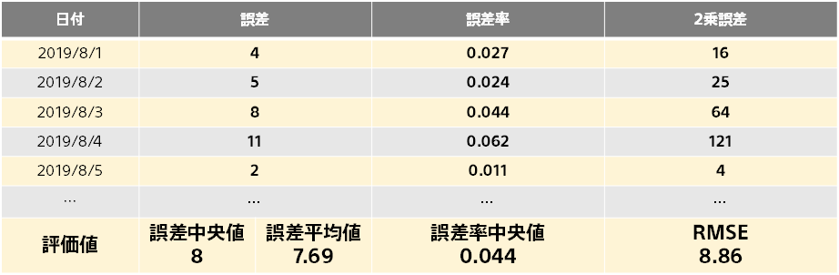

**Mean Absolute Error** is the average of the absolute values of the errors in the predictions for each piece of data included in the evaluation data."

Mean Absolute Error is easily affected by abnormal data. For example, when the evaluation data contains a sample with a very large error (a single piece of data is called a sample. For example, in customer data, it refers to a customer), the mean absolute error tends to take a large value compared to the median absolute error. It is a good idea to evaluate it together with the median absolute error rate and the distribution graph of the prediction.

{}

- {}
- {}
- {}
  {}
