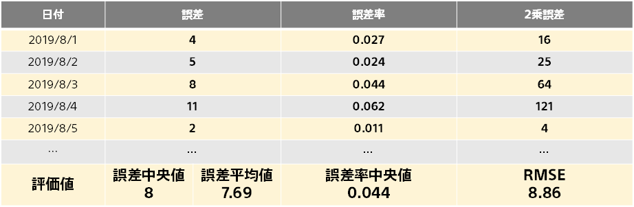

**誤差平均**とは、評価用データに含まれる各データに対して予測を行った際の誤差の絶対値の平均です。

誤差平均は異常データの影響を受けやすく、たとえば評価用データに誤差が非常に大きなサンプル（１つのデータのことをサンプルと呼びます。たとえば、顧客データでは顧客のことです。）が含まれていた時、誤差平均は誤差中央値と比較して大きな値を取る傾向にあります。検証の際には誤差率中央値や予測の分布グラフと合わせて評価すると良いでしょう。

{}

- {}
- {}
- {}
  {}
