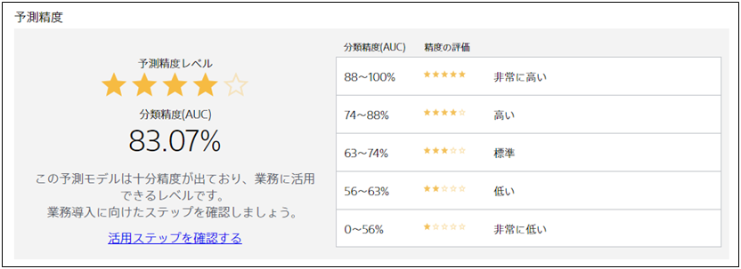

Prediction One では、予測モデル作成(学習)用データから作成した予測モデルがどれくらい良いかの参考指標の一つとして、**予測精度レベル**を提示します。

予測精度レベルは星 1 つ～星 5 つで表現され、星の数が多いほど予測モデルが良い性能であることを示します。

予測精度レベルはサマリ画面に一緒に提示される精度指標を元に計算されます。計算元の精度指標は以下のように問題によって変わります。

- 二値分類の場合：{}
- 多値分類の場合：{}
- 数値予測の場合：{}
- 時系列予測の場合：{}

一般に、予測精度レベルが高ければ高いほど、作成した予測モデルは正しい予測をできます。
ただし、そのモデルが実際に実用的なモデルかどうかはユースケースごとに判断する必要があります。
