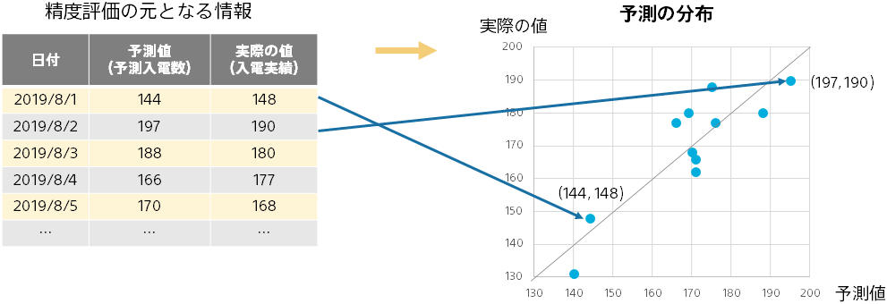
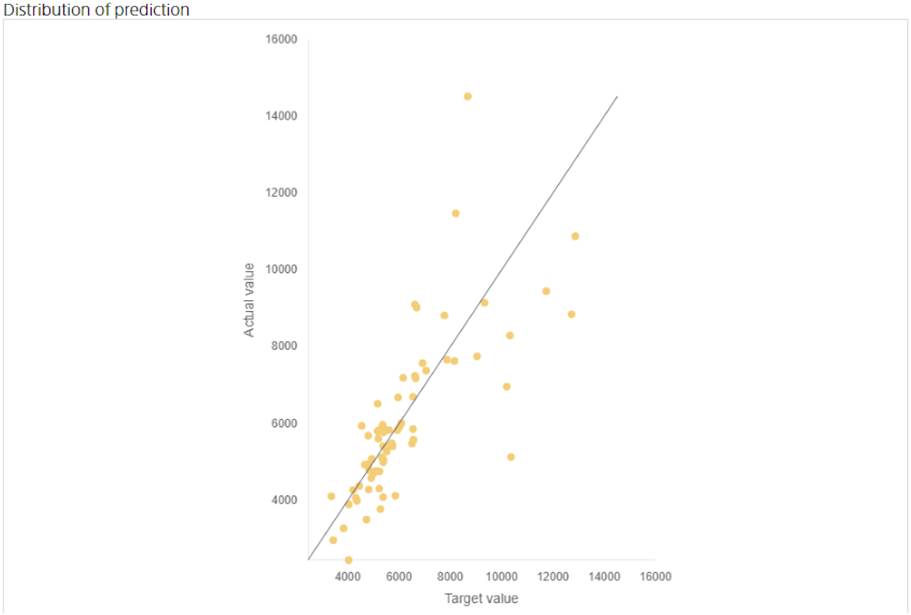

Distribution of Prediction is a visualization of the actual prediction. Each set of (predicted values, actual values) in the evaluation data is plotted as a point. You can see the prediction intuitively.

The closer the point is to the diagonal of the graph, the more accurate the prediction. (the predicted value equals the actual value) By looking at the deviation from the diagonal, you can grasp situations such as not being able to predict well when the actual value is large.

When points are gathered around the diagonal line of the graph, there are many points of data where the actual value is close to the predicted value and the prediction accuracy is high. In such cases, you can expect this model to be a useful predictive model.
