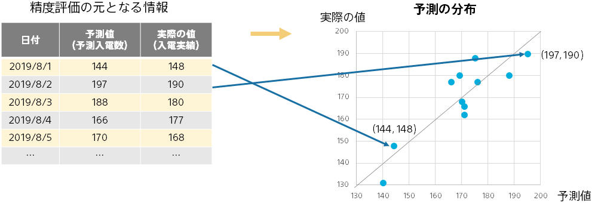
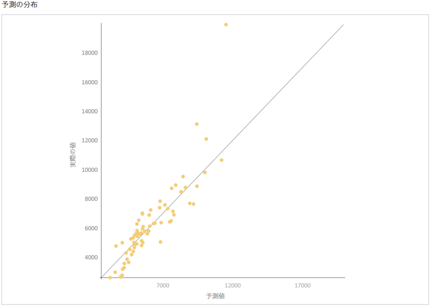

予測の分布は、実際の予測の様子を可視化した図になります。評価用データ中１つ１つの（予測値,実際の値）の組を点としてプロットしたものです。予測の様子が直感的にわかります。

点がグラフの対角線上に近いほど予測精度が高いことを表します。（予測値と実際の値が等しいことになる）対角線からのずれを見ることで、実際の値が大きいときは予測がうまくできていないなどの状況を掴むことができます。

グラフの対角線上付近に点が集まっている時は、実際の値と予測値が近い値を取るデータが多く予測精度が高い状態です。このような場合、実用上役に立つ予測モデルであることが期待できます。
