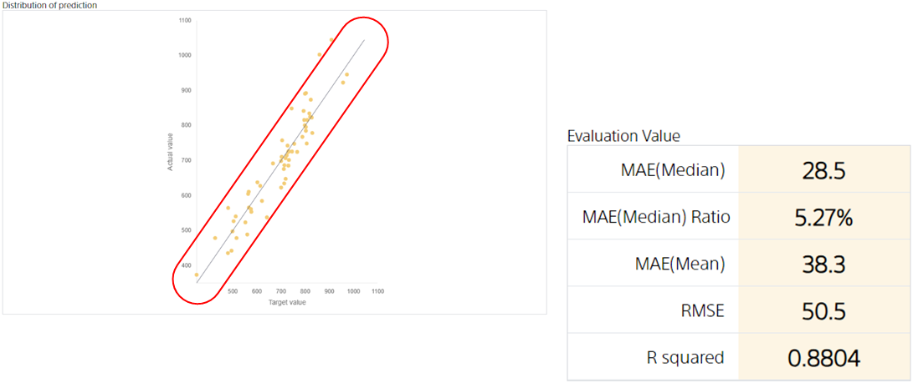

**Coefficient of Determination** is a metric that measures the performance of a numerical prediction model. In general, the higher the value, the better, and in the best case, at 1. It is used to check the correlation between the correct values in the evaluation data and the values predicted by the prediction model.

When the coefficient of determination is close to 1, there tends to be a correlation between the correct value and the predicted value.
At this point, the distribution of predictions is more diagonal and dotted. The figure below shows an example where the coefficient of determination is approximately 0.98.

On the other hand, the coefficient of determination is small if the prediction is close to being independent of the correct value.
In such cases, the distribution of predictions is likely to have points that are off the diagonal. The figure below shows an example where the coefficient of determination is approximately 0.20.

{}

- {}
- {}

{}
