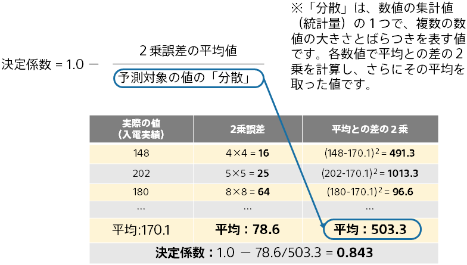
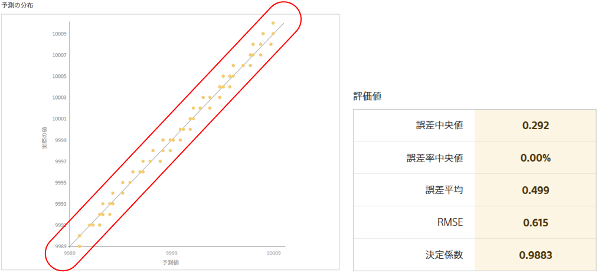
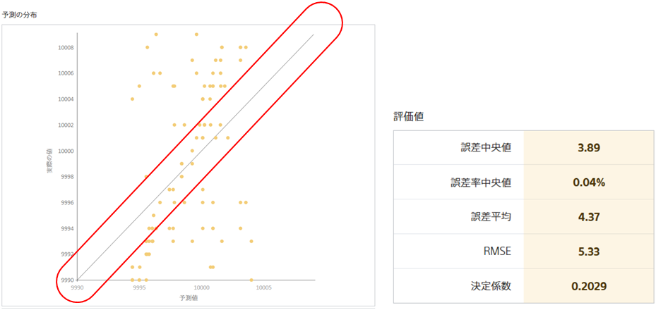

**決定係数**とは、数値予測のモデルの良さを測る指標の一つです。一般的に高ければ高いほどよく、最良の場合 1 になります。評価用データに含まれる正解の値と、予測モデルが予測した値との間にどれくらい相関があるかを確認するために用いられます。

決定係数が 1 に近い値を取っている状態では正解の値と予測した値との間に相関がある傾向にあります。
このとき、予測の分布の図では対角線に点が多い状態になります。以下の図は決定係数が約 0.98 となる例です。

一方、正解の値とは無関係に近い予測を行うと決定係数は小さな値を取ります。
このような場合、予測の分布の図では対角線から離れた位置に点が存在するケースが多くなります。以下の図は決定係数が約 0.20 となる例です。

{}

- {}
- {}

{}
