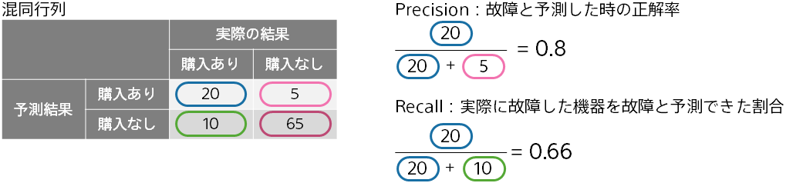

In some use cases of binary classification, you may be interested in finding one of the two values you wish to classify.
For example, if you want to prevent equipment failure by predicting in advance, 
it is more important to predict and prevent failure than to predict normal.
Precision, Recall, and F-score are measures focused on detection.

**Recall** is the percentage of the actual positive that was predicted to be positive.

For example, the confusion matrix in this figure predicts and guesses 20 pieces of data in "Purchased" of 20 + 10.
In this case, the Recall is (20/(20 + 10)) = 0.66.

{}

- {}
- {}
- {}
- {}
  {}
