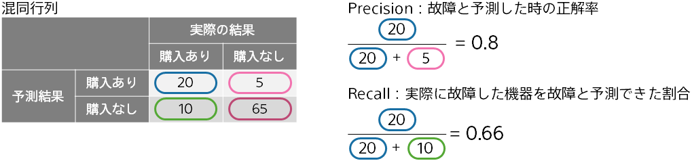

二値分類のユースケースによっては、分類したい２つの値の一方の値の検出に興味がある場合があります。
たとえば、機器の故障を事前に予測して故障を防ぎたい場合では、
故障しないことの予測よりも、故障することをいかに予測して防げるかが重要になります。
一方の検出に重点をおいた精度評価値が、Precision、再現率（Recall）、F 値です。

**再現率（Recall）** は、予測モデルで予測して見つけたいデータのうち、実際に予測を当てることができた割合を示しています。

たとえば、この図の混同行列では「購入あり」である 20+10 のデータのうち 20 個を予測して当てることができています。
この場合、再現率（Recall）は (20/(20+10)) = 0.66 となります。

{}

- {}
- {}
- {}
- {}
  {}
