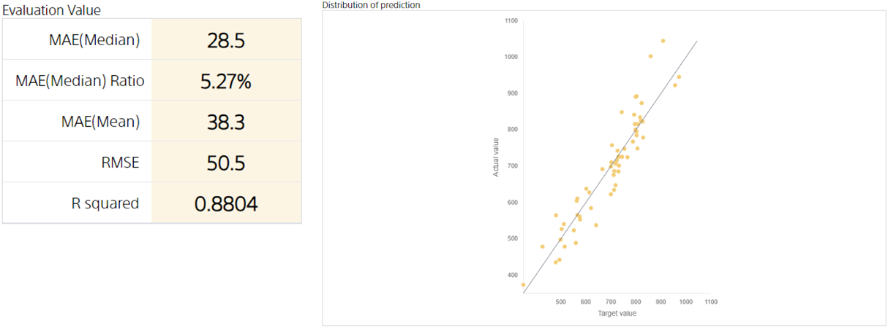

**RMSE**(Root Mean Squared Error) is a metric that measures the performance of a regression model. Also known as root mean squared error. The lower the value, the better, and at best 0.

RMSE is determined by finding the average of the mean squared error between the predicted value and the correct answer for the evaluation data and then calculating the square root of that value. Because the calculation is based on the squared error, RMSE tends to be large when the evaluation data contains samples with very large errors (a single piece of data is called a sample. For example, customer data refers to a customer).

Use an example to see how RMSE takes a large value when a sample with a very large error is included in the evaluation data.
Create prediction model A and prediction model B using exactly the same prediction model creation (training) data.
However, the correct value for only one piece of evaluation data in prediction model B has been changed to a value that is too large to predict.

---

**Evaluation value of prediction model B and distribution of prediction**

**Evaluation value of prediction model B and distribution of prediction**

---

From the distribution diagram of the prediction of prediction model B, it is clear that there is a sample in which the prediction of prediction model B is big and deviates from the prediction.
Therefore, the RMSE of prediction model B is larger than that of prediction model A, although the median absolute error ratio and the median absolute error of prediction model B are almost the same as those of prediction model A.

From these examples, you can see that RMSE is a measure of "Does the prediction model make stable predictions with small errors?"

{}

- {}
- {}
- {}
- {}

{}
