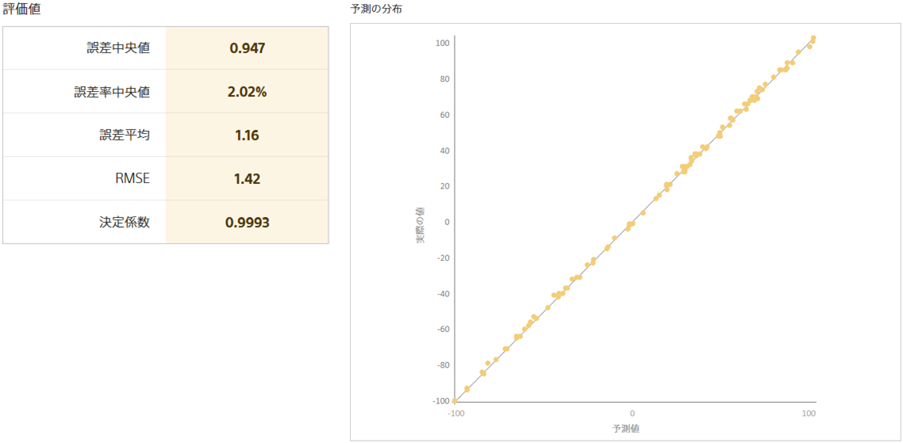
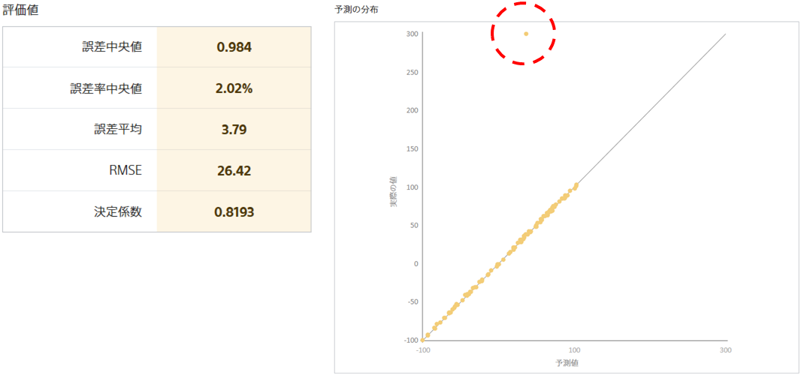

**RMSE**(Root Mean Squared Error)とは、数値予測のモデルの良さを測る指標の一つです。二乗平均平方根誤差と呼ばれることもあります。低ければ低いほどよく、最良の場合 0 になります。

RMSE は、評価用データに対する予測値と正解との間の二乗誤差の平均値を求め、その値の平方根を計算することで求まります。誤差を二乗した値に基づいて計算を行うため、誤差が非常に大きいサンプル（１つのデータのことをサンプルと呼びます。たとえば、顧客データでは顧客のことです。）が評価用データに含まれる時、RMSE は大きな値を取る傾向にあります。

例を用いて、誤差が非常に大きいサンプルが評価用データに含まれる時、RMSE が大きな値を取る様子を確認します。
完全に同じ予測モデル作成(学習)用データを使い、予測モデル A と予測モデル B を作成します。
ただし、予測モデル B の評価用データのうち、1 つだけ正解の値を予測できないほど非常に大きな値に変更しています。

---

**予測モデル A の評価値と予測の分布**

**予測モデル B の評価値と予測の分布**

---

予測モデル B の予測の分布図から、予測モデル B は一つだけ大きく予測を外したサンプルが存在することが分かります。
このため、予測モデル B の誤差率中央値・誤差中央値は予測モデル A とほぼ同じ値であるにも関わらず、予測モデル B の RMSE は予測モデル A よりも大きな値を取っています。

以上の例から、RMSE は「予測モデルが安定して小さい誤差で予測をしているか」を表す指標になることが分かります。

{}

- {}
- {}
- {}
- {}

{}
