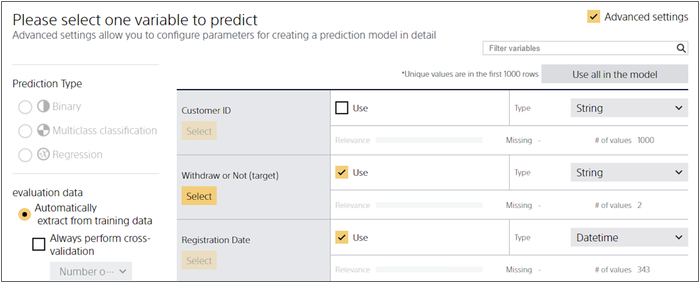

The setting of **Use for the model** is used to specify which variable is used to create a prediction model from the variables contained in the input data for model creation in the advanced model creation setting screen.
<u>Variables checked for "Use for the model" must also be included in the prediction data.</u>

Take the {} data as an example.
Enter `1_サービス退会.csv` used for this tutorial into Prediction One and check the advanced settings, 
which will take you to this screen.

At this time, Prediction One creates a prediction model that predicts whether a customer will withdraw from membership based on "Entry Date", "Customer Rank", "Credit Card Registration", and other variables for which Use for the model is checked.
For this reason, the prediction data must also contain entries for "Entry Date", "Customer Rank", and "Credit Card Registration".

In addition, "Customer ID" variables that are not checked for Use for the model are not used to predict whether a customer will withdraw from membership or not.
Intuitively, "Customer ID" is considered to have nothing to do with "Withdraw or not". As you can see, Prediction One may automatically uncheck Use for the model for variables that are likely not relevant to what you want to predict.
