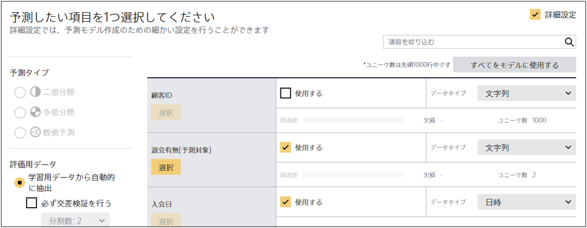

「**モデルに使用**」の設定は、モデル作成の詳細設定画面において、入力されたモデル作成用データの中に含まれる項目の中から、どの項目を使って予測モデルを作成するかを指定するための設定です。
<u>「モデルに使用」でチェックを入れた項目は、予測用データにも含まれている必要があります。</u>

{}のデータを例に説明します。
このチュートリアルで使用する `1_サービス退会.csv` を Prediction One に入力して詳細設定にチェックを入れると、
以下のような画面に遷移します。

この時、Prediction One は「モデルに使用」にチェックが入っている「入会日」「顧客ランク」「クレジットカード登録」などの項目から「退会有無」を予測するような予測モデルを作成します。
そのため、予測用データにも「入会日」「顧客ランク」「クレジットカード登録」の項目が含まれている必要があります。

また、「モデルに使用」のチェックが入っていない「顧客 ID」の項目は「退会有無」の予測には使用されません。
直感的には「顧客 ID」は「退会有無」とは無関係の項目だと考えられます。このように、予測したい項目に関係がない可能性が高い項目について、Prediction One は自動的に「モデルに使用」のチェックを外す場合があります。
