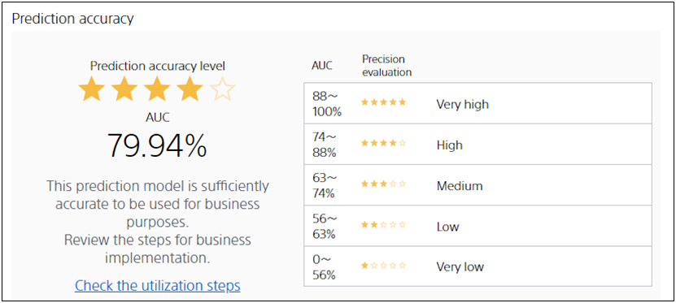

**Information leakage** refers to the creation of a prediction model when the prediction model creation (training) data contains information that can inherently not be used, or when information is used that cannot be identified until the variables to be predicted are known.

Let us use a specific example to illustrate information leakage. The {} provides the following data as a specific example of a dataset for predicting membership withdrawal.

| Customer ID |  Entry data   | Customer rank | ... | Subscription route | Withdraw or not  |
| :-----: | :-------: | :--------: | :-: | :----------: | :-------: |
| ID00001 | 2018/5/21 |  Gold  | ... |     Direct     | (b) Continuation |
| ID00002 | 2017/1/8  |  Platinum  | ... |  Via agency  | (b) Continuation |
| ID00003 | 2017/9/3 |  Gold  | ... |     Direct     |  (a) Withdrawal  |

In this tutorial, we want to predict whether a customer will withdraw or not.

Let's suppose that there is a record of "Sending a withdrawal confirmation email" in this data.

| Customer ID |  Entry data   | Customer rank | ... | Subscription route | Sending a withdrawal confirmation email | Withdraw or not  |
| :-----: | :-------: | :--------: | :-: | :----------: | :------------------: | :-------: |
| ID00001 | 2018/5/21 |  Gold  | ... |     Direct     |         No         | (b) Continuation |
| ID00002 | 2017/1/8  |  Platinum  | ... |     Via agency     |         No         | (b) Continuation |
| ID00003 | 2017/9/3 |  Gold  | ... |     Direct     |         Yes         | (a) Withdrawal |

If you use this data to predict whether a customer will be withdrawing, the prediction model is very accurate.
The reason for this is that "Sending a withdrawal confirmation email" is only sent to those who have withdrawn from the service, so if a prediction model is created using information on whether or not a withdrawal confirmation email has been sent, it is possible to easily predict whether or not a customer will withdraw from the service.

However, <u>in the actual operation, <b>before sending the withdrawal confirmation mail</b>, some measures are taken for those who are likely to withdraw</u>.
Therefore, a prediction model that predicts whether or not a customer will withdraw from the service by using the information of "Sending a withdrawal confirmation email" is not useful in practice.
This is because information about "Sending a withdrawal confirmation email" is only available after the user has left the account, and it is not available before the user has left the account.

### Preventing Information Leakage with Prediction One

Prediction One will prompt you to make sure that your prediction models are not using variables that are not available at the time of prediction if they have a high accuracy.

