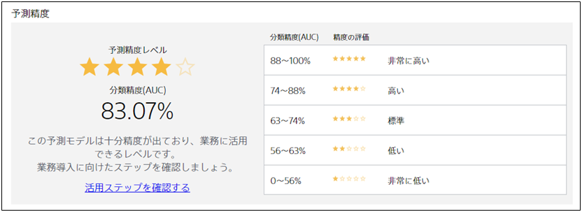

**情報漏れ**とは、予測モデル作成(学習)用データに本来は使用できない情報が含まれていたり、予測したい項目が分かる状態でないと判明しない情報を用いて予測モデルを作成することを指しています。

具体例を用いて、情報漏れを説明します。{}では、退会予測をするためのデータセットの具体例として以下のようなデータを用意しています。

| 顧客 ID |  入会日   | 顧客ランク | ... | 申し込み経路 | 退会有無  |
| :-----: | :-------: | :--------: | :-: | :----------: | :-------: |
| ID00001 | 2018/5/21 |  ゴールド  | ... |     直接     | (b)継続中 |
| ID00002 | 2017/1/8  |  プラチナ  | ... |  代理店経由  | (b)継続中 |
| ID00003 | 2017/9/3  |  ゴールド  | ... |     直接     |  (a)退会  |

このチュートリアルでは退会するか否かを予測したいので「退会有無」が予測したい項目となります。

このデータに仮に「退会確認メールの送信」記録が存在したとします。

| 顧客 ID |  入会日   | 顧客ランク | ... | 申し込み経路 | 退会確認メールの送信 | 退会有無  |
| :-----: | :-------: | :--------: | :-: | :----------: | :------------------: | :-------: |
| ID00001 | 2018/5/21 |  ゴールド  | ... |     直接     |         なし         | (b)継続中 |
| ID00002 | 2017/1/8  |  プラチナ  | ... |  代理店経由  |         なし         | (b)継続中 |
| ID00003 | 2017/9/3  |  ゴールド  | ... |     直接     |         あり         |  (a)退会  |

このデータを使って退会有無を予測すると、予測モデルの精度は非常に高いものとなります。
なぜならば、「退会確認メールの送信」は退会した人にしか行わないため、退会確認メールの送信のあり・なしの情報を用いて予測モデルを作成すれば、退会有無を簡単に予測することができるためです。

しかし、<u>実際の運用場面では、退会確認メールを送信する<b>前に</b>退会する確率が高い人に対して何らかの施策を行います</u>。
そのため「退会確認メールを送信」したという情報を使って退会有無を予測する予測モデルは実用上役に立ちません。
「退会確認メールを送信」したという情報はユーザーが退会してから初めて分かる情報であり、ユーザーが退会する前の段階では分からない情報だからです。

### Prediction One で情報漏れを回避する

Prediction One は作成した予測モデルの性能が非常に高い場合、予測時には利用できない項目を使用していないか確認を促します。

