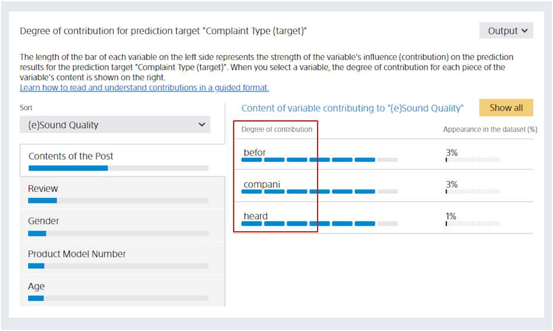

For example, the data collected in the form of sentences such as the free description column of the questionnaire is called **Text**. Prediction One sets the data type to "Text" when it determines that the data is text. Variables that have a data type of "Text Type" and are processed specifically for the Text data type.

### Text Handling in Prediction One

Prediction One can also use data containing Japanese and English sentences as training data.

For example, the "Post content" variable in the dataset used in the {} tutorial contains Japanese text. If the text contains verbs, nouns, adjectives, or other words related to the variable you want to predict, you can see them in the details of contribution.

{}

- {}
  {}
