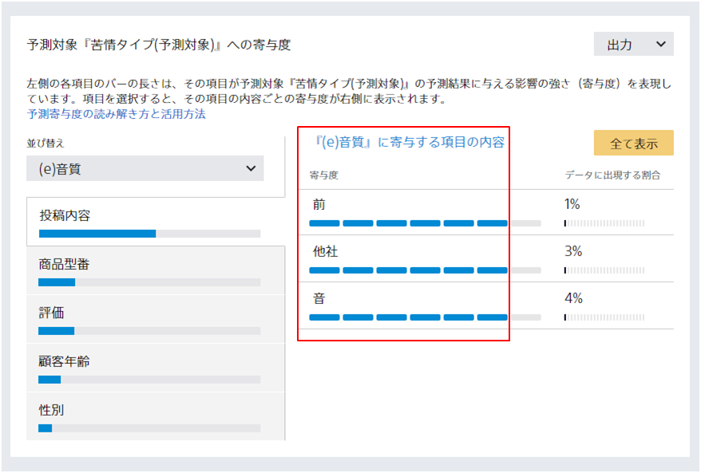

たとえばアンケートの自由記述欄など、文章の形で集められたデータを**テキスト**と呼びます。Prediction One ではデータを文章と判断した場合にデータタイプが「テキスト」に設定されます。データタイプ「テキスト」と指定された項目には、テキスト専用の処理が実行されます。

### Prediction One でのテキスト処理

Prediction One では、日本語・英語の文章が含まれているデータも学習データとして使用できます。

たとえば、{}のチュートリアルにて使用するデータセットの「投稿内容」項目には日本語の文章が含まれています。テキストに含まれる動詞・名詞・形容詞などに予測したい項目に関係する単語が含まれている場合、それらを寄与度画面で確認できます。

{}

- {}
  {}
