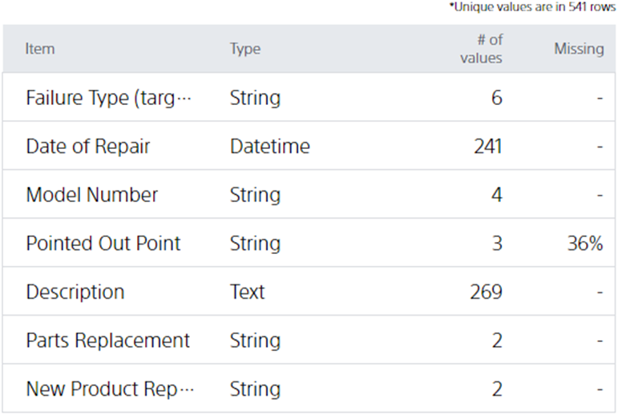

**Unique value** indicates how many values exist when the values of a variable are collected without duplication.

Take the {} tutorial data as an example. "Complaint Type", the variable to be predicted for the dataset used in this tutorial, contains 6 values:

- "(a) Nothing in particular"
- "(b) Scratches on the product"
- "(c) Battery"
- "(d) Instructions"
- "(e) Disappointment"
- "(f) More than one complaint"

  In this case, the number of unique values for "Complaint Type" is **6**, as shown below.

