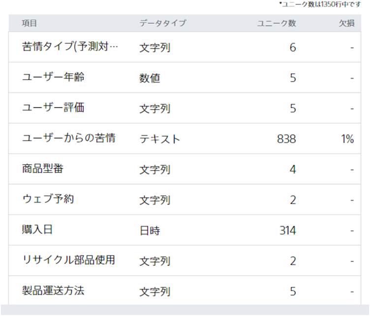

**ユニーク数**とは、ある項目について重複を除いて値を集めた時に何種類の値が存在するかを示すものです。

{}のチュートリアルのデータを例に説明します。このチュートリアルで使用するデータセットの予測したい項目である「苦情タイプ」には

- 「(a)特になし」
- 「(b)製品にキズ」
- 「(c)バッテリー」
- 「(d)説明書」
- 「(e)期待はずれ」
- 「(f)複数の苦情」

の 6 種類の値が存在します。この場合、「苦情タイプ」のユニーク数は下図のように**6**になります。

