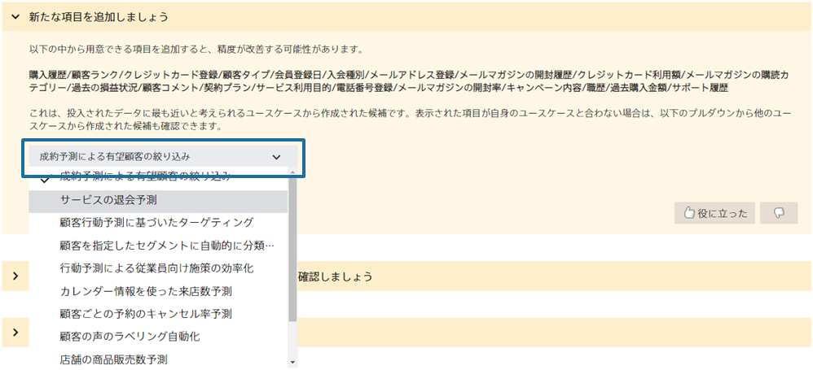

### 説明

投入されたデータに最も近いと考えられるユースケース向けの項目の候補が表示されます。
表示された項目の候補を見て、自身のデータに追加できるものがある場合は、追加して精度が改善するか試しましょう。

表示された項目が自身のユースケースに合わない場合はプルダウンから他のユースケースを選択することもできます。
他のユースケースを選択するとそのユースケースに沿った項目の候補が表示されます。

また、該当するユースケースがないと判断された場合は、{} が表示されます。

### 実施手順

1. 「新たな項目を追加しましょう」の改善ヒントで表示されている項目の候補を見る
1. 候補内に追加できる項目がある場合はデータに追加する。新たに収集できる項目がある場合は収集をする。
1. 項目が追加されたデータで再び予測モデルを作成し、精度が改善するか確認する。

### 関連資料

- {}

