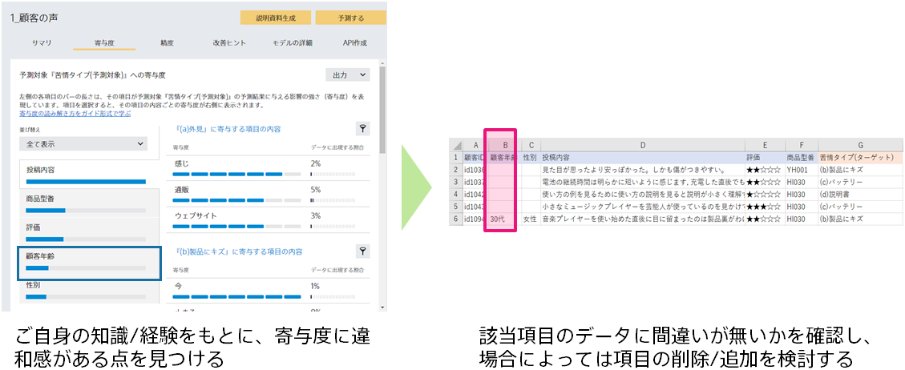

### 説明

寄与度の高い項目がご自身の感覚と合っているか確認することで、(1) 新たに追加すべき項目を思いついたり、(2) 予測モデル作成用データの不備が見つかる場合があります。

(1) 新たに追加すべき項目
あるサービスの退会予測をする際に、「オプションサービスの契約有無」という項目の寄与度が高いとします。この場合、「オプションサービスの契約有無」に有用な情報があるということが推測されるので、もっと詳細な情報である「契約中のオプションサービスのプラン名」という項目を追加することで、さらに精度が改善する可能性があります。

(2) 予測モデル作成用データの不備
あるサービスの退会予測をする際に、「退会完了メールの送信の有無」という項目の寄与度が非常に高いとします。しかし、退会完了メールが送信されたということは、ユーザはすでに退会してしまっています。この場合、退会前に退会を予測し、退会を思いとどまらせるためのビジネスアクションを行うことはできません。このような項目は予測の役に立たないので、予測モデル作成用データから除外すべきです。

### 実施手順

1. 「寄与度」画面を表示する
1. 寄与度のランキングが、ご自身の想定と異なっていないかどうかを確認する
1. 異なっている場合には、データの間違いを探す、または、追加できる項目が無いかを検討する

### 関連資料

- {}
- {}

