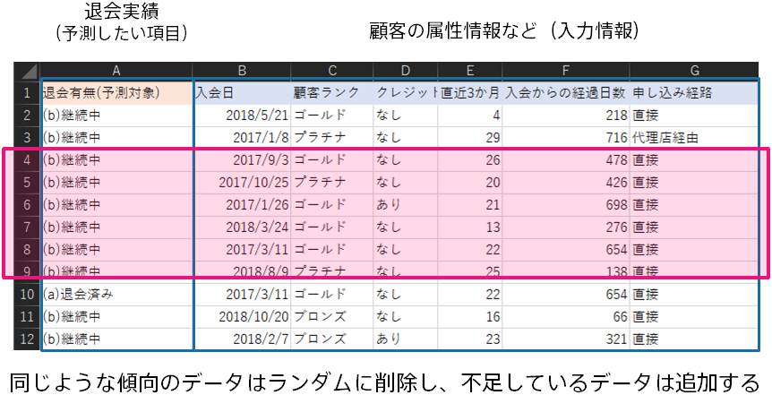

### 説明
精度は高いのに、予測モデルの作成に時間がかかる場合は、学習用データから一部の行を削除しましょう。
時系列予測モードで予測モデルの作成を行う場合は古いデータを削除しましょう。それ以外の予測モデルを作成する場合はランダムに削除しましょう。
学習用データの行数が十分に多い場合、データの行数をある程度減らしても、予測モデルの精度はあまり変わらないことが多く、予測モデルの作成時間も削減することができます。

### 関連資料

- {}

