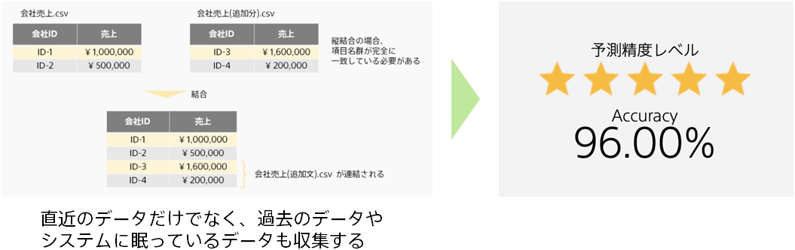

### 説明

予測モデル作成用データの行数が少ない場合は、予測モデルの精度が十分でない可能性があります。
データの行数を増やして予測モデルを再作成し、精度が改善するか確認しましょう。

一般的に、予測モデル作成用データの行数を増やせば増やすほど、精度は改善します。ただし、精度の改善幅は、データの行数が増えるほど緩やかになっていきます。どの程度まで精度を改善できるかはやってみないとわからないことが多いので、まずは試しましょう。
Prediction Oneでは、過去の実績データから将来を予測するため、少なくとも100行以上のデータが必要な場合が多いです。1000行～10万行程度のデータがあると精度が十分に発揮できる可能性が高くなります。

### 実施手順

1. 学習データにするための csv を開く
1. 追加できるデータを挿入、または、コピーし、保存する
1. データを追加・編集した csv を利用して、新規モデルの作成を実行する

### 関連資料

- {}
- {}
