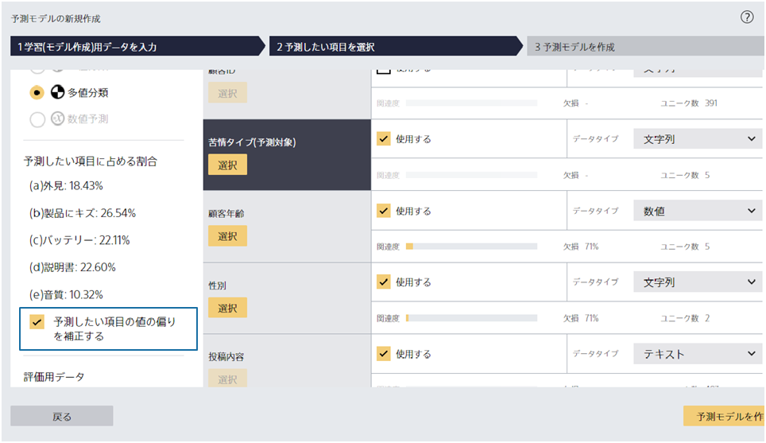

### 説明

予測したい項目に含まれる特定の値の分類精度が低く、正しく分類できていません。
その特定の値の行数を増やして予測モデルを再作成すると、精度が改善する可能性があります。

また、予測モデル作成前の詳細設定画面で「予測したい項目の値の偏りを補正する」にチェックを入れて予測モデルを再作成することで、特定の値の予測精度が悪い状況を緩和することができます。

### 関連資料

- {}

