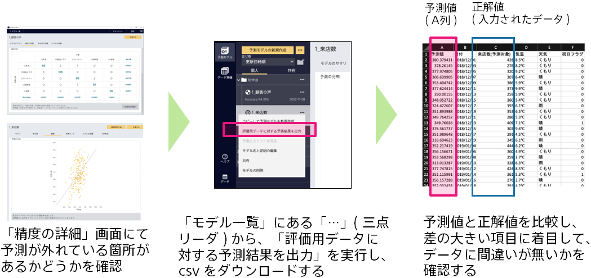

### 説明

予測結果が実際の値と大きく外れているデータを確認することで、精度が出ない理由がわかる場合があります。
モデル一覧から対象のモデルにある3点リーダーメニューの「評価用データに対する予測結果を出力」を選択すると、csvファイルがダウンロードできます。このファイルで予測結果と実際の値が外れている行を確認し、(1)予測が外れているデータを削除・修正したり、(2)正しい予測ができるようにするための項目を追加したりすることで、精度が向上する可能性があります。

(1)予測が外れているデータを削除・修正
不動産の成約価格(万円)を予測する際に、ある行に関して実際の成約価格を「1500万円」と入力すべき所を「15000000万円」と入力してしまったとします。このような行は予測と実際の値が大きく外れますが、単純な入力の誤りであることに気づけるので、データを削除・修正することで、精度改善が期待できます。

(2) 正しい予測ができるようにするための項目を追加
不動産の成約価格を予測する際に、ある物件が築年数が40年のため、予測結果は低く出ていますが、実際には高い価格で成約したことに気づいたとします。なぜこのように高い価格で成約したのかを調査してみると、この物件は最近リフォームされていることがわかりました。このような場合、全ての物件に関して、「リフォームの有無」という項目を追加することで、精度改善が期待できます。

### 実施手順

1. モデルの3点リーダーメニューの「評価用データに対する予測結果を出力」 によって出力された csv を開く
1. A 列の「予測値」と、予測したい項目の差分の大きい箇所を確認する
1. 問題となっているデータを修正、または、行の削除を行う
1. 修正した csv を利用して、学習モデルの作成を行う

### 関連資料

- {}

