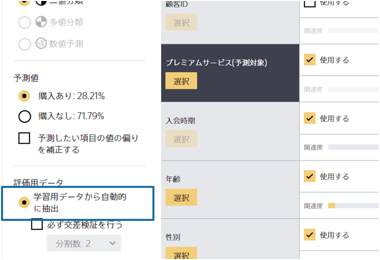
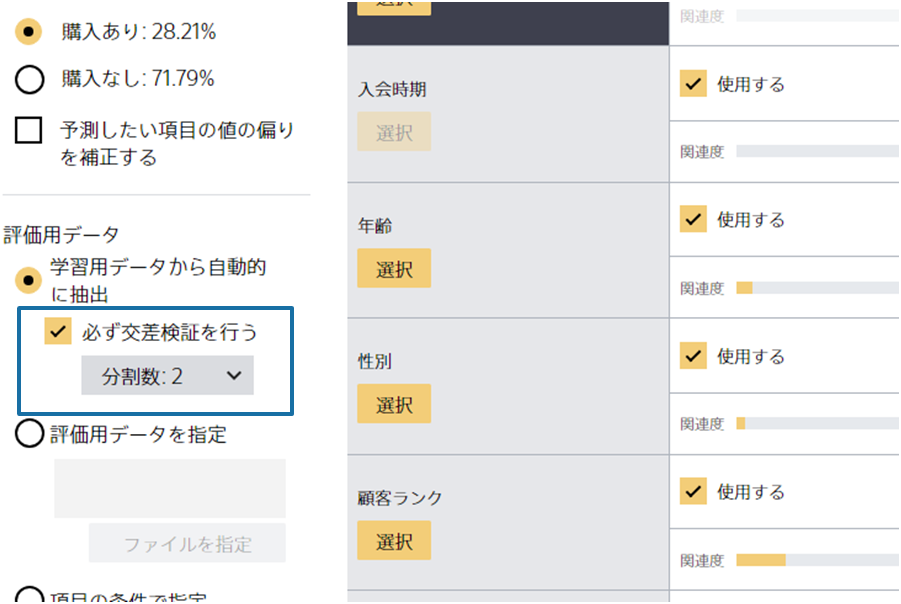
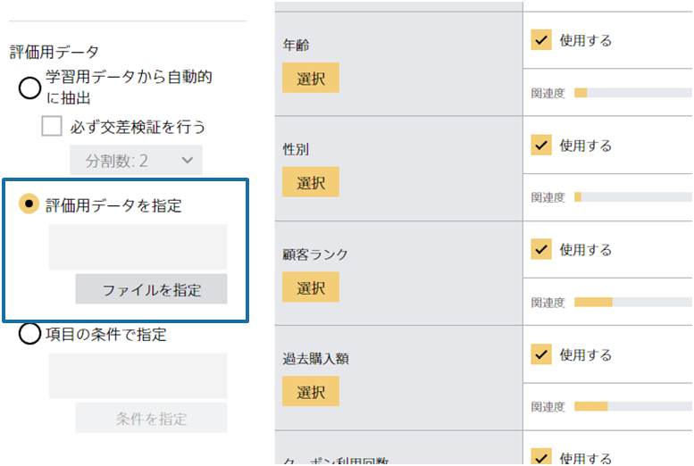
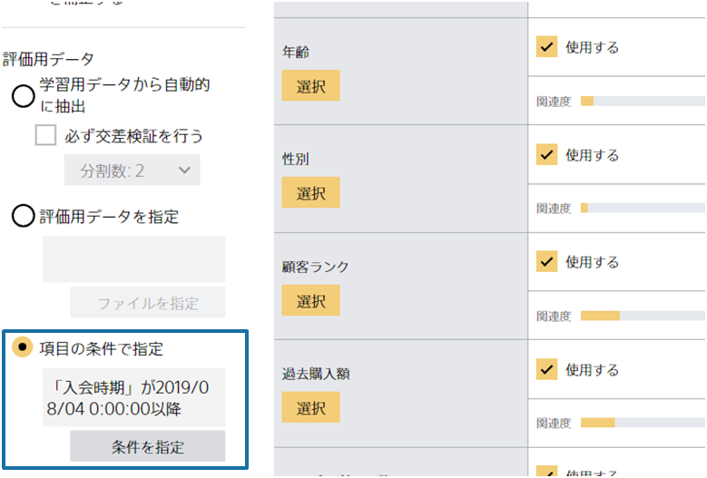

### 説明

予測分析 (機械学習) では手元のデータを**学習用データ**と**評価用データ**に分割することが一般的です。
Prediction Oneでも**学習用データ**と**評価用データ**を用いて予測モデルを作成・評価しています。

**学習用データ**は予測モデルを作成する際に使用されるデータです。 
予測モデルは**学習用データ**からデータに潜むパターンを見いだし、良い予測が行えるパラメータを決定します。 
予測モデルを作成した後、予測モデルの良し悪しを確認したくなりますが、もう一度同じデータ（**学習用データ**）を使って評価をしてしまうと、
カンニングをしたような状態になってしまいます。
なぜならば、予測モデルは**学習用データ**を参考に作成されたものであり、一度見たことがある問題に対しては答えやすいからです。 
そこで、これまで予測モデルが参考にしていないデータを用いて良し悪しを確認する必要があり、そのようなデータとして**評価用データ**を事前に用意しておく必要があります。

**評価用データ**は予測モデルの良し悪しを確認する際に使用されるデータです。 
評価データの選び方は

- 学習用データから自動的に抽出 (交差検証の選択なし)
- 学習用データから自動的に抽出 (必ず交差検証を行う)
- 評価用データを指定
- 項目の条件で指定

の4通りがあります。以下でそれぞれの選び方について説明します。それぞれの評価用データの選び方を把握し、自身に最適な方法で予測モデルを作成しましょう。 
「一番精度が良い評価用データの選び方を採用する」といった方法は不適切なので気を付けましょう。

##### 学習用データから自動的に抽出 (交差検証の選択なし)

「学習用データから自動的に抽出 (交差検証の選択なし) 」では、投入されたデータのうち約10%を評価用データとして自動的に抽出する方法です。 
このようにして抽出された評価用データは予測モデルの学習には用いられず、残された90%のみが学習用データとして使われます。

投入したデータが少ない場合（500行以下の場合）は、「学習用データから自動的に抽出 (交差検証の選択なし) 」を選んでも自動的に
「学習用データから自動的に抽出 (必ず交差検証を行う)」となります（モデルの詳細タブから確認できます）。
これはデータが少ない時は全体の約10%では評価用データが少なくなってしまい、データの選ばれ方によって評価値がぶれやすくなるためです。

##### 学習用データから自動的に抽出 (必ず交差検証を行う)

交差検証とは、与えられたデータを学習用と評価用に分割し、予測モデルの学習と評価を行う作業を、分割点を変えながら繰り返すことで、予測モデルの性能をより正確に検証する手法を指します。 
詳しくは{}を参考にしてください。

##### 評価用データを指定

上記の通り、Prediction Oneは自動的に評価用データを抽出できますが「評価用データを指定」から自らが用意した評価用データも使用できます。
自動では適切な評価用データが抽出されないと考えられる場合はこちらを使いましょう。

自動で適切な評価用データが抽出されない例として以下の3つの条件がそろっている状況を考えてみます。

- 毎年傾向が変わるデータである
- 現在 (2022年) までに手に入っているデータから来年のことを予測したい
- 現在2022年までのデータが手に入っている

このような状況の場合は、2022年までのデータ全てをPrediction Oneに入力して、評価用データを自動的に抽出させるべきではありません。 
自動的に抽出では投入されたデータを学習用データと評価用データに分割する際、全体から万遍なくそれぞれのデータを抽出します。
なので、例えば2020年のデータは学習用データにも評価用データにも含まれることになります。
上から90%を学習用データ、下から10%を評価用データ、という分割はされません。 
一方、現実では2022年現在に2023年のことを予測しようとしており、かつ毎年傾向が変わる特徴があります。
毎年傾向が変わる状況において、2022年までの情報から2023年を予測することは難しいと考えられますが、
自動的に抽出の方法だと、例えば2020年のデータの一部を知ったうえで2020年の残りのデータを評価用データとして評価しています (同じことがすべての年で起こります)。 
ですので、現実の難しさを反映していない評価方法となり、予測モデルの精度が過大評価されてしまいます。

このような場合は、例えば、2020年までのデータを学習用データに、2021年と2022年のデータを評価用データにしてみましょう。
こうすることでより現実の問題設定に近い評価を行えることになります。

（3つの条件のうち「毎年傾向が変わるデータである」といった特徴がない場合は、自動的に抽出する方法で問題はありません）

##### 項目の条件で指定

ある1つの項目の値を基に学習用データと評価用データへの振り分けを設定することもできます。
上記で「2020年までのデータを学習用データに、2021年と2022年のデータを評価用データに」という例を挙げましたが、
事前に2つのcsvを用意しなくてもこの機能から年を条件に指定することで学習用データと評価用データの分割が行えます。

### 関連資料

- {}

