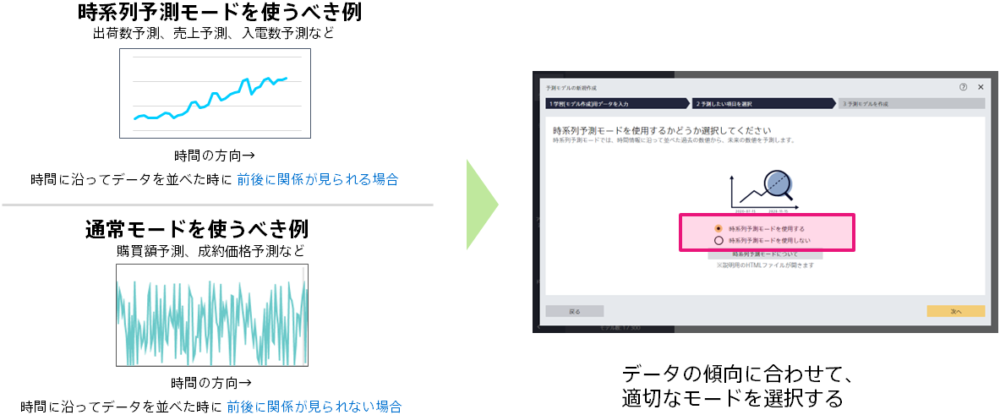

### 説明

データを時間に沿って並べた時、予測したい項目の並びに時間的な関係がある場合は、時系列予測モードを使用すると精度が改善したり、評価結果の信頼性が高まる可能性があります。

時系列予測モードを使うべき例
- データを時間に沿って並べたとき、予測したい項目が徐々に増加/減少したり、周期的に変化したりする場合は、時系列予測モードを使用すべきです。(出荷数予測、売上予測など)

通常の数値予測を使うべき例
- データを時間に沿って並べてみたとき、予測したい項目に一定の傾向が見られない場合は、通常の数値予測を使用すべきです。(購買額予測、成約価格予測など)

### 関連資料

- {}
- {}

