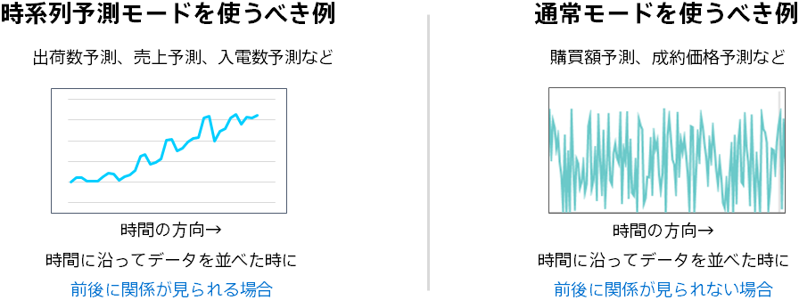

### 説明

このモデルでは時系列予測モードを使用して予測モデルの作成を行っています（時系列予測の詳細については{}）。
時系列予測モードを使用すると、過去の予測したい項目の値や時間情報（季節・曜日・午前や午後などの時間からわかる情報）を利用した予測をするようになります。
データを時間に沿って並べてみたとき、予測したい項目の並びに時間的な関係がある場合、時系列予測モードをご利用ください。
一方で時間に沿ってデータを並べてみても前後に関係が見られない場合は、通常の数値予測が適している可能性もあります。このような場合は通常の数値予測も試してみましょう。

### 関連資料

- {}

