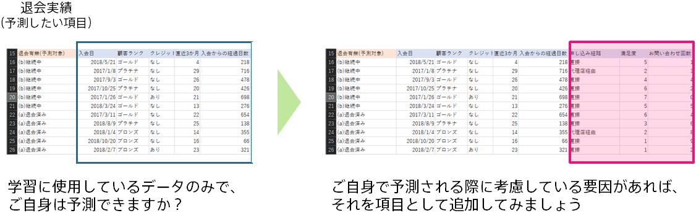

### 説明

Excelなどを使用して予測モデル作成用データを眺め、ちゃんと予測ができそうかを確認しましょう。データを確認することで、(1)データの誤りに気づいたり、(2)追加すべきデータに気づく場合があります。

(1) データの誤り
データ内容や形式が期待している通りかご確認ください。データ準備の際のミスによりデータが途中からずれたり、欠損している場合があります。それらを修正することで、精度が改善する可能性があります。

(2) 追加すべきデータ
ご自身が予測モデル作成用データだけを見て予測できるか実際に試します。このデータだけでは予測できないと思った場合、どういったデータがあれば予測できるのか考え、そのデータを追加することで、精度改善が期待できます。

### 実施手順

1. 学習用データの csv を開く
1. 予測したい項目以外のデータから、予測したい項目をご自身の経験で予測できるかどうかを確認する
1. 正解を導けない場合には、 csv に不足しているご自身の知識が存在していることになるため、csv に項目を追加する

### 関連資料

- {}
- {}

