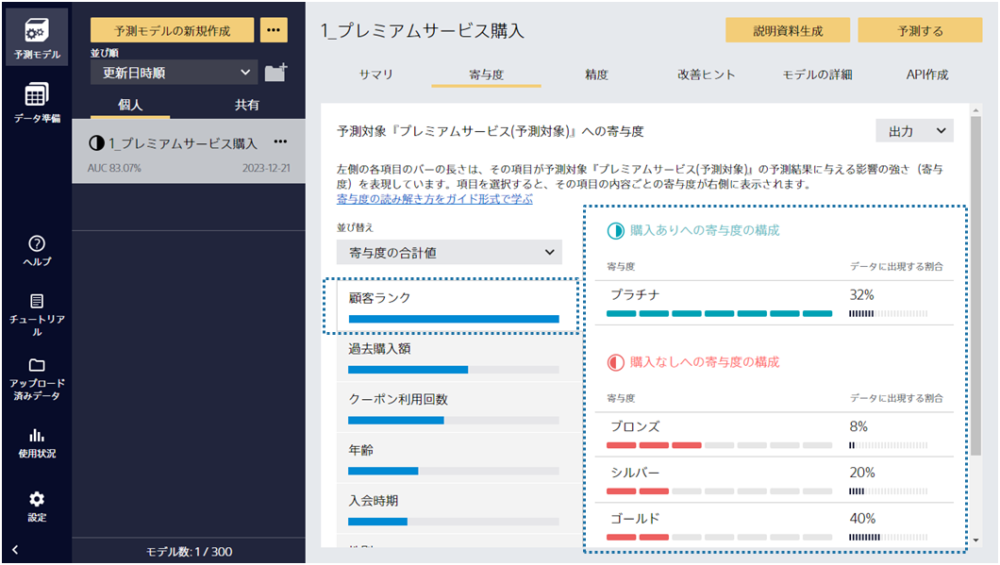

### 説明

Prediction Oneは、何か予測したい対象を一つ選び、それを予測する予測モデルを作成し、未知のデータについて予測対象を予測分析するツールです。
しかし、どの項目が予測対象への影響度が強いのかを分析したい場合は、「寄与度」画面から影響度の強い項目を確認できます。
次のアクションを起こす際に影響度の強い項目から順番に施策を行うことで、効率的に予測対象を改善できると考えられます。

例えば、チュートリアルの{}を見てみます。 
このチュートリアルでは顧客ランクの寄与度が最も高いことが分かり、かつ顧客ランクがプラチナだと購入ありになる傾向があると分かります
 ({}のステップ4参照)。
このことからプレミアムサービスの購入確率を上げるには顧客ランクをゴールドやシルバーからプラチナに上げる施策が効果的であると読み取れます。

寄与度の活用方法について、詳しくは以下の関連資料をご覧ください。

### 関連資料

- {}
- {}
- {}
- {}

