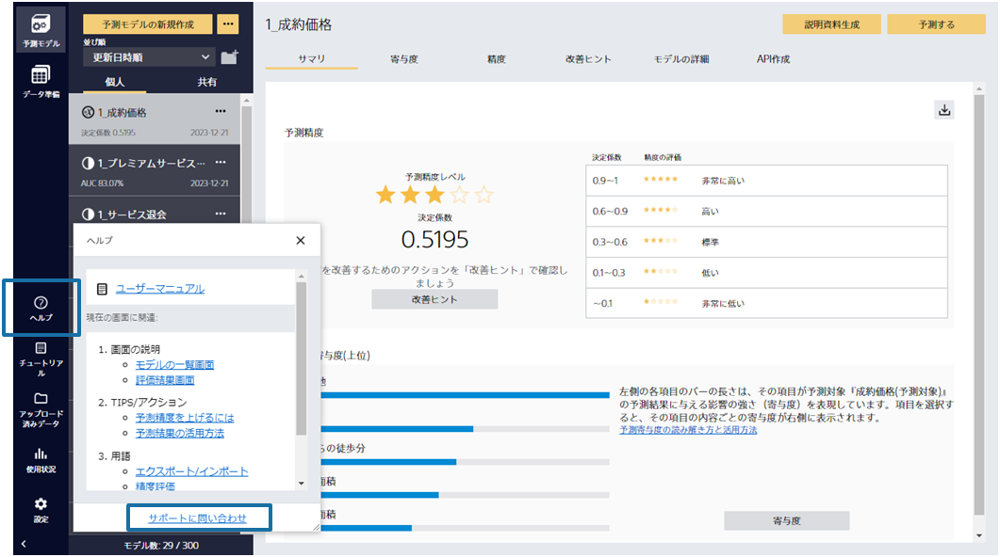

### 説明

ヒントを見て予測モデルを再度作成しても思うように精度が改善しない場合は、問い合わせを活用しましょう。改善の糸口が見つかるかもしれません。 
問い合わせは、Prediction Oneアプリ画面の左のサイドバーにある「ヘルプ」ボタンを押して現れるポップアップの下部にある「サポートに問い合わせ」から行えます。

### 実施手順

1. Prediction Oneアプリ画面の左のサイドバーにある「ヘルプ」ボタンを押す
1. ポップアップが現れる
1. ポップアップ下部の「サポートに問い合わせ」から問い合わせる

