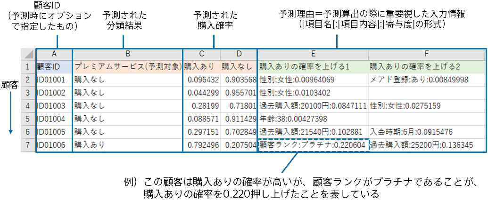

### 説明

予測精度が悪い場合でも、一部の予測については活用できる場合があります。 
例えば、予測確率が高い順に並び替えたとき上位10%程度であれば、精度良く予測できている可能性があります。

以下の画像は{}での予測結果です。
このうち購入ありの確率が高い順番に並び替えて、上位のみをビジネスアクションに繋げると、全体の精度が悪かったとしてもビジネスアクションに繋げた顧客については精度が良い可能性があります。

### 関連資料

- {}

