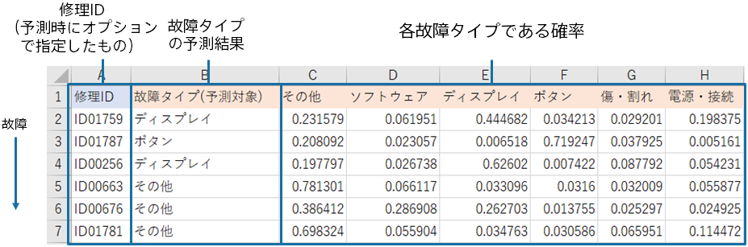

### 説明

予測精度が悪い場合でも、一部の予測については活用できる場合があります。
例えば、他のクラスに比べてある一つのクラスの予測確率が著しく高い場合のみ活用すると、精度良く予測できている可能性があります。

以下の画像は{}での予測結果です。
3行目のID01787の予測結果を確認するとボタンである確率が0.719と他のクラスより著しく高いことが分かります。
このように他のクラスよりも予測確率が著しく高いサンプルに絞って予測結果を利用すると、精度が良いものに絞って活用できる可能性があります。

### 関連資料

- {}

