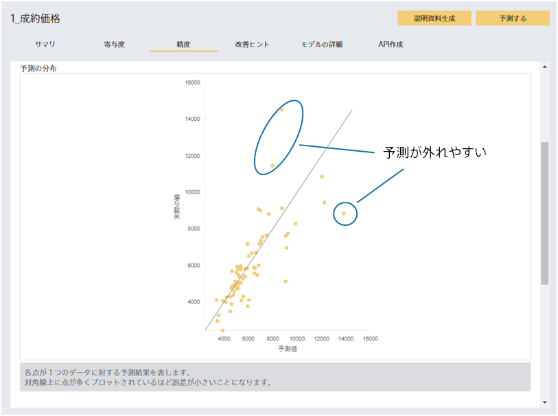

### 説明

予測精度が悪い場合でも、一部の予測については活用できる場合があります。
例えば、頻出する数値の範囲に絞ってみると、精度良く予測できている可能性があります。

以下の画像は{}のチュートリアルでの
{}です。
グラフを見ると不動産価格が高い領域では予測と実際の値が離れやすい傾向にあることが分かります。
このような場合は、予測値が高い場合はPrediction Oneの予測だけでなく人の目も使って確認をすると良いでしょう。

(※時系列予測では画像のような予測の分布が表示されませんが、Excelを使って似たようなグラフを描画することで特に精度の悪い領域を特定できます。)

### 関連資料

- {}

