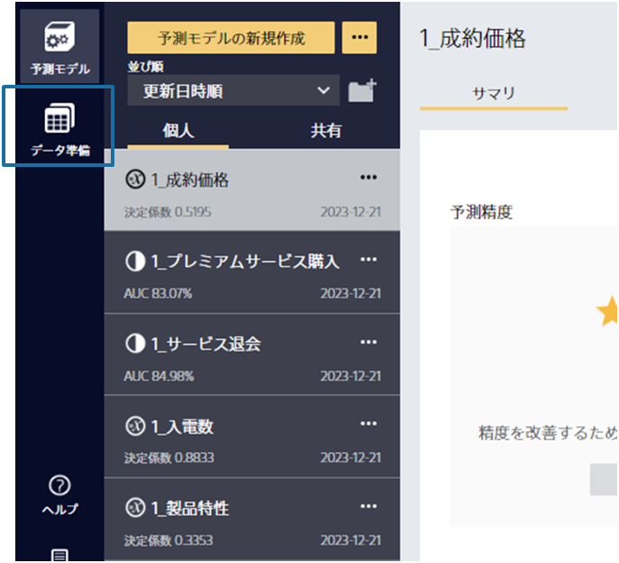

### 説明

データ準備機能は、エクセルの複雑な処理やプログラミングの代わりに、自由にデータ各処理を組み立てられ、モデル作成用のデータを簡単に準備できます。 
データが複数のファイルで管理されていたり、新たな項目を既存の項目から作成したい場合 (例：入会日と退会日から在籍日数の項目を追加) などにデータ準備機能が活用できます。

データ準備機能の詳細は以下から確認できます。

### 関連資料

- {}

