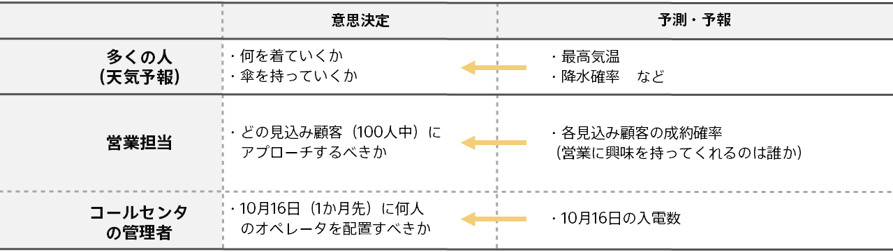
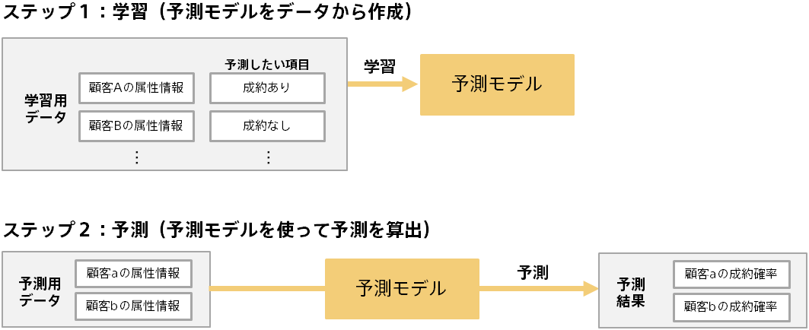
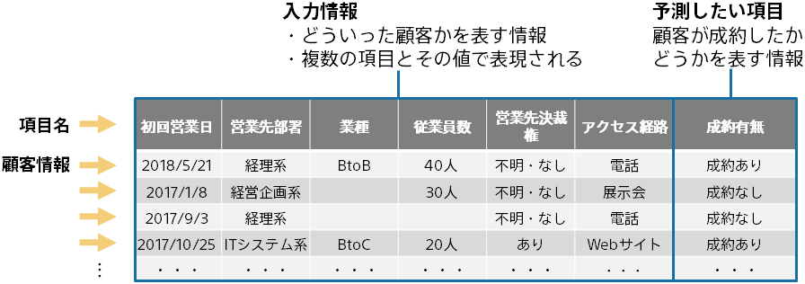
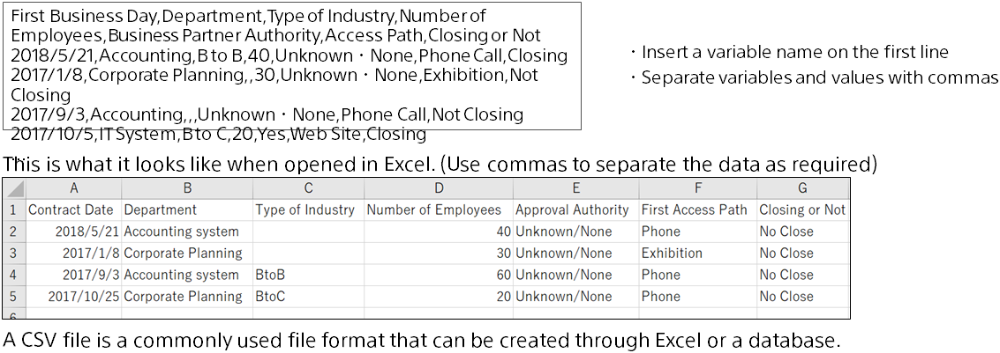
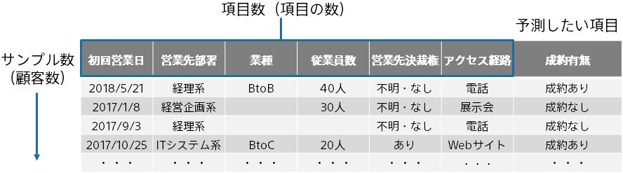
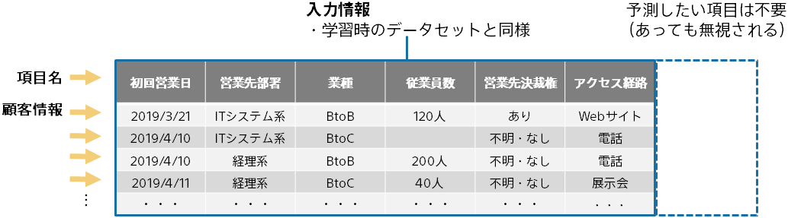

{}

To conduct predictive analytics in Prediction One, a **_{}_**(training data and prediction data) is required.
This document explains how to create datasets.

\*A large sample dataset is included with Prediction One. See the tutorial for interesting examples. See <b>{}</b> for information on how to open a tutorial.

{}

{}

Predictive analytics is an analysis method that uses AI technology to predict future results based on past performance data.  
Predictive analytics is like a weather forecast in business.  
Predictive analytics enables faster and more efficient decision-making in many aspects of your business.  

It has a wide range of applications and brings efficiency to a wide range of operations including marketing, production management, customer support and assessment.
{}

{}

Predictive analytics involves two steps: learning and predicting. The following is an example of predicting a customer's contract from actual contract data.  

{}

{}

Prepare data with the variables of input information and the variables that represent the actual results you want to predict. The following is an example of a close prediction. 

Prediction One can handle dates, strings, numbers, and text. Any necessary preprocessing is done automatically, such as leaving the unknown blank.
If you would like to see how datasets are used inside Prediction One, see "{}".
{}

{}

Prepare the dataset as a csv file (comma-delimited text file) or as a tsv file (tab-delimited text file). 

If you would like to learn more about topics such as the timestamp formats that can be used in datasets, see {}".{}

{}

In predictive analytics, the accuracy of predictions is determined by the scale and quality of the prediction model creation (training) data used to create the prediction model.

- The more rows, the more accurate the prediction. It needs at least 100.
- The more variables, the more accurate the prediction. You need to prepare variables related to the variable you want to predict. You should not include variables that are not clearly related to the variable you want to predict.
- You don't know how accurate your dataset is until you actually learn. Prediction One makes learning easy, so try it when you're ready.
  {}

{}

So far, we have discussed the prediction model creation (training) data required for learning (prediction model creation). 
When you create a prediction model and use it to obtain prediction results, you prepare data for prediction. 
Prepare the same input variables as the prediction model creation (training) data for the target you want to predict. You don't need the variable you want to predict. 

In this example, the close probability is predicted for the customer in the prediction data.
{}

{}

Dataset (data for prediction and prediction model creation (training)) was explained in this document.
In predictive analytics, it is not an exaggeration to say that the accuracy of prediction is determined by the dataset, and it is very important to prepare and create the dataset.
However, it's hard to get a perfect dataset up first, so start by creating as many datasets as you can easily prepare and running Prediction One.
 

##### Dataset Checklist

- For the target you want to predict (Days you want to predict customers and incoming calls), is the input information and the variable you want to predict written?
- Do you have multiple inputs related to the variable you want to predict?
- Whether the dataset was created or saved as a csv file (comma-delimited text file) or as a tsv file (tab-delimited text file)
- csv files have a ".csv" extension, and tsv files have a ".tsv" extension.
- Whether the first line is a variable name
- Indicates whether the number of items in the data on and after line 2 is the same (For example, does the first line have 4 items, but one line has 5 items, and so on?)
- 100 or more rows
  {}
