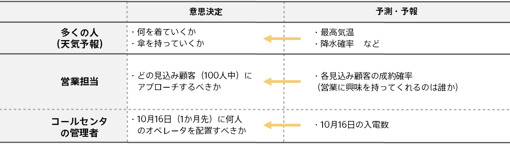
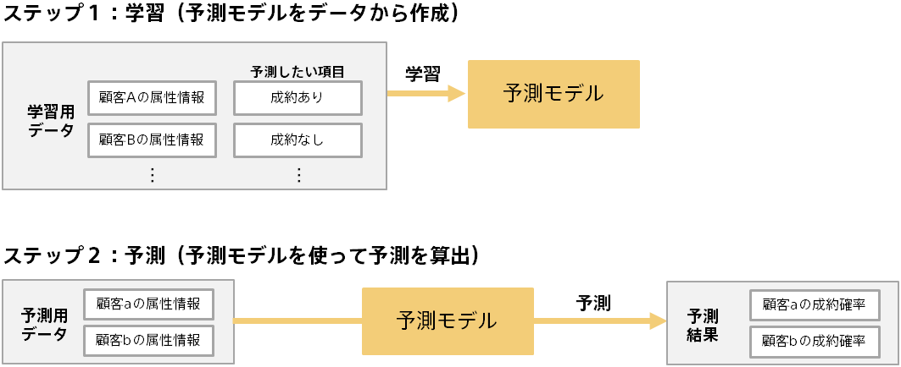
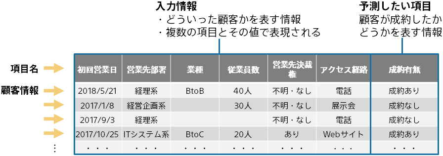
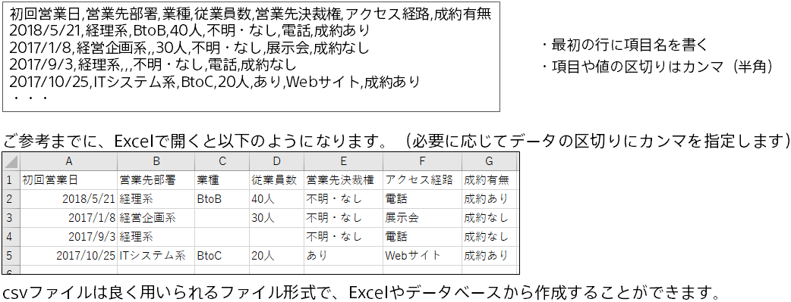
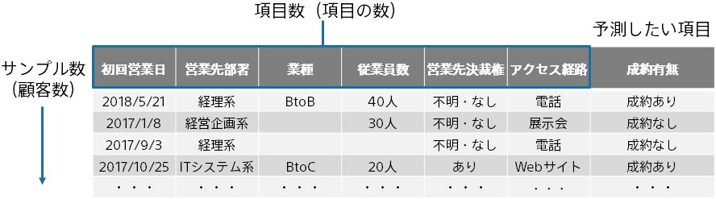
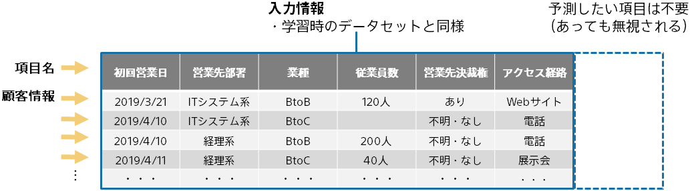

{}

Prediction One で予測分析を行うには、**_{}_**(学習用データと予測用データ)が必要になります。
本資料では、データセットの作り方についてご説明します。

※Prediction One では豊富なサンプルデータセットが同封されています。チュートリアルから興味のある例をご参照ください。チュートリアルの開き方については<b>{}</b>をご参照ください。

{}

{}

予測分析とは、AI 技術を活用し、過去の実績データに基づき将来の結果を予測する分析手法です。  
予測分析はビジネスにおける天気予報のようなものです。  
予測分析を行うことにより、ビジネスの多くの場面で意思決定がより早く且つ効率的にできるようになります。  

応用範囲は広く、マーケティング・生産管理・顧客サポート・査定など、幅広い業務で効率化をもたらします。
{}

{}

予測分析では、学習と予測という２つのステップがあります。以下は成約実績データから顧客の成約予測を行う例です。  

{}

{}

入力情報の項目と、予測したい対象の実績を表す項目を持つデータを用意します。 以下は、成約予測の例です。 

Prediction One では、日付、文字列、数値、テキストを扱うことができます。不明部分は空欄でよいなど、 必要な前処理は自動的に行います。
データセットが Prediction One 内部でどの様に利用されるかをご覧になりたい方は「{}」をご参照ください。
{}

{}

データセットは、csv ファイル（カンマ区切りのテキストファイル）か、tsv ファイル（タブ区切りのテキストファイル）として用意します。 

データセットで使用できるタイムスタンプのフォーマットなどの詳細をご覧になりたい方は「{}」をご参照ください。{}

{}

予測分析では、予測モデルの作成に利用した予測モデル作成(学習)用データの規模・質によって、予測の精度が決まってきます。

- 行数は多ければ多いほど、予測精度は高くなります。最低 100 個は必要です。
- 項目数も多ければ多いほど、予測精度は高くなる傾向にあります。予測したい項目に関係のある項目を準備する必要があります。明らかに予測したい項目に関係のない項目は含めない方が良いです。
- 準備したデータセットでどの程度の予測精度がでるかは、実際に学習をやってみないとわからないところがあります。 Prediction One では簡単に学習を実行することができるので、準備できた範囲で試してください。
  {}

{}

これまで、学習（予測モデル作成）に必要な予測モデル作成(学習)用データについてご説明しました。 
予測モデルを作成し、それを利用して予測結果を得る際には、予測用データを用意します。 
予測したい対象について、予測モデル作成(学習)用データと同じ入力項目を用意します。予測したい項目は不要です。 

この例では、予測用データに含まれる顧客に対して、成約確率が予測されます。
{}

{}

本資料ではデータセット(予測モデル作成(学習)用データ、予測用データ)について説明しました。
予測分析においては、データセットによって予測精度が決まると言っても過言ではなく、データセットの準備・作成は非常に重要です。
とはいえ、最初に完璧なデータセットを準備するのは大変なので、まずは簡単に準備できる範囲でデータセットを作成し、 Prediction One を動かしてみてください。
 

##### データセットチェックリスト

- 予測したい対象（顧客や入電数を予測したい日）について、入力情報と予測したい項目が書かれているか
- 予測したい項目に関連のある入力情報を複数用意できているか
- データセットを csv ファイル（カンマ区切りのテキストファイル）か tsv ファイルで（タブ区切りのテキストファイル）作成・保存したか
- csv ファイルであれば、ファイルの拡張子が”.csv”、tsv であれば”.tsv”になっているか
- 先頭の行が項目名になっているか
- ２行目以降のデータの項目数が同じか（例：１行目が４項目なのにある行では 5 項目ある、などがないか）
- 行数が 100 以上あるか
  {}
