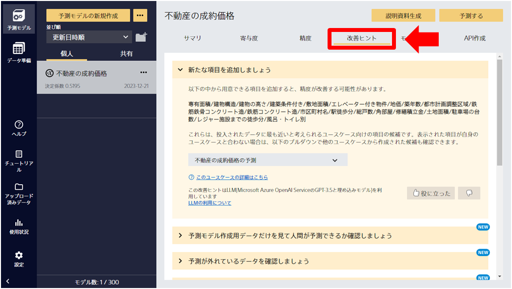

{}

v1.7 (2022年12月) よりも古い Prediction One を使用して生成された予測モデルは、再学習を行うことでヒントが表示されます。 
学習用データのサイズが 20MB を超える場合は、ヒントが毎回同一となる可能性があります。 

{}

{}
ヒント機能は、モデル精度向上をするために、ヒントを提供する機能です。

例えば、データの量に課題がある場合、データ量を増やすようなヒントを促し、精度向上するために有益な提供をいたします。
Prediction Oneでは自社データでAI予測モデルを容易に作成できますが、予測モデルを実際に活用するには一定以上の予測精度が必要になります。
しかし、予測精度改善を進めるにはノウハウや経験が必要なことが多く、データサイエンティストのアドバイスを必要とするケースが多くありました。

今回追加するヒント機能では、弊社の豊富なコンサルティングから得たノウハウをもとに、データサイエンティストが実施するであろう精度改善施策やチェックポイントを分析対象のデータや予測精度の状況に合わせてリストアップして提示します。これによりデータサイエンティストのコンサルティングを受けることに近い体験を提供いたします。

ご利用方法については、{}をご参照ください。

{}

