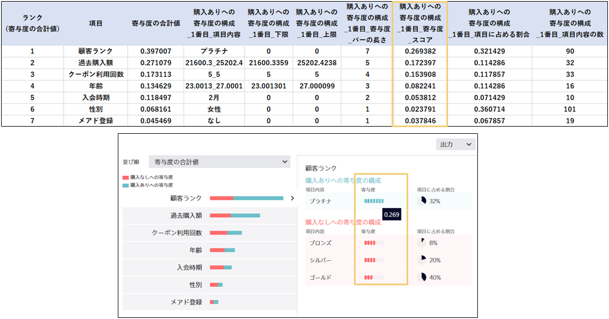

{}

This document describes outputting predictive contribution in csv format. For a description of how to read the predictive contribution, refer to {}. 
The predictive contribution may make it easier to explain the results of the predictive analytics to interested parties in a way they can understand.
If you wish to use the predictive contribution figures when producing documentation, for example, you can export the data as a csv file for your use. 
Below is a description of the correlation between the contents of the screen and the output csv for

 - Binary Classification
 - Multiclass Classification
 - and Regression (Time Series Prediction)

respectively. 
The contents displayed for any prediction type<u> will be saved to csv</u>.

{}

{}

Here an explanation is given using the "{}" 
row sorted by "total value of contribution". 
When this is done, each item in the csv output is as follows.
 - Rank (total value of contribution)
 - Item
 - Total value of contribution
 - Composition_of_contribution_to_purchased(no purchase)_#n_item_content
 - Composition_of_contribution_to_purchased(no purchase)_#n_lower limit
 - Composition_of_contribution_to_purchased(no purchase)_#n_upper limit
 - Composition_of_contribution_to_purchased(no purchase)_#n_contribution_bar_length
 - Composition_of_contribution_to_purchased(no purchase)_#n_contribution_score
 - Composition_of_contribution_to_purchased(no purchase)_#n_item_proportion
 - Composition_of_contribution_to_purchased(no purchase)_#n_item_content_number

Note that n is from 1 to 3.

#### Rank (total value of contribution)
"Rank (total value of contribution)" is the number of each item’s order on the contribution details screen.

#### Item
"Item" is each item that appears on the contribution details screen.

#### Total value of contribution
The "total value of contribution" is the number displayed on mouseover of the bar for each item. This figure is a combination of the contribution to "no purchase" and the contribution to "purchased". 
Below is an example of a mouseover of the customer rank bar.

#### Composition_of_contribution_to_purchased(no purchase)_#n_item_content
"Composition_of_contribution_to_purchased(no purchase)_#n_item_content" is the item details displayed on the right side of the screen when each item is clicked.
In the case of numeric items, such as past purchase amounts, the lower and upper limits of the range are output separated by "_ (underscore)".

#### Composition_of_contribution_to_purchased(no purchase)_#n_lower limit (and upper limit)
Composition_of_contribution_to_purchased(no purchase)_#n_lower limit (and upper limit) represents the lower and upper limits when the item content is numeric.
If it is not a number, 0 will be entered.

#### Composition_of_contribution_to_purchased(no purchase)_#n_contribution_bar_length
"Composition_of_contribution_to_purchased(no purchase)_#n_contribution_bar_length" is length of the bar for the content of each item shown in a 7-level display. 

#### Composition_of_contribution_to_purchased(no purchase)_#n_contribution_score
"Composition_of_contribution_to_purchased(no purchase)_#n_contribution_score" is the actual value displayed on mouseover of the bar for the content of each item shown in the 7-level display.

#### Composition_of_contribution_to_purchased(no purchase)_item_proportion
"Composition_of_contribution_to_purchased(no purchase)_item_proportion" is the proportion of the total training data made up of the content of each item.

#### Composition_of_contribution_to_purchased(no purchase)_#n_item_content_number
"Composition_of_contribution_to_purchased(no purchase)_#n_item_content_number" is the number of the content of each item within the training data.
While this is not displayed on any part of the screen, the content of the display means the same thing as the proportion of the item.

This explanation was based on sorting the column by "total value of contribution", but the method of csv output is the same for "purchased in descending order of contribution" and "no purchase in descending order of contribution".

{}

{}

Here an explanation is given using the "{}"
with the filter set to "show all". 
When this is done, each item in the csv output is as follows.
 - Rank (show all)
 - Item
 - Contribution to overall prediction value increase
 - Classification
 - Prediction_value_increase_#n_item_content
 - Prediction_value_increase_#n_lower_limit
 - Prediction_value_increase_#n_upper_limit
 - Prediction_value_increase_#n_contribution_bar_length
 - Prediction_value_increase_#n_contribution_score
 - Prediction_value_increase_#n_proportion
 - Prediction_value_increase_#n_item_content_number

Note that n is from 1 to 3.

#### Rank (show all)
"Rank (show all)" is the number of each item’s order on the contribution details screen.

#### Item
"Item" is each item that appears on the contribution details screen.

#### Contribution to overall prediction value increase
"Contribution to overall prediction value increase" is the number displayed on mouseover of the bar for each item. In this case, the problem is to classify into five categories, so there are five identical values in a row. 
Below is an example of a mouseover of the post content bar.

#### Classification
The "classification" is the value (i.e., the classification target) contained in the item you wish to predict in the multiclass classification. In this case, the problem is to classify into five categories, so there are five values in a row.

#### Prediction_value_increase_#n_item_content
"Prediction_value_increase_#n_item_content" is the item details displayed on the right side of the screen when each item is clicked.
In the case of numeric items, such as customer age, the lower and upper limits of the range are output separated by "_ (underscore)".

#### Prediction_value_increase_#n_lower_limit (and upper limit)
"Prediction_value_increase_#n_lower_limit (and upper limit)" represents the lower and upper limits when the item content is numeric.
If it is not a number, 0 will be entered.

#### Prediction_value_increase_#n_contribution_bar_length
"Prediction_value_increase_#n_contribution_bar_length" is length of the bar for the content of each item shown in a 7-level display. 

#### Prediction_value_increase_#n_contribution_score
"Prediction_value_increase_#n_contribution_score" is the actual value displayed on mouseover of the bar for the content of each item shown in the 7-level display.

#### Prediction_value_increase_#n_proportion
"Prediction_value_increase_#n_proportion" is the proportion of the total training data made up of the content of each item.

#### Prediction_value_increase_#n_item_content_number
"Prediction_value_increase_#n_item_content_number" is the number of the content of each item within the training data.
While this is not displayed on any part of the screen, the content of the display means the same thing as the proportion of the item.

This explanation assumes the filter is set to "show all", but the method of csv output is the same for "(a) Appearance," "(b) Scratches on the product," "(c) Battery," "(d) Instructions," and "(e) Sound quality" (the type of value contained in the item you want to predict).

{}

{}

The csv output for numerical prediction (time series prediction) is as follows.
 - Rank (total value of contribution)
 - Item
 - Total value of contribution
 - Prediction_value_increase(decrease)_#n_item_content
 - Prediction_value_increase(decrease)_#n_lower_limit
 - Prediction_value_increase(decrease)_#n_upper_limit
 - Prediction_value_increase(decrease)_#n_contribution_bar_length
 - Prediction_value_increase(decrease)_#n_contribution_score
 - Prediction_value_increase(decrease)_#n_proportion
 - Prediction_value_increase(decrease)_#n_item_content_number

Note that n is from 1 to 3.

These items have the same correlation with the csv output of contributions in binary classification, so please refer to csv output of contributions in binary classification for details.

This explanation was based on sorting the column by "total value of contribution", but the method of csv output is the same for "prediction value increase in descending order of contribution" and "prediction value decrease in descending order of contribution". 
For a time series prediction, there may be series as well as sort order in the pull-down that displays contribution details.
In this case, as before, the contents displayed will be output to csv, depending on the selection of these (order and series).

{}