{}

本資料では、予測寄与度のcsv出力について説明します。予測寄与度についての説明は{}をご参考ください。 
予測寄与度があると予測分析の結果を関係者に説明する際に理解が得られやすくなることがあります。
資料作成で予測寄与度の数値を使用したい場合などに、csv出力して活用して下さい。 
以下では、

 - 二値分類
 - 多値分類
 - 数値予測 (時系列予測)

についてそれぞれ画面の内容と出力されるcsvの内容の対応関係について説明します。 
どの予測タイプでも<u>表示されている内容がcsvに保存されます</u>。

{}

{}

「{}」の例で
並び順を「寄与度の合計値」にした場合で説明します。 
この時、csv出力される各項目は以下の通りです。
 - ランク(寄与度の合計値)
 - 項目
 - 寄与度の合計値
 - 購入あり (なし) への寄与度の構成_n番目_項目内容
 - 購入あり (なし) への寄与度の構成_n番目_下限
 - 購入あり (なし) への寄与度の構成_n番目_上限
 - 購入あり (なし) への寄与度の構成_n番目_寄与度_バーの長さ
 - 購入あり (なし) への寄与度の構成_n番目_寄与度_スコア
 - 購入あり (なし) への寄与度の構成_n番目_データに出現する割合
 - 購入あり (なし) への寄与度の構成_n番目_項目内容の数

なお、n は 1～3 です。

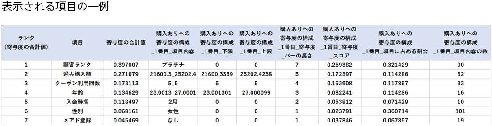

#### ランク(寄与度の合計値)
「ランク(寄与度の合計値)」は、寄与度画面に出てくる各項目の順番の数字です。
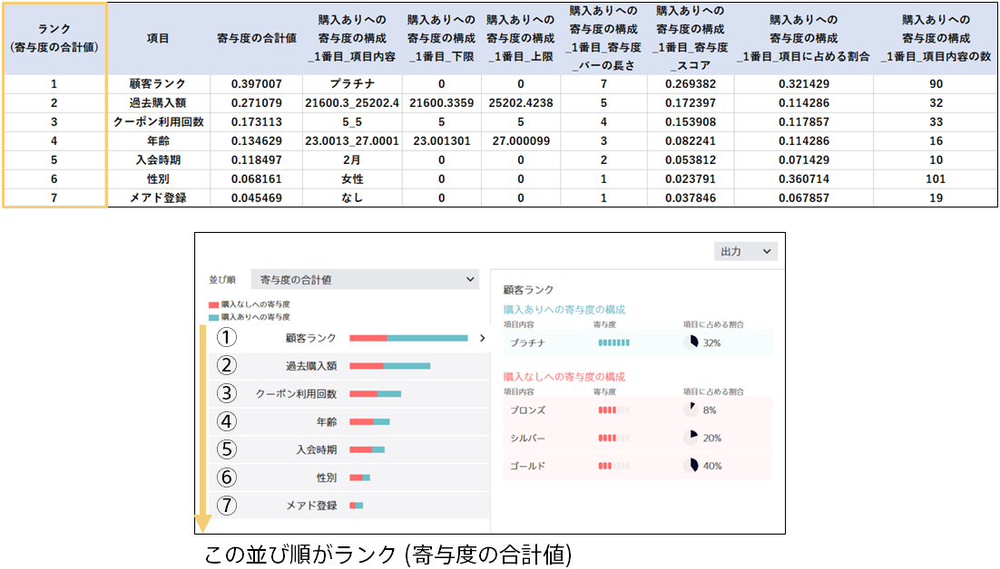

#### 項目
「項目」は、寄与度画面に出てくる各項目です。
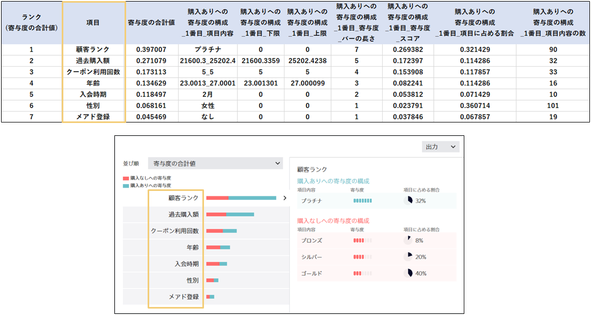

#### 寄与度の合計値
「寄与度の合計値」は、各項目のバーをマウスオーバーしたときに表示される数値です。購入なしへの寄与度、購入ありへの寄与度が合わさった数値となります。 
下は顧客ランクのバーをマウスオーバーした際の例です。
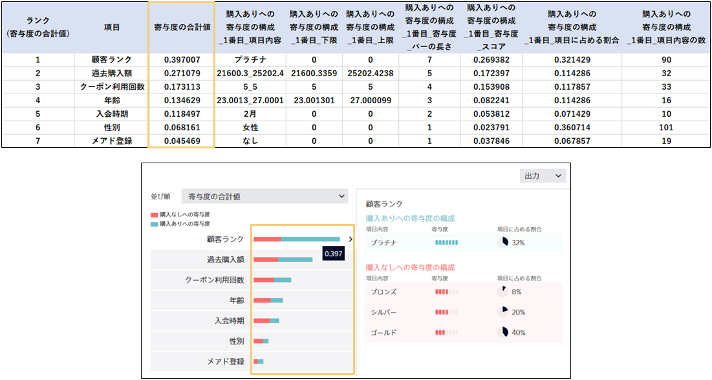

#### 購入あり (なし) への寄与度の構成_n番目_項目内容
「購入あり (なし) への寄与度の構成_n番目_項目内容」は、それぞれの項目をクリックし右側の詳細を表示させたときの項目内容です。
過去購入額のように数値の項目の場合、その範囲の下限と上限が「_ (アンダーバー)」区切りで出力されます。
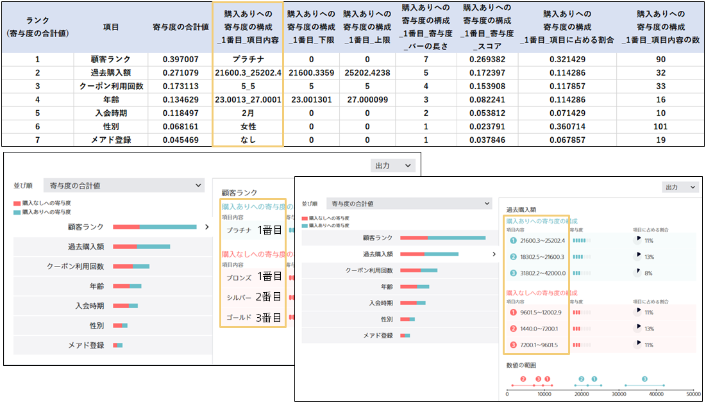

#### 購入あり (なし) への寄与度の構成_n番目_下限 (と上限)
「購入あり (なし) への寄与度の構成_n番目_下限 (と上限)」は、項目内容が数値である場合の下限と上限です。
数値でない場合は、0 が入ります。
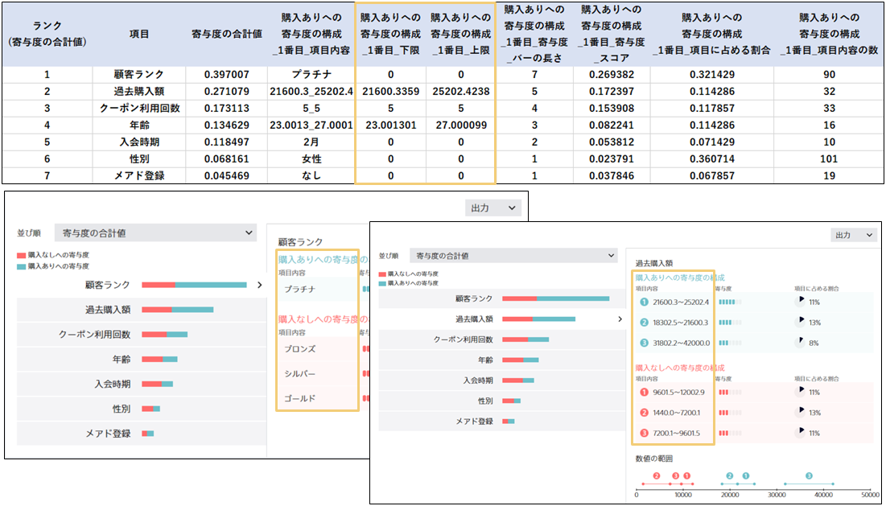

#### 購入あり (なし) への寄与度の構成_n番目_寄与度_バーの長さ
「購入あり (なし) への寄与度の構成_n番目_寄与度_バーの長さ」は、7段階表示で示される各項目内容のバーの長さです。 
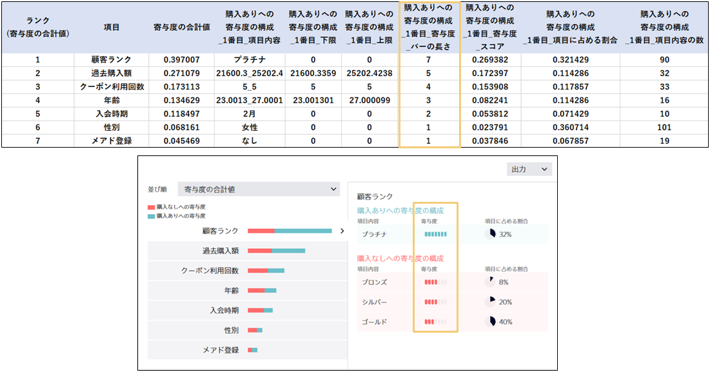

#### 購入あり (なし) への寄与度の構成_n番目_寄与度_スコア
「購入あり (なし) への寄与度の構成_n番目_寄与度_スコア」は、7段階表示で示される各項目内容のバーをマウスオーバーしたときに表示される実際の値です。
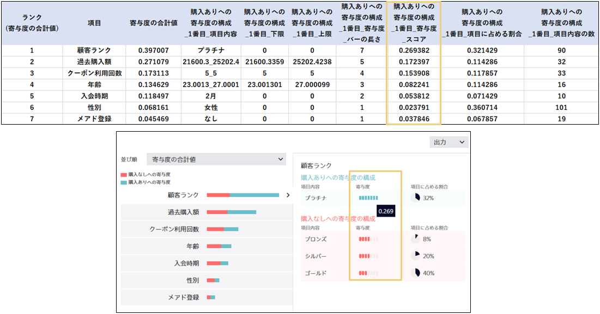

#### 購入あり (なし) への寄与度の構成_n番目_データに出現する割合
「購入あり (なし) への寄与度の構成_n番目_データに出現する割合」は、それぞれの項目内容が学習データ中に占める割合です。
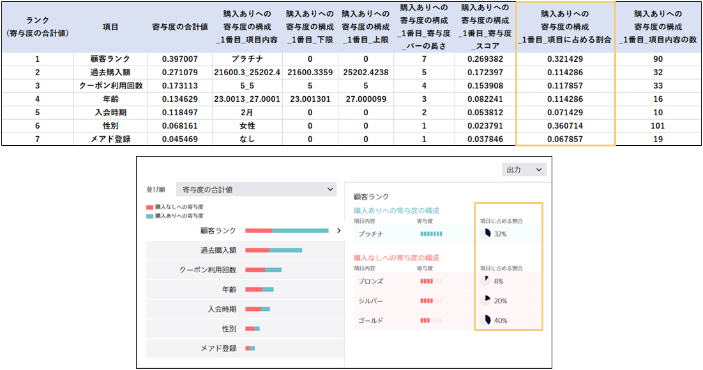

#### 購入あり (なし) への寄与度の構成_n番目_項目内容の数
「購入あり (なし) への寄与度の構成_n番目_項目内容の数」は、学習データ中のそれぞれの項目内容の数です。
画面上にこれが表示されている部分はありませんが、データに出現する割合が同じような意味の表示内容です。
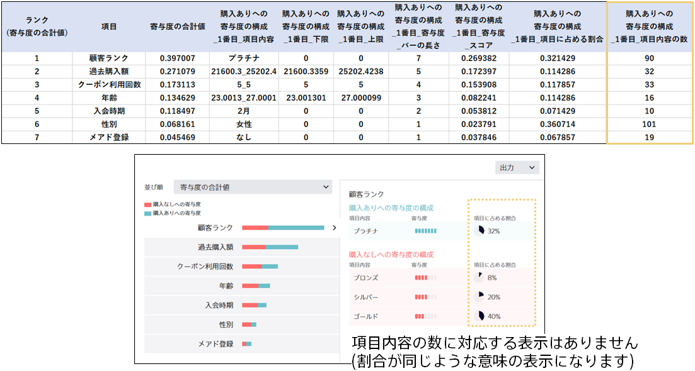

並び順が「寄与度の合計値」の場合で説明しましたが、「購入ありの寄与度降順」「購入なしの寄与度降順」でもcsv出力のされ方は同様です。

{}

{}

「{}」の例で
絞り込みを「全て表示」にした場合で説明します。 
この時、csv出力される各項目は以下の通りです。
 - ランク(全て表示)
 - 項目
 - 全体の予測値増加の寄与度
 - 分類
 - 予測値増加_n番目_項目内容
 - 予測値増加_n番目_下限
 - 予測値増加_n番目_上限
 - 予測値増加_n番目_寄与度_バーの長さ
 - 予測値増加_n番目_寄与度_スコア
 - 予測値増加_n番目_データに出現する割合
 - 予測値増加_n番目_項目内容の数

なお、n は 1～3 です。

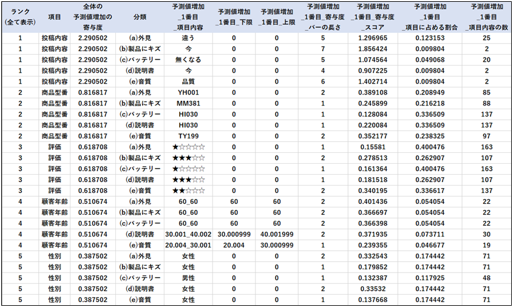

#### ランク(全て表示)
「ランク(全て表示)」は、寄与度の詳細画面に出てくる各項目の順番の数字です。
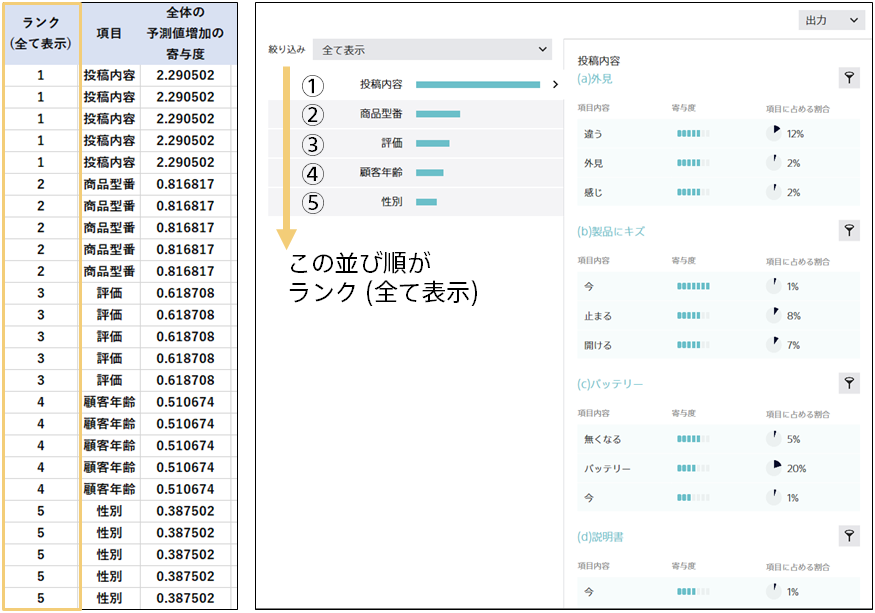

#### 項目
「項目」は、寄与度の詳細画面に出てくる各項目です。
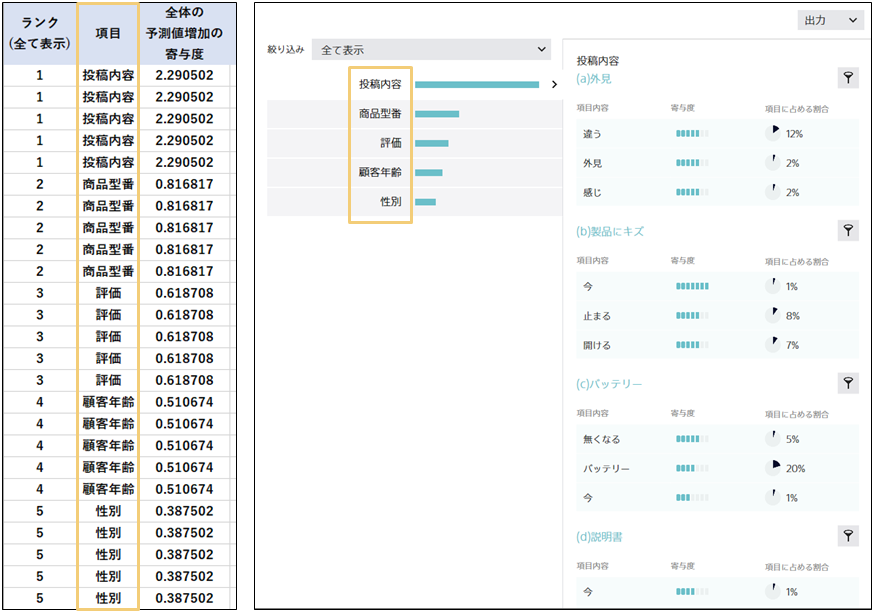

#### 全体の予測値増加の寄与度
「全体の予測値増加の寄与度」は、各項目のバーをマウスオーバーしたときに表示される数値です。今回は5つに分類する問題なので5つ同じ値が並んでいます。 
下は投稿内容のバーをマウスオーバーした際の例です。
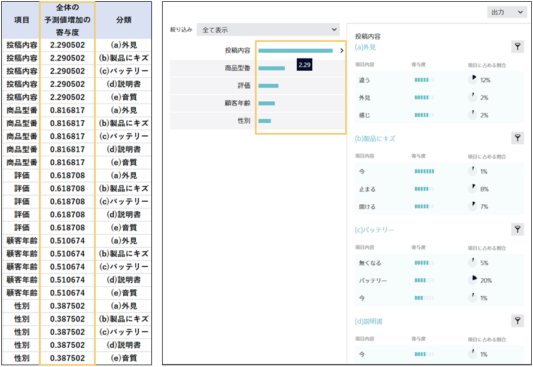

#### 分類
「分類」は、多値分類で予測したい項目に含まれている値 (つまり分類先) です。今回は5つに分類する問題なので5つの値が並んでいます。
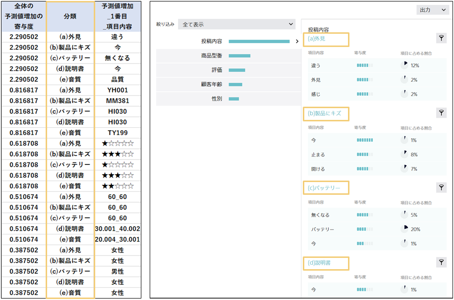

#### 予測値増加_n番目_項目内容
「予測値増加_n番目_項目内容」は、それぞれの項目をクリックし右側の詳細を表示させたときの項目内容です。
顧客年齢のように数値の項目の場合、その範囲の下限と上限が「_ (アンダーバー)」区切りで出力されます。
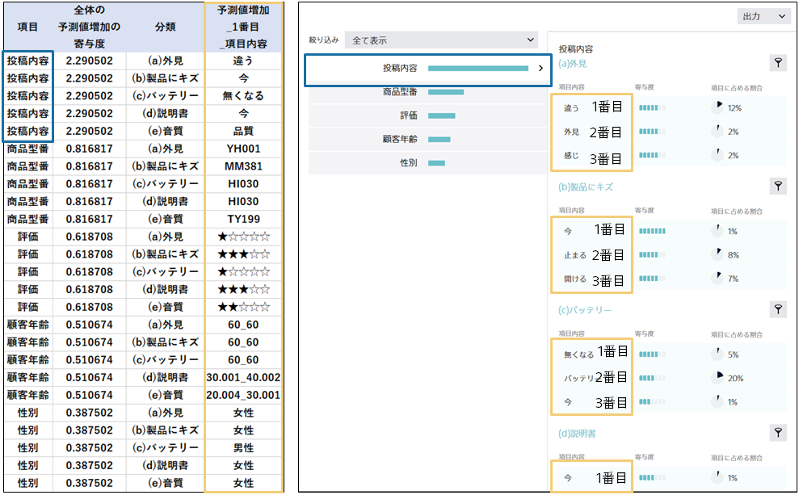

#### 予測値増加_n番目_下限 (と上限)
「予測値増加_n番目_下限 (と上限)」は、項目内容が数値である場合の下限と上限です。
数値でない場合は、0 が入ります。
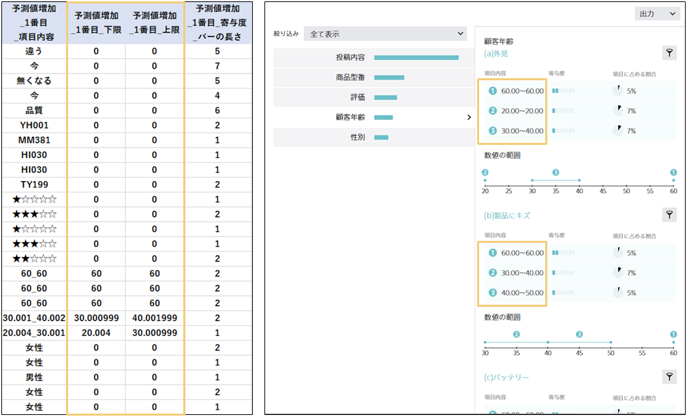

#### 予測値増加_n番目_寄与度_バーの長さ
「予測値増加_n番目_寄与度_バーの長さ」は、7段階表示で示される各項目内容のバーの長さです。 
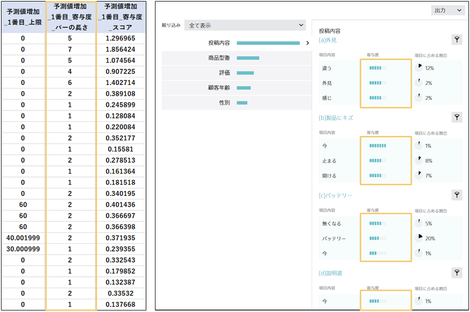

#### 予測値増加_n番目_寄与度_スコア
「予測値増加_n番目_寄与度_スコア」は、7段階表示で示される各項目内容のバーをマウスオーバーしたときに表示される実際の値です。
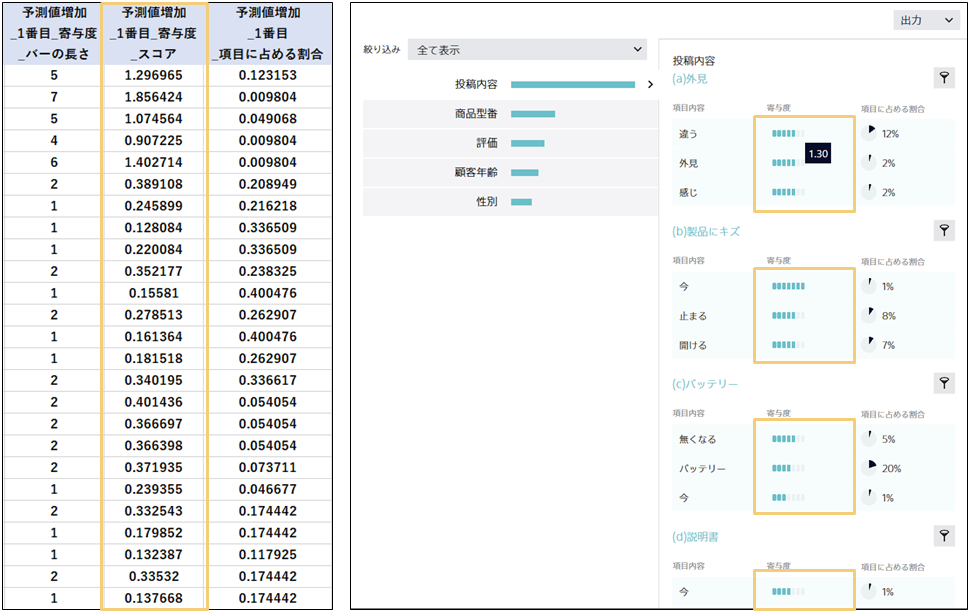

#### 予測値増加_n番目_データに出現する割合
「予測値増加_n番目_データに出現する割合」は、それぞれの項目内容が学習データ中に占める割合です。
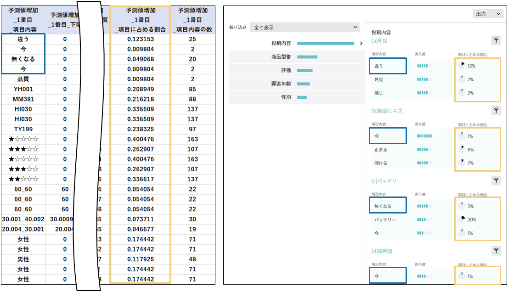

#### 予測値増加_n番目_項目内容の数
「予測値増加_n番目_項目内容の数」は、学習データ中のそれぞれの項目内容の数です。
画面上にこれが表示されている部分はありませんが、データに出現する割合が同じような意味の表示内容です。
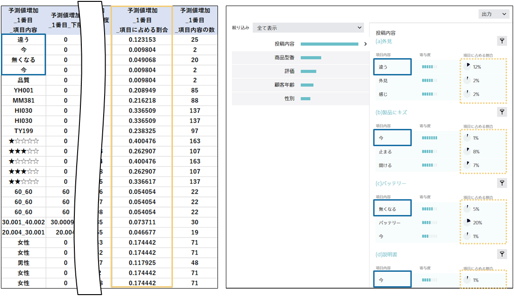

絞り込みが「全て表示」の場合で説明しましたが、「(a)外見」「(b)製品にキズ」「(c)バッテリー」「(d)説明書」「(e)音質」(予測したい項目に含まれる値の種類) でもcsv出力のされ方は同様です。

{}

{}

数値予測 (時系列予測) でcsv出力される各項目は以下の通りです。
 - ランク(寄与度の合計値)
 - 項目
 - 寄与度の合計値
 - 予測値増加 (減少) _n番目_項目内容
 - 予測値増加 (減少) _n番目_下限
 - 予測値増加 (減少) _n番目_上限
 - 予測値増加 (減少) _n番目_寄与度_バーの長さ
 - 予測値増加 (減少) _n番目_寄与度_スコア
 - 予測値増加 (減少) _n番目_データに出現する割合
 - 予測値増加 (減少) _n番目_項目内容の数

なお、n は 1～3 です。

これらの項目は、二値分類の寄与度csv出力と対応関係が一致していますので、詳細は二値分類の寄与度csv出力をご確認ください。

並び順が「寄与度の合計値」の場合で説明しましたが、「予測値増加の寄与度降順」「予測値減少の寄与度降順」でもcsv出力のされ方は同様です。 
時系列予測の場合は、寄与度の詳細を表示するプルダウンに、並び順だけでなく系列も存在することがあります。
この場合も今までと同様に、これら (並び順、系列) の選択状況によって表示されている内容がcsv出力されます。

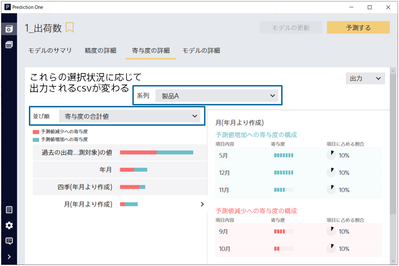

{}