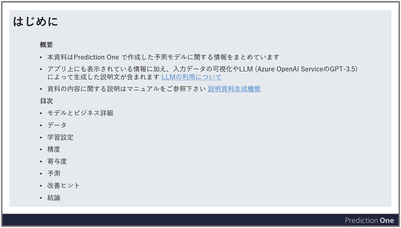
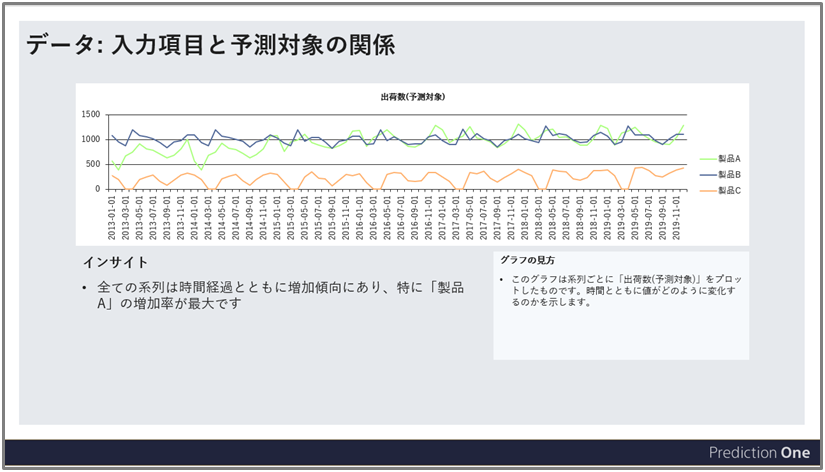

{}
Prediction One を実際に業務に導入しようとするとき、精度の良い予測モデルを作成して終わりではなく予測精度や寄与度を資料にまとめて関係者に報告することが必要になる場合があります。資料の準備には時間がかかりますし、他者に分かりやすく説明をするためにデータやモデルについての詳細を理解する必要があります。

このような時に活用できるのが、本資料で紹介する説明資料生成機能です。説明資料生成機能は作成した予測モデルに関する情報を自動でスライドに出力します。本資料ではこの機能によってどのような資料が生成されるのかをご説明します。

アプリ内での本機能の使用方法については{}をご参照ください。

{}

{}
Prediction One で予測モデルを作成した後、モデルの詳細画面に精度や寄与度等に関する情報がアプリ画面上に表示されます。本機能で出力される説明資料はそれらの情報の一部、または本機能で独自に出力した情報をスライドの形式でまとめたものです。説明資料は以下のセクションから構成されています。

{}
- 表紙とはじめに
- モデルとビジネス詳細
- データ
- 学習設定
- 精度
- 寄与度
- 改善ヒント
- 予測
- 結論
{}
{}
- 表紙とはじめに
- モデルとビジネス詳細
- データ
- 学習設定
- 精度
- 寄与度
- 改善ヒント
- 結論
{}
これより各セクションごとに資料の内容をご説明します。

{}

{}
このセクションには表紙と「はじめに」というページが含まれています。「はじめに」ページには生成された資料の概要が記されています。

{}

{}
このセクションには「モデルとビジネス詳細」ページが含まれます。このページには作成した予測モデルの名前、アプリ画面上で任意に入力したモデルとビジネスについての説明文を記載しています。予測モデルを作成する背景や目的をまとめて確認できます。

{}

{}
このセクションには「学習用データのサマリ」、「データの詳細」、「入力項目と予測対象の関係」の 3 種類のページが含まれます。

#### 学習用データのサマリ
予測モデルの学習に使用されたデータの概要が表示されています。表示される情報を以下に列挙します。これらはアプリ上の「モデルの詳細タブ」に表示されている情報の一部です。

- 項目情報 
  各項目のデータタイプやユニーク数等が表にまとめられます。時系列予測モードを使用した場合のみ「予測時個別指定」という列が追加されます。予測時に個別に指定する必要がある項目には「〇」を、必要が無い項目には「-」を表示します。
- 予測したい項目 
  予測対象の項目名です。
- 予測したい項目の統計/内訳 
  分類の場合、予測したい項目の内訳が表示されます。項目に含まれる値とその出現する割合を意味します。数値予測の場合、予測したい項目の統計が表示されます。項目に含まれる値の最大値・最小値・平均値・中央値が表示されます。予測した項目の統計/内訳は入力データの先頭最大 1000 行から計算された値をスライド上に表示しています。そのため、アプリの「モデルの詳細」タブに表示されている情報と異なっている場合があります。
- 入力された表データのサイズ 
  学習に実際に使用された表形式データの列数と行数ではなく、最初に入力したCSV/TSVデータの列数と行数を示しています。

#### データの詳細
予測モデルの学習に使用されたデータについて、学習用データのサマリよりも詳細な項目情報を表にまとめています。サマリページに記載されている項目名、データタイプ、ユニーク数、欠損、相関に加えて、以下の 2 つの項目を表示しています。
  - 基本統計量 
  データタイプが文字列である項目はその項目に含まれる値とその出現する割合が表示されます。値が 8 種類以下の場合は全ての値についてその出現割合が表示されますが、 9 種類以上の値が存在する場合 7 種類までが表示されそれ以降は省略されます。データタイプが数値の場合、最大値、最小値、平均値、中央値が表示されます。
  - グラフ 
  データタイプが文字列の場合、グラフの縦軸はその項目に含まれる値のデータ中への出現回数を意味し、横軸は値の種類を意味します。データタイプが数値の場合、グラフの縦軸はある数値範囲に含まれる数値データの数量を意味し、横軸はその項目に含まれる値の範囲を等間隔に分割した数値範囲を意味します。このグラフを見ることで各項目の分布がどのようになっているのかを一目で確認できます。

#### 入力項目と予測対象の関係
データをより良く理解するために、入力項目と予測対象との間にどのような関係があるのかを算出しています。予測タイプごとに適切なグラフと説明文を表示しています。

- 二値分類、数値予測 
入力項目を複数組み合わせた時に予測対象とどのような関係性にあるのか、独自のモデルを使用して算出しています。項目が多く存在するとき様々な組み合わせと関係性が導かれますが、特に予測した項目への影響が大きいものをスライド上に出力しています。説明資料中ではそれらの関係性のことを「ルール」と呼んでいます。あるルールに該当する場合と該当しない場合とで予測したい項目にどのような違いが現れるかを定量的に示し、文章とグラフとで表現しています。ルールを寄与度等と合わせて解釈することによりデータに対する理解が深まると期待できます。

- 多値分類 
1 つの入力項目と予測対象との関係をグラフとインサイトの文章で説明しています。入力項目は関連度スコアが高いものから選択されます。入力項目が文字列型の場合、その入力項目のなかで出現頻度の最も高い5 種類の値の分布を予測対象のごとに計算しています。グラフの見方を具体的に説明すると、例えば下図の例の場合、「故障タイプ（予測対象）」が「電源・接続」である学習データのうち、「故障個所」が「ディスプレイ」であるデータが約 20 %, 「電源」であるデータが約 80 ％, 「ボタン」であるデータが約 0 ％となります。

入力項目が数値型の場合、予測対象ごとに入力項目の平均値を比較するグラフとインサイトを提示します。

いずれの場合でも予測対象の値は学習データ中の出現頻度が高い順に最大 8 種類まで表示されます。インサイトの文章ではグラフから読み取れるポイントを最大 2 つ列挙しています。

- 時系列予測 
時間の経過とともに予測対象がどのように変化するのか、グラフとインサイトの文章で説明します。横軸に時刻をとり、時間経過とともに増加傾向なのか、減少傾向なのか、横ばい傾向なのかを提示します。

なお、データによってはこれらの入力項目と予測対象との関係を求めることができないこともあり、その場合にはスライド上に「ルールを作成できませんでした」「インサイトを生成できませんでした」等のエラーメッセージが表示されます。
{}

{}
このセクションには「学習設定」ページが含まれます。「学習設定」ページには「モデルの詳細」タブに表示される情報のうち学習設定に関連した項目がまとめられています。

{}

{}
このセクションにはアプリ内の「精度」タブに表示される内容の一部がまとめられています。予測タイプに依らず共通して含まれるページは「精度評価」ページで、精度評価値の表、精度を評価した文章と評価指標の説明文が記載されています。
{}
精度評価の文章は LLM (大規模言語モデル)を使用して生成されており、誤った内容を含む場合もあるため、慎重にご活用ください。LLM については{}をご参照ください。
{}

「精度」セクションの他のページについては、予測タイプによって評価方法が異なるため、資料に含まれるページも各々で異なります。

#### 二値分類
- 「混同行列」ページ 
  予測の正解と不正解の様子を表す混同行列と、その見方を記載しています。
  
- 「ROCカーブ」ページ 
  予測確率によるソート順の精度を表すROCカーブと、その見方を記載しています。
  

#### 多値分類
- 「混同行列」ページ 
  予測の正解と不正解の様子を表す混同行列と、その見方を記載しています。予測したい項目に含まれる値は最大 6 種類まで表示され、残りの値については混同行列が省略されます。省略された分についてはアプリ画面をご参照ください。
  
  
#### 数値予測
- 「予測の分布」ページ 
  縦軸に実際の値、横軸に予測値をとるようなグラフとその見方を記載しています。
  

#### 時系列予測
- 「予測と実績」ページ 
  予測期間ごとに実績値と予測値とを描画したグラフを表示しています。
  
{}

{}
「寄与度」セクションにはアプリ内の「寄与度」タブに表示される内容の一部がまとめられています。具体的には「項目の寄与度」、「寄与度の構成」ページが含まれています。

#### 項目の寄与度
すべての予測タイプに共通して「項目の寄与度」ページが寄与度セクションに含まれます。「項目の寄与度」ページには予測寄与度のグラフと寄与度の要約と解釈、さらに寄与度の説明文が記載されています。寄与度のグラフは「寄与度の詳細」タブの「寄与度の合計値」のグラフと同様のものを表示しています。
{}
寄与度の要約と解釈は LLM によって生成されており誤った内容を含む可能性があるため、慎重にご活用ください。LLM については{}をご参照ください。
{}

#### 寄与度の構成
「寄与度の構成」ページには各項目の値ごとの寄与度も含むより詳細な結果を確認することが出来ます。ただし予測タイプによって表示される内容が異なります。
- 二値分類と数値予測 
  寄与度の大きさ上位 3 項目について各項目ごとに 1 枚のスライドが生成されます。各項目の寄与度の構成のグラフとその見方、寄与度の活用アイディアをスライド内に記載しています。
  
- 多値分類 
  最も寄与度の大きな項目に関して、予測したい項目の各クラスに寄与する項目の内容を記載しています。寄与度の大きさと各項目内容のデータに出現する割合がグラフとして表示されています。
  
- 数値予測 (時系列予測モードを使用) 
  寄与度の構成ページは生成されません。

{}

{}
本セクションには「改善ヒント」ページが含まれます。アプリ内の「改善ヒント」タブに表示されるヒントのうち、上位最大 3 つがスライド上にまとめられています。ただし LLM を使用しているヒント等、一部のヒントは上から 3 番目以内に表示されていてもスライドに表示されません。他のヒントをご覧になりたい場合はアプリ内の「改善ヒント」タブをご覧ください。

{}

{}
{}
本セクションには時系列予測以外では「予測結果の傾向」、「項目の傾向変化」のページが含まれます。時系列予測の場合には「予測結果の傾向」ページのみが含まれます。

#### 予測結果の傾向
このページでは予測用データを用いて予測を行ったときにその結果が学習時の評価結果と比較して何か傾向の変化はあるか、もしあるならばどのように変化しているかを説明します。

グラフは学習時と予測時とで予測結果を比較したもので、予測タイプごとに意味が異なります。二値分類の場合は予測したい値の予測確率を、多値分類の場合は各クラスに当てはまると予測されたデータの割合を、数値予測の場合はある範囲に予測値が含まれるデータの割合を示します。

予測結果の傾向が大幅に異なっている場合精度も変化している可能性があるのでモデルの再学習を検討してみましょう。

なお時系列予測の場合は傾向の変化を棒グラフでなく、時系列の折れ線グラフで図示します。また、学習時と予測時の予測結果の比較の文章は作成されません。

#### 項目の傾向変化
このページでは学習時と予測時とで学習に使用した項目の傾向に変化がないかを説明します。学習時と比較して傾向が大幅に変化している項目がある場合、その時点で作成した予測モデルでは正確に予測できなくなっている可能性があるので注意が必要です。

スライド上のグラフと「変化最大の項目」は最も傾向変化の大きい項目の学習時と予測時との比較について説明しています。

時系列予測の場合はこのページは生成されません。

{}
{}

{}
資料の最後に結論ページが生成されます。精度のまとめ、寄与度のまとめ、次のアクションが提示されます。モデル情報入力画面にて、ご自身の取り組みのフェーズを選択しない場合には次のアクションは表示されません。{} これらの内容はLLM によって生成されており誤った内容を含む可能性があるため、慎重にご活用ください。LLM については{}をご参照ください。{}

{}

{}
説明資料にはアプリ上で表示される情報がまとめられています。この資料の利用シーンには以下のような場面が挙げられます。
- 業務導入に向けて Prediction One で実現できることを上長に説明をする
- 説明資料をプレゼン資料として使用し、プロジェクトメンバーにモデル作成の取り組みを報告する
- 学習用データに関する説明を読んでデータの傾向をより良く理解する
- データに即した精度や寄与度の説明、解釈を読んでより良く理解する
{}
- 予測結果を可視化してより良く理解する
- 学習時と予測時との傾向変化を確認して新規モデル作成を検討する
{}

編集可能な形式で資料が出力されるため、生成された資料をそのまま用いるだけでなくご自身で改編することも可能です。説明資料中の文章やグラフを発表資料の一要素として活用するだけでも資料準備の工数削減に繋がります。また学習用データの可視化やデータに即した精度や寄与度の説明文といった資料独自のコンテンツを読むことでより深くデータとモデルを理解することに役立ちます。アプリ上の情報と相補的に活用することをご検討下さい。
{}

{}
説明資料生成機能は予測モデルの情報を自動でスライド形式に出力できる機能です。これまで Prediction One の利用結果をプロジェクトメンバーや上長に共有するときにはご自身で資料を作成していただく必要がありました。この機能を使用することによって資料作成を効率化することができ、モデル作成完了から共有までの時間を短縮することに繋がります。その結果、より円滑に Prediction One を実際の業務に導入できたり、予測モデル作成の試行錯誤などより重要な活動に注力できるようになると期待できます。

本資料を参考に、ぜひ説明資料生成機能をビジネスでご活用ください。
{}