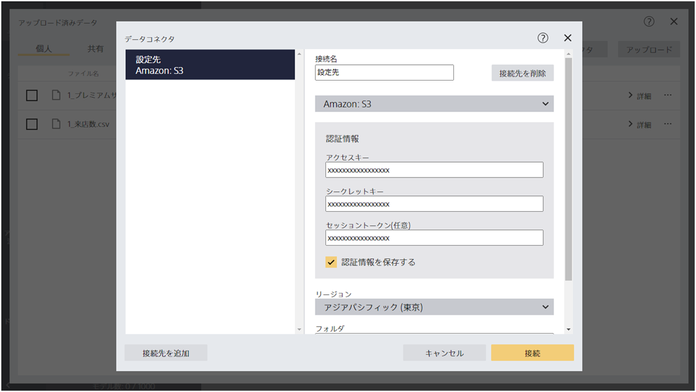
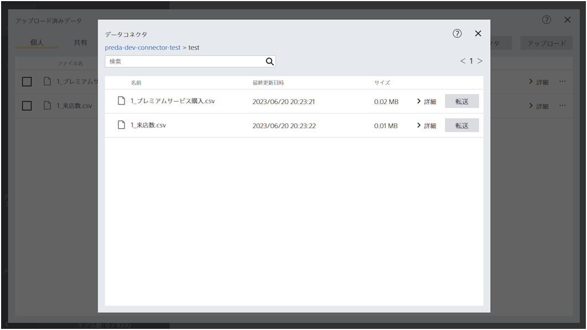

---
title: "データコネクタ機能"
date: 2023-06-15T11:00:00+06:00
lastmod: 2023-06-15T11:00:00+06:00
weight: 22
draft: false
# metaタグのパラメータ
meta:
  description: ""
# クラウド・デスクトップ限定ページの場合は片方のみtrueにする
visible:
  is_cloud_only: true
  is_desktop_only: false
# 検索でヒットする文字列の指定
keywords: ["データコネクタ", "外部データ"]
---

{}
Amazon Web Services (AWS)が提供するAmazon S3、または、Google Cloud Platform (GCP)が提供するCloud Storageを通じて、Prediction Oneへ指定ファイルを転送できる機能を追加しました。
これまでは、手動でAmazon S３からcsvファイルをダウンロードし、そのデータをPrediction Oneへアップロードすることで、モデルを作成する仕様となっていました。
今回のデータコネクタ機能が追加されたことにより従来の手間を省くことができ、作業効率化を図ることが期待できます。なお、今後もパブリッククラウドとの接続口を順次拡張していく予定です。

{}

{}
接続情報を入力します。
一時的な認証情報を使用する場合は「アクセストークン」も入力します。

ファイル一覧が表示されました。
転送ボタンをクリックします。

{}

{}
本資料では、データコネクタ機能のデータ転送方法についてご紹介しました。
以下にポイントをまとめます。

- データコネクタ機能では外部サービスにあるデータセットを転送することができる

{}
