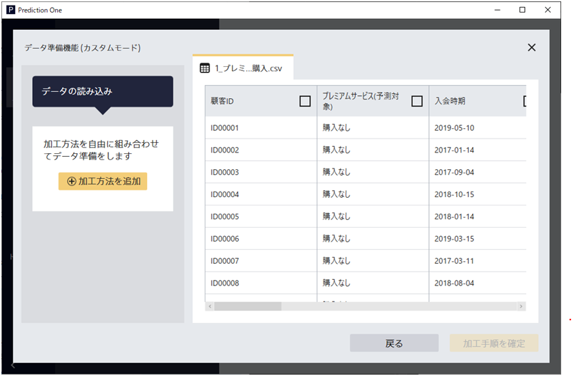
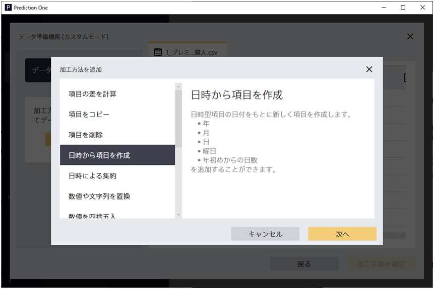
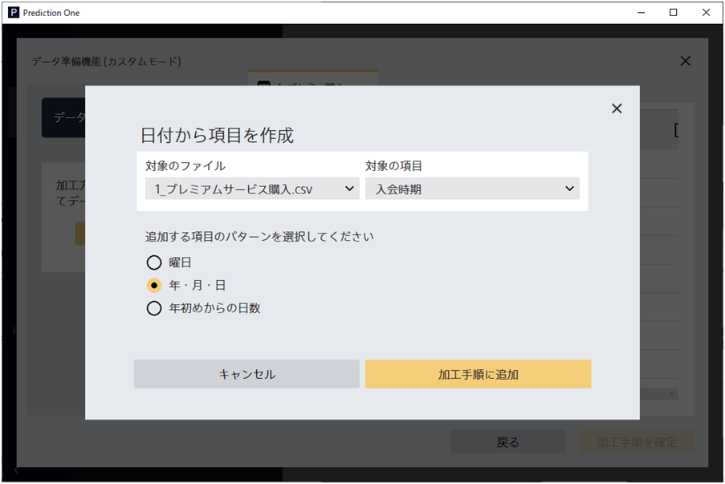
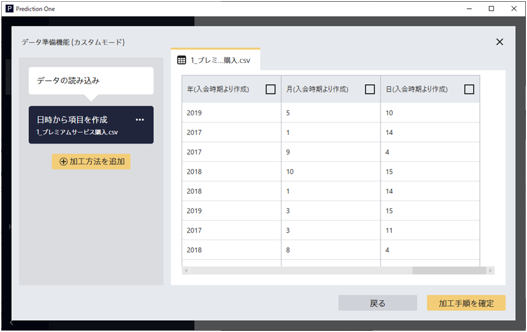
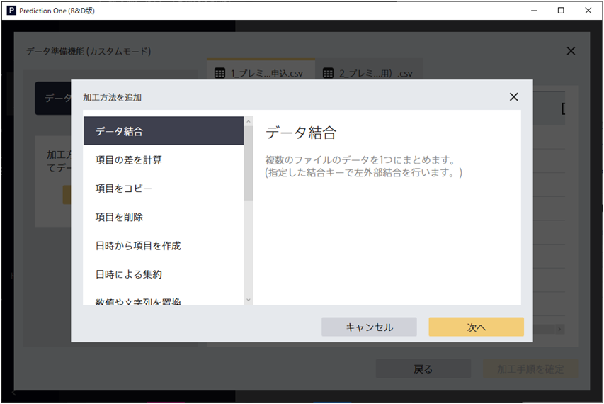
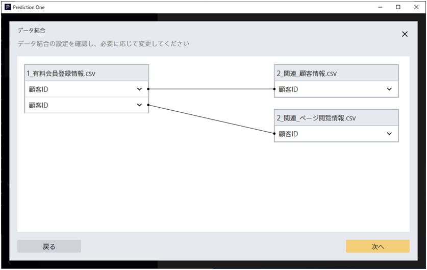
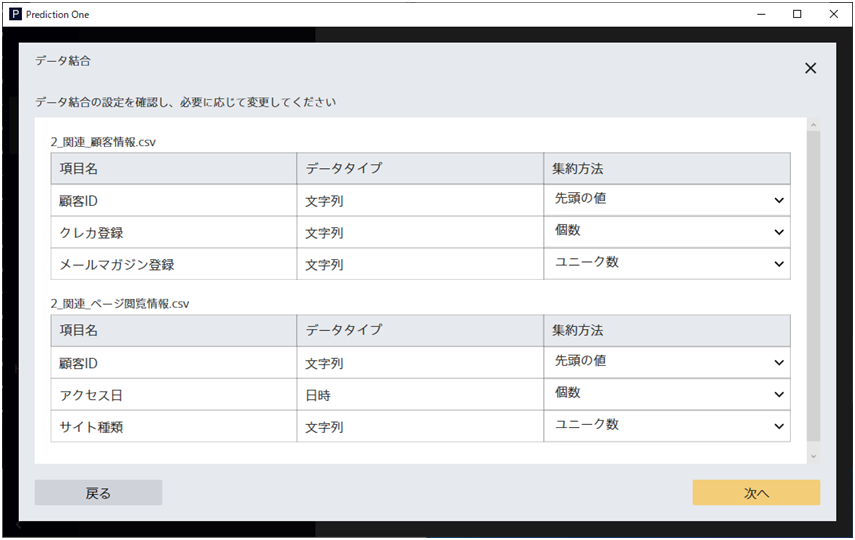
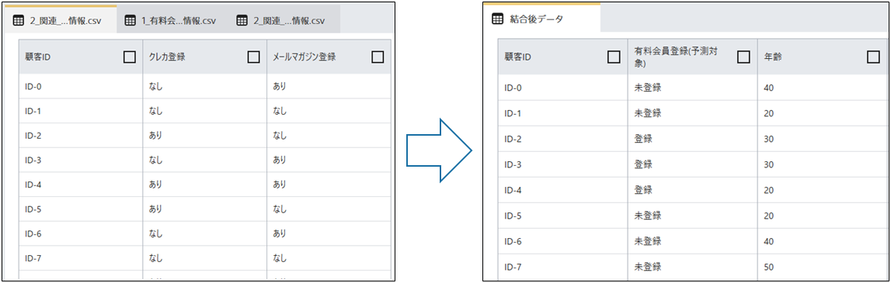
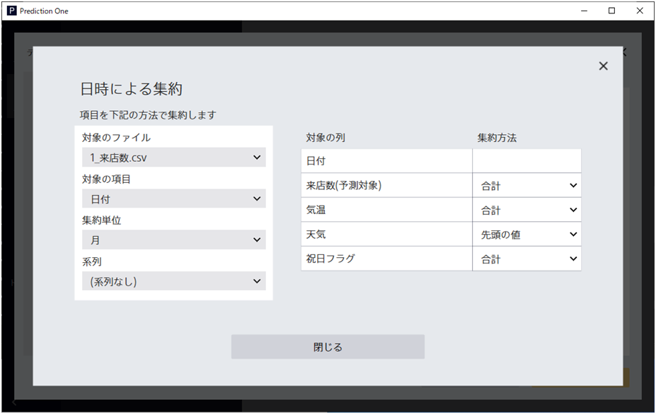
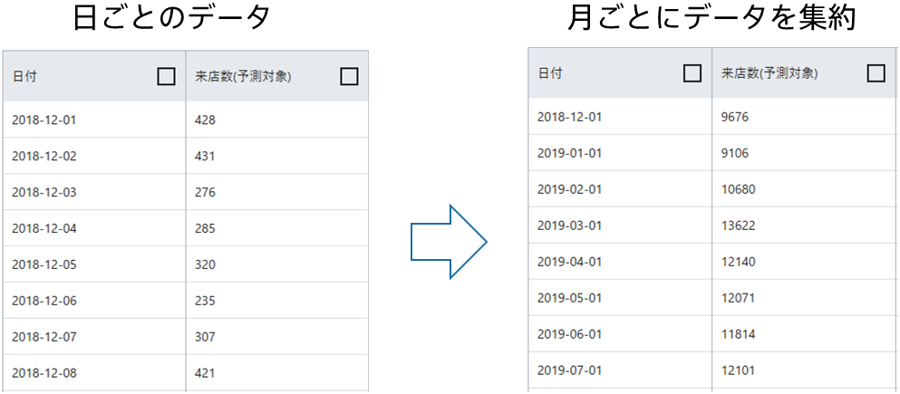

{}
データ準備機能は、エクセルの複雑な処理やプログラミングの代わりに、自由にデータ各処理を組み立てられ、モデル作成用のデータを簡単に準備できます。データ準備機能では、ユースケース別ガイドや予測モデル作成機能では出来なかったさまざまな加工処理ができます。

このページでは、データ準備機能でできる加工処理についていくつか紹介したいと思います。

{}

{}
「加工方法を追加」をクリックして実行したい加工を選ぶことで、データを簡単に加工できます。
たとえば、日時項目をもとに「年」「月」「日」の項目を作成できます。

①「日時から項目を作成」を選びます

②「年・月・日」を選びます

③「年」「月」「日」の項目が追加されていることがプレビューから確認できます


どのような加工ができるかは項目のデータタイプによって異なります。
加工の詳細や仕様は{}をご確認ください。

{}

{}
データ準備機能のデータ結合は、ユースケース別ガイドで実行できるデータ結合よりさらに詳細な指定が可能です。
**3つ以上のデータを同時に結合できて、データ結合時の項目の集約方法を指定**できます。データ結合は以下の2ステップで実行できます。

##### ①複数のデータを読み込んだ上で「データ結合」を選択します

##### ②データの結合関係を指定します

##### ③データ結合時に項目をどのように集約するかを指定します

以上の操作で簡単にたくさんのファイルを1つにまとめることができます。

{}

{}
データ準備機能では、**「日付による集約」を使って日ごと・週ごと・月ごと・年ごとにデータをまとめる**ことができます。
また、集約するときにどのように集約するかを指定することで平均や合計の項目を作成することもできます。

たとえば集約単位を「月」とすれば、日時項目を基準にして月ごとにデータを集約します。


Prediction Oneで時系列予測をするためには日時項目を整理する必要があります (参考：{})。
日付による集約を使えば、時系列予測をするためのデータ準備が簡単にできます。


{}

{}
本資料では、データ準備機能のデータ準備機能についてご紹介しました。
以下にポイントをまとめます。

- データ準備機能では自由にデータ加工手順を追加することができる
- データ結合では、複数ファイルを結合することができ、集約方法も指定することができる
- 日付による集約では、日時項目をもとにデータを集約することができて、時系列予測をするためのデータ準備が簡単にできる
- 加工済みデータをダウンロードすることができる

複雑な加工手順をデータ準備機能で実行し、データ準備を効率化しましょう。

{}
