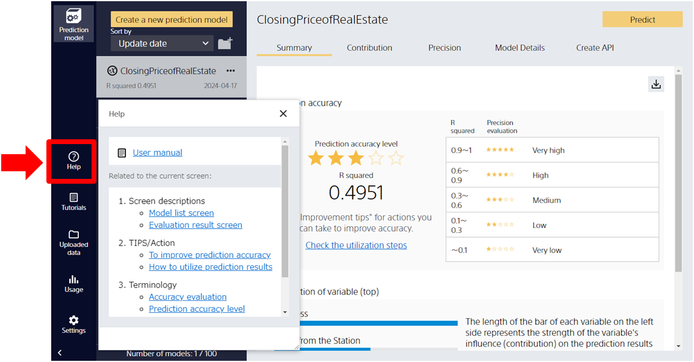

{}
The ability to display the necessary help content for each screen has been added.

Prediction One offers an extensive manual, tips, and a wealth of other content, but some users have said that it is difficult to locate the relevant sections.
The help feature that has been added will allow users to access the necessary content when they need it, rather than having to search for the relevant section in the manual.
Users will be able to immediately resolve any problems they may have during use, including not only how to use the software, but also explanations such as how to view the prediction accuracy.

For more information on how to use the in-app help, see {}.
{}

