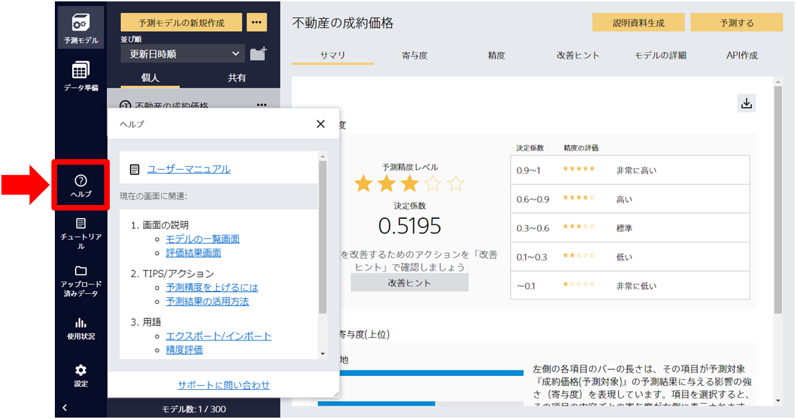

{}
画面ごとに必要なヘルプの内容を表示する機能を追加しました。

Prediction Oneでは豊富なマニュアル・TIPSなどの豊富なコンテンツをご用意していますが、該当箇所を探すのが難しいという声もありました。
今回追加するヘルプ機能により、マニュアルから該当箇所を探すのではなく、必要な時に必要な内容にアクセスできるようになります。
使い方はもとより、予測精度の概要の解説など、利用する上での疑問をすぐに解消しながら利用できるようになります。

ご利用方法については、{}をご参照ください。
{}

