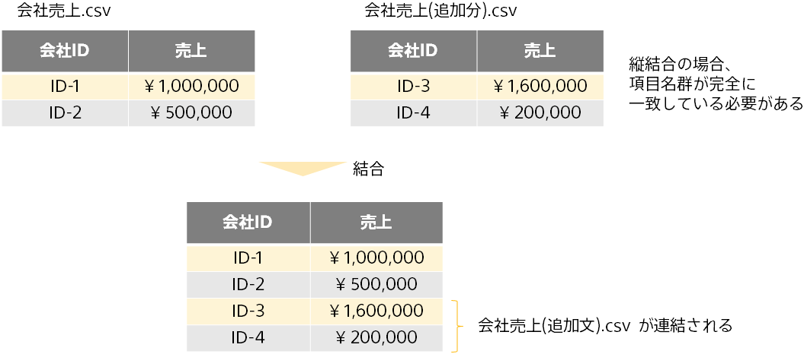

{}
Prediction One では、予測モデル作成(学習)用データとして使用するデータファイルに関連するデータファイルを結合して予測モデルを作成できます。

本資料では、どのようなデータを結合することができるか・どのようなデータを結合することでより役に立つ予測モデルが作成できるかについて説明します。

データ結合のチュートリアルもありますので、具体例としてご参照ください。{}：`C:/Program Files/Sony/Prediction One/ja-JP/doc/sample_dataset/use_case`{}

- {}
- {}

{}

{}
データ結合とは、互いに関連のある複数のデータを合体させ、一つのデータにまとめあげることです。
ここで関連のあるデータとは、あるデータの行と別のデータの行との対応関係がわかるデータを指します。

各データは**結合キー項目**と呼ばれる、各データ間で共通の値を持つ項目を介してデータ間の関連性を表現します。

以下の例は、会社に関する情報を持つ２つのデータを一つのデータへと結合しています。この例では、結合キー項目は「会社 ID」となります。

{}

{}
データ結合機能を使用するには、予測対象項目が含まれる**予測モデル作成(学習)用データ**に加えて、
予測モデル作成(学習)用データと結合キー項目によって関連付けられる**関連データ**を用意します。
結合キー項目の項目名は必ずしも一致する必要はありませんが、項目値は予測モデル作成(学習)用データと関連データの間で同じ値によって対応付けられる必要があります。

以下の例は、予測モデル作成(学習)用データと関連データを結合しています。

結合キーの項目名は予測モデル作成(学習)用データでは「会社 ID」、関連データでは「管理番号」となっていますが、Prediction One でこれらの項目を結合キーを設定することで結合が可能です。

しかし、結合キーの項目値が予測モデル作成(学習)用データでは「ID-1」である一方、関連データでは「会社-1」と異なる値を使用しているため、「ID-1」の行に関しては結合が行われません。正しく対応させるためには、関連データの結合キー値を「会社-1」から「ID-1」に修正する必要があります。

{}

{}
データ結合は、学習と予測それぞれのステップの前に実行されます。予測時には予測用の関連データを改めて指定することもできます。あるいは、学習時に使用した関連データを使い回して結合することもできます。

{}

{}
Prediction One でデータ結合を行う方法について説明します。「モデル設定」の画面（予測モデル作成(学習)用データ読み込み後の画面）で、以下の手順を順番に行ってください。

1. モデル設定の画面で、詳細設定チェックボックスをオンにします。

2. 予測対象項目を含む予測モデル作成(学習)用データを入力し、予測対象を選択します。
3. 「データ結合」ボタンをクリックします。

4. データ結合画面では、関連データを入力します。予測モデル作成(学習)用データと関連データの結合キーはそれぞれ自動判定されますが、想定と異なる結合キーが選択されている場合は、プルダウンから結合キー項目を変更します。
5. 予測モデル作成(学習)用データと関連データが正しい結合キー項目について対応付けられているかを確認してから、「予測モデルの作成」ボタンをクリックします。

データ結合は、予測モデル作成(学習)用データの結合キー値に対応したキー値が関連データに存在する場合に限り、関連データから予測モデル作成(学習)用データへ集計する形で行われます。(この結合方法は、左外部結合と言われます。)

関連データの結合キー値に重複がみられるか否かによって、結合の処理方法が異なります。この結合処理方法の詳細を、例を用いて説明します。
{}

{}
**横結合**とは、項目を増やす(ファイルの列方向を増やす)様なデータ結合方法のことです。

関連データの結合キー項目値に重複がない(ユニークである)場合、予測モデル作成(学習)用データへの横結合はキー値を対応付けて項目をコピーをする事により実行されます。
この結合により、関連データの項目名と同一の項目が予測モデル作成(学習)用データに新しく追加されます。

下の例では、`会社売上.csv`と`会社属性.csv`の関係は結合キー項目「会社 ID」によって関連付けられており、関連データのキー項目値に重複がなくユニークです。データ結合により、予測モデル作成(学習)用データには関連データの項目「会社名」「業種」が追加されます。

{}

{}
関連データの結合キー項目値に重複が発生するデータ関係の他の例を以下の表に挙げます。

関連データの結合キー項目値に重複がある場合、結合例１のように項目をそのままコピーをする事によって横結合を行うことは得策ではありません。
結合キーが重複する関連データのうち、いずれか一つの行をそのままコピーすることになり、残りの行の情報が結合データから失われてしまうためです。

Prediction One では、結合キーが重複する行について、項目値の平均やユニーク数などのさまざまな集計方法により、なるべく多くの関連データの情報を結合データへまとめ上げます。
集計方法は、結合後データの項目数が行数を大きく超えない様に、Prediction One により自動で決定されます。

下の例では、`会社売上.csv`と`社員情報.csv`は結合キー項目「会社 ID」によって関連付けられており、関連データのキー項目値に重複があります。
データ結合により、予測モデル作成(学習)用データには関連データの各項目から集計された項目「社員名の数」「社員年齢の平均」などが追加されます。

Prediction One では、重複のある横結合を実行する関連データには、表示欄の下部に「追加項目の確認」ボタンが現れます。クリックすることで、追加生成される項目の候補を事前に確認できます。
また、「表形式で確認する」ボタンからも関連データに対応して追加生成される項目の候補を確認できます。

{}

{}

関連データの結合キー項目値に重複があり、且つ関連データにデータタイプが「日時」である項目(日時項目)が存在する場合、時間情報を利用した集計方法が更に追加されます。
たとえば、関連データ各項目の日時項目における「最新値」や「もっとも古い値」などです。

日時項目を利用した集計項目の名前は「(関連データ項目名) の (集計方法) ＠ (時刻型項目)」というフォーマットにしたがって命名されます。

下の例では、`会社売上.csv`と`採用人数.csv`が結合キー項目「会社 ID」によって関連付けられており、更に　`採用人数.csv`には「採用年度」という日時項目が存在します。データ結合により、予測モデル作成(学習)用データには関連データの各項目から集計された項目「採用人数の平均」などに加えて、日時項目「採用年度」を用いた項目「採用人数の最新値（採用年度）」などが追加されます。

時刻型として識別される値フォーマットについては、
{}を参照してください。

{}

{}
**縦結合**とは、予測モデル作成(学習)用データに関連データを行方向に連結するようなデータ結合方法を言います。
関連データの項目名群と予測モデル作成(学習)用データの項目名群が完全に一致する場合、Prediction One は結合キーを用いた横結合を行わず、縦結合を行います。
縦結合により、予測モデル作成(学習)用データの行数が増加します。

下の例では、`会社売上.csv`と`会社売上(追加分).csv`を縦結合しています。
データ結合により、`会社売上.csv`の下に`会社売上(追加分).csv`が連結されます。結合データの行数はそれぞれのデータの合計行数となります。

データ結合画面においては、予測モデル作成(学習)用データの下に縦結合された関連データが表示されます。

{}

{}
結合データの項目数が行数を大きく超えてしまう場合は、自動で予測に有効な追加項目の自動選択に関するメッセージが出されます。

メッセージ画面で「予測に有効な項目を自動選択する」オプションを選択すると、
予測モデルの精度向上に寄与すると思われる追加項目だけが自動で選択されて結合されます。

<u>選別対象となる項目は、関連データから追加・作成される項目に限られます。もとから予測モデル作成(学習)用データに含まれる項目は削除対象にはなりません。</u>

<u>予測に有効な項目の自動選択は、簡易的な予測モデルを作成して各項目の有効度を評価することで行われます。このため、全ての追加項目を使用するよりも、必ずしも精度が向上するわけではありません。</u>

{}

{}

モデルの詳細確認画面から、データ結合によって各関連データから追加された項目を確認できます。

また、結合データの項目の寄与度を見て、不要な追加項目を削除してモデルを再作成することもできます。
これには２種類の方法があります。

- 結合データの項目単位で削除するには、予測モデル一覧のモデルプルダウンから、「結合したモデル作成用データを保存する」を選んで結合データを保存した後、結合データを入力ファイルとして予測モデルを作成します。

- 関連データの項目ごと削除するには、関連データを直接編集して該当項目を削除したのち、データ結合機能を使用して予測モデルを再作成します。
  {}

{}
モデルの予測精度を確認後、「予測する」ボタンから予測を実行します。

はじめに予測モデル作成(学習)用データに対応するデータを入力します。予測用データの項目名は予測対象項目を除いて予測モデル作成(学習)用データと一致している必要があります。
予測用データを入力すると、予測用データに対するデータ結合画面に遷移します。

学習時に関連データを横結合した場合、予測時にも同様の項目名を持つ関連データを入力する必要があります。
「モデル作成時のデータを再利用」ボタンを押すと、学習時に使用した関連データをそのまま引き継いで使用します。

<u>予測用データに含まれる結合キー項目値が関連データに存在しない場合、関連データ由来の項目値は欠損扱いとなるので注意してください。 
予測モデルを実際に使用する場面で、予測用データに対応する関連データを学習時に事前に用意可能であるならば、関連データを学習用と予測用に分割せずまとめておいたほうが良いでしょう。</u>
逆に、事前に用意が不可能なデータが関連データに含まれる場合には、それらを用いて予測モデルを作成しないように事前に削除してください。

{}

{}
データ結合において追加する関連データは、予測モデル作成(学習)用データにある項目だけでは分からない情報で、
データの傾向が見いだせたり、データのカテゴリ情報などを含んだものが望ましいです。

- 予測モデル作成(学習)用データに存在する項目値に共通性が見いだせる項目
  - 例：予測モデル作成(学習)用データの商品名項目に対する、生産社名や大カテゴリ項目
- 予測モデル作成(学習)用データには存在しないが、予測対象に相関がありそうな項目
  - 例：売上が予測対象のときの、過去の売上データや来店者数

反対に、予測モデル作成(学習)用データとほとんど同じ意味の項目や、必要以上に細分化された情報項目は、追加しても予測精度の向上が望めない場合があります。

- 予測モデル作成(学習)用データの項目と同じ意味の項目
  - 例：予測モデル作成(学習)用データの商品名に対応する、固有の取り扱い ID 名
- ユニーク数が多すぎる項目
  - 例：予測モデル作成(学習)用データの人物 ID に対応する人物の名前

{}

{}
本資料では、どのようなデータを結合することができるか・どのようなデータを結合することでより役に立つ予測モデルが作成できるかについて説明しました。以下にポイントをまとめます。

- データ結合とは、複数のデータを合体させ一つのデータにまとめあげることである
- 結合には縦結合と横結合の２種類がある
  - 横結合は列方向に項目を追加する
  - 縦結合は行方向にデータを連結する
- 横結合では、共通の値を持つ結合キー項目を介して予測モデル作成(学習)用データと関連データを結合する
- 関連データ側の結合キー項目に値の重複がない場合、結合キー値を対応つけて項目をコピーして追加する
- 関連データ側の結合キー項目に値の重複がある場合、平均や最新値などのさまざまな集計方法で項目を生成し追加する
- 結合データの行数に対し項目数が多すぎる場合、予測に有効な追加項目だけを結合できる
- 関連データは、予測モデル作成(学習)用データにある項目だけでは分からない情報で、データの傾向や共通性が見いだせる情報を含んだものが望ましい

{}
