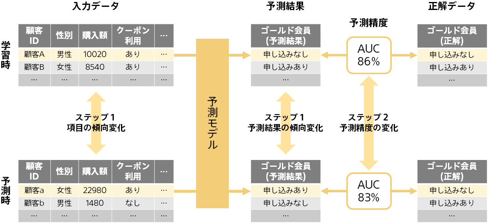
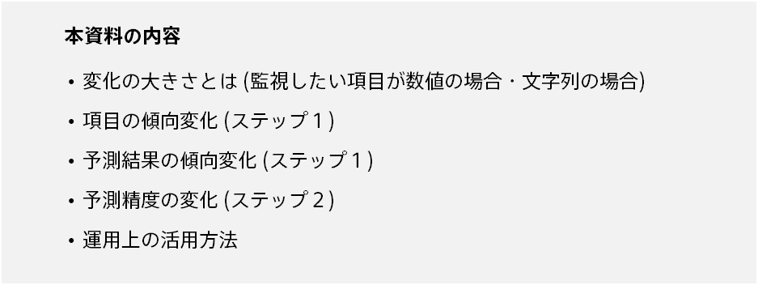
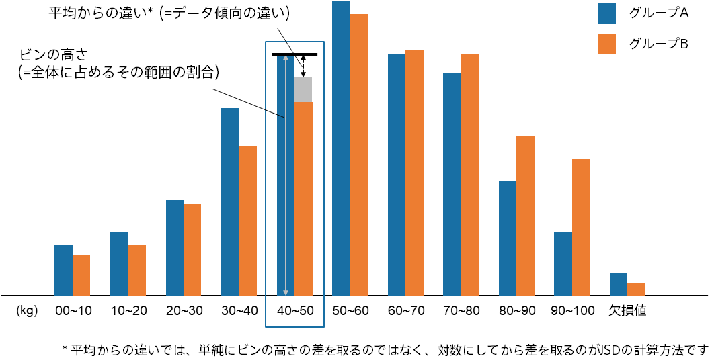
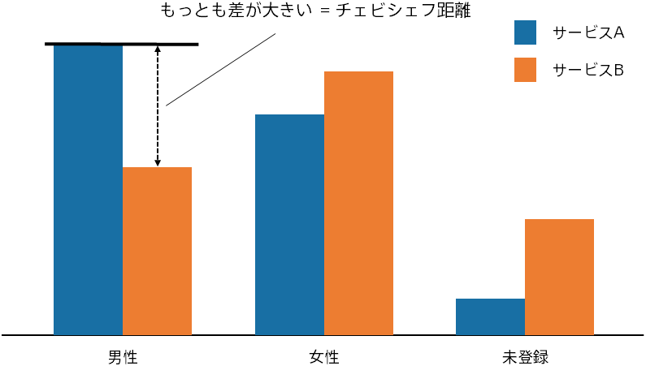

{}

 <!-- サマリの画像 -->

一般的に予測分析では、データの傾向が学習時から変化すると良い予測が行えなくなる可能性があります。
これは、学習時に予測モデルがつかんだ入力データと予測項目の関係が予測時には使えなくなってしまうためです。 
そのため、Prediction One で作成した予測モデルを長く用いていると、その間にデータの傾向が学習時から変化し、予測モデルの性能が低下してしまう可能性があります。 

モデルの監視では、Prediction One で作成した予測モデルを {} を使って運用する場合に、
データの傾向変化が起きていないかを監視し通知できます。

傾向の変化を読み取る機能は、

- 項目の傾向変化 (ステップ1)
- 予測結果の傾向変化 (ステップ1)
- 予測精度の変化 (ステップ2)

に大別されます。以下では傾向の変化の大きさについて説明した後に、それぞれの機能についてご説明します。 

 <!-- 本資料の内容の画像 -->
{}

{}

傾向の変化を監視したくても、漠然とデータを見比べるだけではどの程度データが変化し予測モデルへの影響があるのか知ることは難しいです。 
そのため、二つのデータ (例えば、学習時の入力データと予測時の入力データ) を比べて、それらの間にどれくらいの差異があるのか定量的に示す方法が必要になります。 
二つのデータの差を定量的に表したものが「変化の大きさ」となります。

#### 監視したい項目が数値の場合

 <!-- JSDを説明する図の画像 -->

監視したい項目が数値の場合は、変化の大きさとしてジェンセン・シャノン・ダイバージェンス (Jensen-Shannon Divergence, JSD) という指標を用いています。 
JSDは二つのデータ分布の距離 (データ分布がどの程度離れているか、つまりどの程度異なるか) を測る方法としてよく使われる指標です。 
Prediction One で採用しているJSDの計算方法の概要をあるグループAとグループBの体重を例に説明します。まずグループAとグループBの体重の取りうる範囲を10分割したヒストグラムを作成します。
これに加え、欠損値が入る場合も考慮して欠損値に関するビンも追加します。
この11本のヒストグラムの各ビン (例えば40kg～50kgのビン) について、そのビンの高さ (＝全体に占めるその範囲の割合) とグループAとグループBの平均からの違い (＝データ傾向の違い) を掛け合わせた数値を計算します。具体的には、40kg～50kgの割合がグループAでは高くグループBでは低い場合、このビンの数値は大きく計算されます。これを全てのビンについて計算し足し合わせたものがJSDとなります。 
つまり簡単には、二つのデータについて各ビンの大きさが異なっているほどJSDの値が大きくなると言えます。

#### 監視したい項目が文字列の場合

 <!-- チェビシェフ距離を説明する図の画像 -->

監視したい項目が文字列の場合は、変化の大きさとしてチェビシェフ距離 (Chebyshev distance) という指標を用いています。チェビシェフ距離もJSDと同じくデータの違いを測ることができます。 
チェビシェフ距離とは、例えばあるサービスAとサービスBの性別の登録情報 (男性、女性、未登録) があったとき、サービスAとサービスBの各ビンの割合の差 (男性の割合の差、女性の割合の差、未登録の割合の差) の最大値のことです。 
つまり、二つのデータについて最も割合の異なるビンの大きさの差がチェビシェフ距離として表れることになります。
{}

{}

項目の傾向変化は学習時の入力データと予測時の入力データを比べて、項目ごとに変化の大きさを算出しモデルの監視をする機能です。 
その項目が、数値であればJSDが、文字列であればチェビシェフ距離が変化の大きさとして計算されます。
日時とテキストについては変化の大きさを算出することができません。 

#### メッセージの種類
項目の傾向変化で出されるメッセージの種類は以下の通りです。 

項目全体についてのメッセージ

| メッセージ　| 説明 | 
| :--------- | :------------ | 
| 傾向が変化していると思われる項目はありません | 学習時から傾向が変化している可能性が高い項目がない場合です。 |
| いくつかの項目で傾向が変化しています | 変化の大きさを算出した項目のうち、学習時から傾向が変化している可能性が高い項目が存在していて、かつその割合が3割未満の場合です。 どの項目が変化しているのか確認することをお勧めします。 |
| 多くの項目で傾向が変化しています | 変化の大きさを算出した項目のうち、学習時から傾向が変化している可能性が高い項目の割合が3割以上の場合です。 どの項目が変化しているのか確認することをお勧めします。 |
| 信頼性の高い傾向変化の算出にはデータの追加が必要です | 学習時、もしくは予測時のデータ数が100未満の場合です。 変化の大きさの信頼性を高めるために、データの追加をお勧めします。 |

各項目についてのメッセージ

| メッセージ　| 説明 | 
| :--------- | :------------ | 
| 学習時とほぼ同じ傾向です | 学習時から傾向が変化している可能性が低い場合です。数値の場合は変化の大きさが0.15未満のときですが、文字列の場合はその種類数に応じて判断します (※1) 。 |
| 学習時から傾向が変化している可能性があります | 学習時から傾向が変化している可能性がある場合です。数値の場合は変化の大きさが0.15以上0.3未満のときですが、文字列の場合はその種類数に応じて判断します (※2) 。 データの傾向が変化していないか、この項目の情報に何が起きているのか調べることをお勧めします。 |
| 学習時から傾向が変化している可能性が高いです | 学習時から傾向が変化している可能性が高い場合です。数値の場合は変化の大きさが0.3以上のときですが、文字列の場合はその種類数に応じて判断します (※3) 。 データの傾向が変化していないか、この項目の情報に何が起きているのか調べることをお勧めします。 |
| この項目では変化の大きさを算出できません | 日時とテキストについては変化の大きさを算出できないため、このメッセージが出されます |
| 学習時と予測時に全てのデータで欠損となっているため、変化の大きさを算出できません | このメッセージが出された項目では学習時も予測時も全ての行でデータが欠損しています。 データに間違いがないか確認をお勧めします。 |
| 学習時に全てのデータで欠損となっているため、変化の大きさを算出できません | このメッセージが出された項目では学習時に全ての行でデータが欠損しています。 データに間違いがないか確認をお勧めします。 |
| 予測時に全てのデータで欠損となっているため、変化の大きさを算出できません | このメッセージが出された項目では予測時に全ての行でデータが欠損しています。 データに間違いがないか確認をお勧めします。 |
| 学習時よりも欠損のデータが増えています | 変化の大きさは算出できますが、欠損が増えた理由が何なのか調べることをお勧めします。 |
| 学習時よりも欠損のデータが減っています | 変化の大きさは算出できますが、欠損が減った理由が何なのか調べることをお勧めします。 |
| 学習時によく現れていたカテゴリー (〇〇) が予測時に現れておらず、学習時に現れていないカテゴリー (〇〇) が予測時に現れています | 学習時と予測時で文字列に予期しない変更が起こっていないか調べることをお勧めします。新しい文字列が得られている場合は、新しいデータを使った予測モデルの作成も検討してください。 |
| 学習時によく現れていたカテゴリー (〇〇) が予測時に現れていません | 学習時と予測時で文字列に予期しない変更が起こっていないか調べることをお勧めします。 |
| 学習時に現れていないカテゴリー (〇〇) が予測時に現れています | 学習時と予測時で文字列に予期しない変更が起こっていないか調べることをお勧めします。新しい文字列が得られている場合は、新しいデータを使った予測モデルの作成も検討してください。 |
| 学習時の最大値を上回るデータ、最小値を下回るデータが増えています | 数値の項目について出されるメッセージです。学習時に与えた入力データの最大値、最小値について、それを超える (上回る・下回る) データが予測時に増えた場合に出されます。この項目において、学習時の最大値や最小値を超えることが正常か確認をお勧めします。 |
| 学習時の最大値を上回るデータが増えています | 数値の項目について出されるメッセージです。学習時に与えた入力データの最大値について、それを上回るデータが予測時に増えた場合に出されます。この項目において、学習時の最大値を上回ることが正常か確認をお勧めします。 |
| 学習時の最小値を下回るデータが増えています | 数値の項目について出されるメッセージです。学習時に与えた入力データの最小値について、それを下回るデータが予測時に増えた場合に出されます。この項目において、学習時の最小値を下回ることが正常か確認をお勧めします。 |

(※1) 具体的には、種類数が10以下の場合は変化の大きさが0.15未満、種類数が11以上50以下の場合は変化の大きさが0.1未満、種類数が51以上の場合は変化の大きさが0.05未満のときです。 
(※2) 具体的には、種類数が10以下の場合は変化の大きさが0.15以上0.3未満、種類数が11以上50以下の場合は変化の大きさが0.1以上0.2未満、種類数が51以上の場合は変化の大きさが0.05以上0.1未満のときです。 
(※3) 具体的には、種類数が10以下の場合は変化の大きさが0.3以上、種類数が11以上50以下の場合は変化の大きさが0.2以上、種類数が51以上の場合は変化の大きさが0.1以上のときです。

{}

{}

予測タイプが二値分類、多値分類、数値予測のどれであるのかによって、予測結果の傾向変化で算出される変化の大きさは異なります。以下でそれぞれご説明します。

#### 二値分類
予測タイプが二値分類のときは、予測値として選択した対象の予測確率の傾向が、学習時と予測時においてどの程度異なるかを監視します。 
この際の予測確率は数値ですので、JSDが変化の大きさとして計算されます。

#### 多値分類
予測タイプが多値分類のときは、分類結果の傾向が、学習時と予測時においてどの程度異なるかを監視します。 
この際の分類結果は文字列ですので、チェビシェフ距離が変化の大きさとして計算されます。

#### 数値予測
予測タイプが数値予測のときは、予測値の傾向が、学習時と予測時においてどの程度異なるかを監視します。 
この際の予測値は数値ですので、JSDが変化の大きさとして計算されます。

#### メッセージの種類
予測結果の傾向変化で出されるメッセージの種類は以下の通りです。 

予測結果の傾向変化についてのメッセージ

| メッセージ　| 説明 | 
| :--------- | :------------ | 
| 学習時とほぼ同じ傾向です | 学習時から傾向が変化している可能性が低い場合です。二値分類と数値予測の場合は変化の大きさが0.15未満のときですが、多値分類の場合はその種類数に応じて判断します (※1) 。 |
| 学習時から傾向が変化している可能性があります | 学習時から傾向が変化している可能性がある場合です。二値分類と数値予測の場合は変化の大きさが0.15以上0.3未満のときですが、多値分類の場合はその種類数に応じて判断します (※2) 。 AIだけでなく人の判断からでも、予測結果の傾向が変化することが妥当なのか調べることをお勧めします。例えば、予測結果の傾向変化のグラフを参考に、ある特定の範囲や文字列で特徴的な変化が起こっているのか、それとも全体的な変化が起こっているのか、などを確認することや、予測結果の出力機能を使ってそれぞれのデータがどのように予測されたのか確認することなどが挙げられます。 |
| 学習時から傾向が変化している可能性が高いです | 学習時から傾向が変化している可能性が高い場合です。二値分類と数値予測の場合は変化の大きさが0.3以上のときですが、多値分類の場合はその種類数に応じて判断します (※3) 。 AIだけでなく人の判断からでも、予測結果の傾向が変化することが妥当なのか調べることをお勧めします。例えば、予測結果の傾向変化のグラフを参考に、ある特定の範囲や文字列で特徴的な変化が起こっているのか、それとも全体的な変化が起こっているのか、などを確認することや、予測結果の出力機能を使ってそれぞれのデータがどのように予測されたのか確認することなどが挙げられます。 |
| 予測値の傾向を学習時と比較すると、最大値を上回る値の数、最小値を下回る値の数、平均のずれがそれぞれ大きくなっています | 予測タイプが数値予測でこのような現象が起きた場合に出されるメッセージです。 AIだけでなく人の判断からでも、このような変化が起きることが妥当なのか調べることをお勧めします。特にこのケースでは最大値と最小値が更新されているのでそのような事象があり得るのか調べること、そして平均のずれ (全体的な傾向変化) があるので学習時と予測時で根本的な環境の違いがないか調べること、などを検討してみてください。 |
| 予測値の傾向を学習時と比較すると、最小値を下回る値の数、平均のずれがそれぞれ大きくなっています | 予測タイプが数値予測でこのような現象が起きた場合に出されるメッセージです。 AIだけでなく人の判断からでも、このような変化が起きることが妥当なのか調べることをお勧めします。特にこのケースでは最小値が更新されているのでそのような事象があり得るのか調べること、そして平均のずれ (全体的な傾向変化) があるので学習時と予測時で根本的な環境の違いがないか調べること、などを検討してみてください。 |
| 予測値の傾向を学習時と比較すると、最大値を上回る値の数、平均のずれがそれぞれ大きくなっています | 予測タイプが数値予測でこのような現象が起きた場合に出されるメッセージです。 AIだけでなく人の判断からでも、このような変化が起きることが妥当なのか調べることをお勧めします。特にこのケースでは最大値が更新されているのでそのような事象があり得るのか調べること、そして平均のずれ (全体的な傾向変化) があるので学習時と予測時で根本的な環境の違いがないか調べること、などを検討してみてください。 |
| 予測値の傾向を学習時と比較すると、平均のずれが大きくなっています | 予測タイプが数値予測でこのような現象が起きた場合に出されるメッセージです。 AIだけでなく人の判断からでも、このような変化が起きることが妥当なのか調べることをお勧めします。特にこのケースでは、平均のずれ (全体的な傾向変化) があるので学習時と予測時で根本的な環境の違いがないか調べることなどを検討してみてください。 |
| 予測値の傾向を学習時と比較すると、最大値を上回る値の数、最小値を下回る値の数がそれぞれ大きくなっています | 予測タイプが数値予測でこのような現象が起きた場合に出されるメッセージです。 AIだけでなく人の判断からでも、このような変化が起きることが妥当なのか調べることをお勧めします。特にこのケースでは、最大値と最小値が更新されているのでそのような事象があり得るのか調べることなどを検討してみてください。 |
| 予測値の傾向を学習時と比較すると、最小値を下回る値の数が大きくなっています | 予測タイプが数値予測でこのような現象が起きた場合に出されるメッセージです。 AIだけでなく人の判断からでも、このような変化が起きることが妥当なのか調べることをお勧めします。特にこのケースでは、最小値が更新されているのでそのような事象があり得るのか調べることなどを検討してみてください。 |
| 予測値の傾向を学習時と比較すると、最大値を上回る値の数が大きくなっています | 予測タイプが数値予測でこのような現象が起きた場合に出されるメッセージです。 AIだけでなく人の判断からでも、このような変化が起きることが妥当なのか調べることをお勧めします。特にこのケースでは、最大値が更新されているのでそのような事象があり得るのか調べることなどを検討してみてください。 |
| 予測確率の傾向を学習時と比較すると、最大値を上回る値の数、最小値を下回る値の数、平均のずれがそれぞれ大きくなっています | 予測タイプが二値分類でこのような現象が起きた場合に出されるメッセージです。 AIだけでなく人の判断からでも、このような変化が起きることが妥当なのか調べることをお勧めします。特にこのケースでは最大値と最小値が更新されているのでそのような事象があり得るのか調べること、そして平均のずれ (全体的な傾向変化) があるので学習時と予測時で根本的な環境の違いがないか調べること、などを検討してみてください。 |
| 予測確率の傾向を学習時と比較すると、最小値を下回る値の数、平均のずれがそれぞれ大きくなっています | 予測タイプが二値分類でこのような現象が起きた場合に出されるメッセージです。 AIだけでなく人の判断からでも、このような変化が起きることが妥当なのか調べることをお勧めします。特にこのケースでは最小値が更新されているのでそのような事象があり得るのか調べること、そして平均のずれ (全体的な傾向変化) があるので学習時と予測時で根本的な環境の違いがないか調べること、などを検討してみてください。 |
| 予測確率の傾向を学習時と比較すると、最大値を上回る値の数、平均のずれがそれぞれ大きくなっています | 予測タイプが二値分類でこのような現象が起きた場合に出されるメッセージです。 AIだけでなく人の判断からでも、このような変化が起きることが妥当なのか調べることをお勧めします。特にこのケースでは最大値が更新されているのでそのような事象があり得るのか調べること、そして平均のずれ (全体的な傾向変化) があるので学習時と予測時で根本的な環境の違いがないか調べること、などを検討してみてください。 |
| 予測確率の傾向を学習時と比較すると、平均のずれが大きくなっています | 予測タイプが二値分類でこのような現象が起きた場合に出されるメッセージです。 AIだけでなく人の判断からでも、このような変化が起きることが妥当なのか調べることをお勧めします。特にこのケースでは、平均のずれ (全体的な傾向変化) があるので学習時と予測時で根本的な環境の違いがないか調べることなどを検討してみてください。 |
| 予測確率の傾向を学習時と比較すると、最大値を上回る値の数、最小値を下回る値の数がそれぞれ大きくなっています | 予測タイプが二値分類でこのような現象が起きた場合に出されるメッセージです。 AIだけでなく人の判断からでも、このような変化が起きることが妥当なのか調べることをお勧めします。特にこのケースでは、最大値と最小値が更新されているのでそのような事象があり得るのか調べることなどを検討してみてください。 |
| 予測確率の傾向を学習時と比較すると、最小値を下回る値の数が大きくなっています | 予測タイプが二値分類でこのような現象が起きた場合に出されるメッセージです。 AIだけでなく人の判断からでも、このような変化が起きることが妥当なのか調べることをお勧めします。特にこのケースでは、最小値が更新されているのでそのような事象があり得るのか調べることなどを検討してみてください。 |
| 予測確率の傾向を学習時と比較すると、最大値を上回る値の数が大きくなっています | 予測タイプが二値分類でこのような現象が起きた場合に出されるメッセージです。 AIだけでなく人の判断からでも、このような変化が起きることが妥当なのか調べることをお勧めします。特にこのケースでは、最大値が更新されているのでそのような事象があり得るのか調べることなどを検討してみてください。 |
| 予測時にモデルから出力されなかったカテゴリー (〇〇) が存在します | 予測タイプが多値分類でこのような現象が起きた場合に出されるメッセージです。 AIだけでなく人の判断からでも、このような変化が起きることが妥当なのか調べることをお勧めします。特にこのケースでは、予測時の環境で該当カテゴリーが出現しないのが妥当か調べることをお勧めします。 |
| 信頼性の高い傾向変化の算出にはデータの追加が必要です | 学習時の評価用データ数 (※4) 、もしくは予測時のデータ数が100未満の場合です。 変化の大きさの信頼性を高めるために、データの追加をお勧めします。 |

(※1) 具体的には、種類数が10以下の場合は変化の大きさが0.15未満、種類数が11以上50以下の場合は変化の大きさが0.1未満、種類数が51以上の場合は変化の大きさが0.05未満のときです。 
(※2) 具体的には、種類数が10以下の場合は変化の大きさが0.15以上0.3未満、種類数が11以上50以下の場合は変化の大きさが0.1以上0.2未満、種類数が51以上の場合は変化の大きさが0.05以上0.1未満のときです。 
(※3) 具体的には、種類数が10以下の場合は変化の大きさが0.3以上、種類数が11以上50以下の場合は変化の大きさが0.2以上、種類数が51以上の場合は変化の大きさが0.1以上のときです。 
(※4) 学習時に評価用データを自動的に抽出すると選択した場合は、自動的に抽出された評価用データの数が100未満の場合にこのメッセージに該当します。
自動的に抽出した場合は学習用データのうち10%が評価用データとして抽出されることにご注意ください (つまり1000件の学習データが必要になります) 。
「必ず交差検証を行う」を選択した場合は全ての学習用データが評価用データとしても使用されるため、学習用データが100件以上あればこのメッセージに該当しないことになります。

{}

{}

Prediction One では、正解データを後から登録することができます ({}) 。 
項目の傾向変化と予測結果の傾向変化は、予測モデルの性能低下の原因となりうる、データの傾向変化を監視する機能です。
しかし、正解が得られた場合は直接モデルの性能評価を行うことができるので、正解を登録し学習時と比べて予測モデルの性能がどうなっているのか確認することをお勧めします。 

#### メッセージの種類
予測精度の変化で出されるメッセージの種類は以下の通りです。 

予測精度の変化についてのメッセージ

| メッセージ　| 説明 | 
| :--------- | :------------ | 
| 学習時に評価した予測精度 (〇〇) より大幅に上昇しています | 二値分類ではAUCについて、多値分類ではAccuracyについて、数値予測では決定係数について、予測精度が0.3より大きく上昇した場合です |
| 学習時に評価した予測精度 (〇〇) より上昇しています | 二値分類ではAUCについて、多値分類ではAccuracyについて、数値予測では決定係数について、予測精度の上昇が0.15より大きく0.3以下だった場合です |
| 学習時に評価した予測精度 (〇〇) と同等です | 二値分類ではAUCについて、多値分類ではAccuracyについて、数値予測では決定係数について、予測精度の上昇が0.15以下で予測精度の低下が0.15未満だった場合です |
| 学習時に評価した予測精度 (〇〇) より低下しています | 二値分類ではAUCについて、多値分類ではAccuracyについて、数値予測では決定係数について、予測精度の低下が0.15以上0.3未満だった場合です |
| 学習時に評価した予測精度 (〇〇) より大幅に低下しています | 二値分類ではAUCについて、多値分類ではAccuracyについて、数値予測では決定係数について、予測精度が0.3以上低下した場合です |
| 正解が登録されていないか、正解の種類が足りておらず精度が算出できません | 正解が登録されていない場合に出されるメッセージです。また、二値分類ではAUCの算出に2種類のデータがどちらも必要になるため、登録された正解が片方しかない場合もこのメッセージが出されます。 |
| 登録された正解数が少なく十分な信頼性ではありません。学習時の精度は〇〇です。 | 登録した正解数が100未満の場合に出されるメッセージです |

{}

{}

ここまでモデルの監視には主に「項目の傾向変化」、「予測結果の傾向変化」、「予測精度の変化」の機能があることをご説明しました。 
「予測精度の変化」は、正解を登録して直接的に予測時における予測モデルの性能を測ることができるため、最も信頼のできる評価方法と言えます。
しかし、実用上では正解データがすぐに得られることは少なく、この評価を常に行うのは難しいことも多いはずです。 
一方、「項目の傾向変化」、「予測結果の傾向変化」は予測モデルの性能を直接的に測ることはできませんが、正解データを必要とせず傾向の変化を評価できるという利点があります。 
そのため、正解データが得られない間は、「項目の傾向変化」、「予測結果の傾向変化」を活用して、予測モデルの性能低下の予兆がないか確認し、
正解が得られた際に実際に予測精度がどのように変化しているのか「予測精度の変化」を用いて確認することをお勧めします。 

また、それぞれの機能で予測モデルの性能低下やその予兆が見られた場合は、{} を用いた予測モデルの再学習もできます。
最新のデータを学習させることで性能低下を防げる可能性があります。

{}

{}

本資料では、Prediction One で作成した予測モデルを予測APIを使って運用する場合に、モデルの監視で性能低下の原因となりうるデータの傾向変化を検出できることをご説明しました。以下にポイントをまとめます。

<b>ポイント</b>

- 学習時から時間が経つとデータの傾向が変わり、良い予測が行えなくなる可能性がある (予測モデルの性能低下)
- 「項目の傾向変化」と「予測結果の傾向変化」では、性能低下の予兆がないか確認できる
- 正解データが得られる場合は「予測精度の変化」で、実際に学習時と予測時の予測精度を比較できる

<b>ユースケース例</b>

- {} を使って予測をする
  - 「項目の傾向変化」から入力データに学習時と予測時で傾向変化がないか確認
  - 「予測結果の傾向変化」から予測結果に学習時と予測時で傾向変化がないか確認
- 時間が経ち予測APIに与えた入力データの正解が手に入ったので登録する ({}) 。
  - 「予測精度の変化」から予測精度に変化がないか確認

{}
