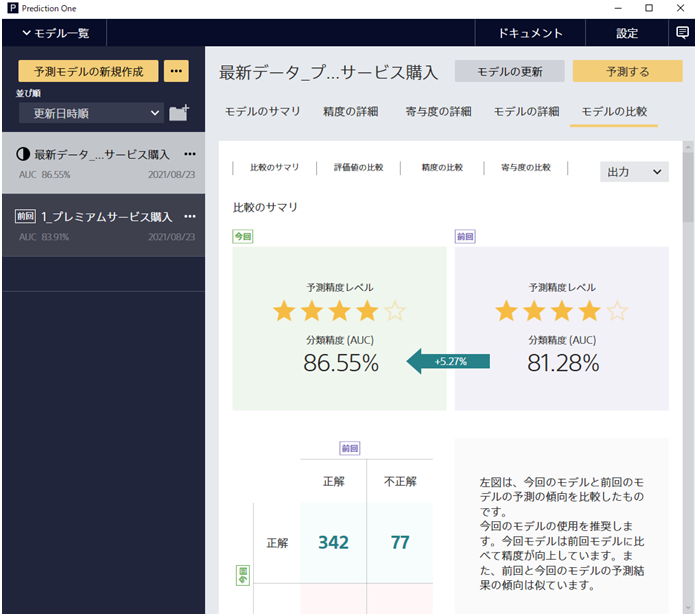

{}
When using a model created in Prediction One in business, there is a problem with the accuracy of the model declining as it gets older.

This document describes the method for updating a model with the latest data to create a model that reflects the trends of the latest data.

There is also a tutorial on updating models, so please refer to it as a specific example.{}: `C:/Program Files/Sony/Prediction One/ja-JP/doc/sample_dataset/use_case`{}

- {}
- {}

{}

{}
As mentioned above, it is common for the accuracy of a created model to decline as time goes by.
Model updating refers to the process for creating a new model that reflects the latest data in order to prevent this problem and enable prediction that reflects the trends of the latest data.

It is important to perform an accuracy evaluation after creating a new model, particularly when a model is updated.
By calculating evaluation values for the previous model and new model using the same evaluation data, the results can be compared to confirm that the new model is more accurate than the previous model.

The following two steps are required to actually update a model.
- step1: Add the latest data. Prepare the latest data for training and input it to Prediction One. The data for prediction model creation (training) to input can include the previous data for prediction model creation, but it is not required.
- step2: Specify the evaluation data. Specify the data to use for model evaluation. It is desirable for the evaluation data to be the same as that used for business, and using some of the latest data as evaluation data is a realistic approach.

The procedure required after actually starting to update a model in Prediction One and the method for viewing the results are described below.

{}

{}
First of all, input the data for prediction model creation (training) to use for updating the model. The data for prediction model creation to input can include the previous data for prediction model creation (training), but it is not required.

If you select the first option, [Only use new data for training], only the data you input to Prediction One this time is used for training.
Select this option in cases where you have all the data to input at hand, including the data from last time.

If you select the second option, [Latest data does not include old data], Prediction One performs training using both the data you input to Prediction One this time and the previous data for prediction model creation (training).
Select this option mainly in cases where you only have new data to input, which does not include the data from last time.

{}

{}
When the data for prediction model creation (training) has been input, the training settings screen is displayed.
This screen is mostly the same as the regular training screen, but has some differences that are described here.
The training settings screen for updating a model indicates the differences in the items used in the old data and the new data.

For example, in the figure below, there is a minus symbol to the bottom right of the [Age] item, which means that the item was included in the old data but is not included in the new data.
This item cannot be used for training because it is not included in the latest data.

There is a plus symbol to the bottom right of the [Option] item, which means that the item was not included in the old data but is included in the new data.
This item is also deselected by default.

{}

{}
Now let’s take a look at the method for inputting evaluation data to Prediction One.
Click [Next] on the details screen to display the screen for inputting the evaluation data.

The first option, [Specify evaluation data file] enables you to explicitly specify the file to use for comparing the models.
It is desirable for the evaluation data specified here to be the same as that actually used for business, and in most cases the latest data can be obtained.

The second option, [Use the following criteria to extract evaluation data from the data for prediction model creation (training)], enables you to specify the evaluation data based on the values of specified items.
For example, by selecting [Customer ID] as the item and specifying [2,000 or above] as the range, training is performed based on the data with a customer ID below 2,000, and evaluation is performed from the data above that.
Actual business data often has time series information in the data itself, and specifying a range for that item in the criteria can enable you to perform evaluation in line with a realistic problem.

{}

{}
Now let’s take a look at how to view the comparison results. [Model Comparison] tab
The left half of the screen displays the evaluation results for the newly trained model, and the right half of the screen displays the evaluation results of the model trained last time.
First of all, the comparison summary enables you to check a number of stars indicating the level of prediction accuracy, together with numeric values indicating changes in metrics.

The numeric values and number of stars indicating the level of prediction accuracy summarize the performance of the model and give you an idea of whether the precision has improved.
If the new model is more accurate, a green arrow indicates the amount of change, as shown in the figure below.
If the old model is more accurate, the arrow is red and a negative value is given for the accuracy.

The comparison summary includes text indicating which model is recommended.
For binary prediction/multiclass prediction, there is a matrix indicating the number of correct and incorrect predictions in the evaluation data.
This matrix is suitable for viewing changes in prediction result trends.

With numeric value type prediction, changes in the trend of prediction results are depicted as a graph instead of a matrix.
Error values are plotted on the horizontal axis and vertical axis of the graph, and data with improved error compared to the old model is displayed in green.
Data with worse error is displayed in red. 

This graph is also for checking changes in the trend of prediction results, and the summary comment on the right side of the graph takes this prediction trend into account.

By scrolling the screen, you can also see the results of the evaluation value comparison and accuracy comparison.
The evaluation value comparison is the most important metric after the model summary comparison.
It enables you to check whether the metrics of the new model have been correctly improved over the previous model.

The graph displayed in the accuracy comparison is also overlaid to enable a comparison of the two models.
It is useful for comparing more detailed model evaluation results. For specific information on the meaning of prediction accuracy metrics, refer to the following pages.

- {}
- {}
- {}

 

{}

{}

Finally, let’s take a look at how to output prediction results. You can use the [Output] button on the top right of the model comparison screen to save the results of the model comparison.
[Save displayed information as image (.png)] enables you to save the displayed graphs in the same manner as the regular accuracy details screen.
[Model prediction results for evaluation data] enables you to output the results of performing prediction on the evaluation data using both the new model and old model.

The table below shows actual prediction results that were downloaded. As you can see, the prediction results of the old model and the new model are output in separate rows.
This enables you to check how prediction results have changed for different items of data.
The prediction results in each row are useful for understanding the actual prediction in addition to the evaluation metrics.

{}

{}
This document focused on the creation of a model that reflects the latest data trends.
It described the function for updating a model.
Here are the key points:

- Updating a model involves creating a new model using the latest data and has the advantage of enabling you to make predictions that reflect the trends in the latest data.
- When inputting the latest data, you can select whether to include the previous training data in the new data.
- When comparing an existing model with a new model, you can use the same evaluation data to compare the evaluation results.
- You can either specify a file you have prepared for the evaluation data, or input a data interval to use for evaluation.
  In both cases, it is desirable to use the latest data actually used in business as the evaluation data.
- If the accuracy has improved and the prediction trends are similar, then it is likely that the addition of data has enabled a more correct model to be created. If the prediction trends differ:
  It is effective to check the difference in predictive contribution and the actual prediction results and check whether the input data is correct and whether there are any changes in the data trends.

If the data has been retrieved correctly and the amount of data is increasing, the prediction accuracy should usually improve.
You should be able to use the model update function to create a model that efficiently reflects the latest data trends.
With these points in mind, try creating a model with new data and check the evaluation results and prediction results, as it may be of help to your business.

{}
