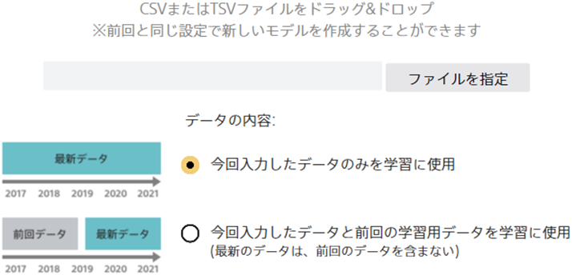

{}
Prediction One で作成したモデルをビジネスで活用する際、モデルが古くなるにつれて精度が下がってしまうという問題があります。

本資料では、最新データを用いてモデルを更新することで、最新のデータの傾向を反映したモデルを作成する方法を説明します。

モデルの更新に関するチュートリアルもありますので、具体例としてご参照ください。{}：`C:/Program Files/Sony/Prediction One/ja-JP/doc/sample_dataset/use_case`{}

- {}
- {}

{}

{}
上述のように、作成したモデルは時間が経過するにつれて精度が下がってしまうことが一般的です。
モデルの更新とは、この問題を防ぎ最新のデータの傾向を反映した予測を行うために、最新のデータでモデルを新しく作成することを指します。

特にモデルの更新においては新しいモデル作成後の精度評価が重要で、前回のモデルと今回作成したモデルを
同じ評価用データを用いて評価値を算出し、結果を比較することで新しいモデルが前回モデルよりも高い精度であることを確認できます。

実際にモデルの更新を行うためには以下の2つのステップが必要です。
- step1: 最新データの追加。学習に用いる最新データを用意して Prediction One に入力します。このとき入力する予測モデル作成(学習)用データは前回の予測モデル作成(学習)用データを含んでも含まなくてもどちらでも問題ありません。
- step2: 評価用データの指定。モデルの評価に用いるデータを指定します。このとき用意する評価用データはビジネスで使用するデータと同様のものが好ましく、最新のデータを一部切り出して評価用データとすることが現実に即した設定といえます。

実際にPrediction One で「モデルの更新」を開始した際に必要な手順と結果の見方について以降では説明を行っていきます。

{}

{}
まず初めにモデル更新において予測モデル作成(学習)用データの入力を行います。入力する予測モデル作成(学習)用データは前回の予測モデル作成(学習)用データを含んでも含まなくてもどちらでも問題ありません。

1つ目の選択肢である、「今回入力したデータのみを学習に使用」を選択した場合、Prediction One は今回入力したデータのみを学習に使用します。
こちらを選択するケースとしては、入力するデータとして前回のデータも含む全データが手元にある状態が挙げられます。

2つ目の選択肢である、「最新のデータは、前回のデータを含まない」を選択した場合、Prediction One は今回入力したデータと前回の予測モデル作成(学習)用データを学習に使用します。
こちらを選択するケースとしては、入力するデータとして前回のデータを含まない新しいデータだけが手元にある状態が主に挙げられます。

{}

{}
予測モデル作成(学習)用データの入力が終わると、次に学習の設定画面が表示されます。
基本的には通常の学習画面と同様ですが、いくつか通常の学習時とは違いがありそれらを説明していきます。
まずモデルの更新の学習の設定画面では、前回データに使用した項目と今回データに使用する項目についての違いが表示されます。

たとえば下図の「年齢」項目については右下にマイナスが描かれたアイコンがついており、これは前回データに含まれていたが今回データに含まれない項目を表します。
この項目は最新のデータに含まれないため学習に使用することはできません。

また下図の「オプション」項目については右下にプラスが描かれたアイコンがついており、これは前回データに含まれず今回データにのみ含まれる項目を表します。
この項目も同様にデフォルトでは使用しない項目としてチェックが外れています。

{}

{}
次に Prediction One で評価用データを入力する方法について説明します。
詳細画面で次へを押下すると評価用データを入力する画面が現れます。

1つ目の選択肢である「評価用データをファイルから指定する」ではモデルを比較するために使用するファイルを明示的に指定できます。
ここで指定する評価用データは、実際にビジネスで使用する上で想定される評価用データが好ましく、多くの場合は入手できるデータの中でも最新のものであることが一般的です。

2つ目の選択肢である「評価用データを以下の条件で予測モデル作成(学習)用データから抽出する」オプションでは、ユーザが指定した項目の値に基づいて評価用データを指定できます。
たとえば項目として「顧客ID」を選択し範囲を「2000以上」とすることで、顧客ID が2000未満のデータから学習を行い、以上のデータから評価を行うことが可能になります。
現実のビジネスデータではデータ自体に時系列性が存在するケースが多く、条件の指定により項目の範囲を指定することでより現実の問題設定に即した評価を行うことができます。

{}

{}
次に比較結果の確認画面の見方に付いて説明を行います。「モデルの比較」タブでは
画面の左半分に今回学習したモデルの評価結果が、右半分に前回学習したモデルの評価結果が表示されます。
まず、比較のサマリでは前回と今回の予測精度レベルの星の数と指標の変化を数値と共に確認できます。

予測精度レベルの星の数と数値は、モデルの性能を要約した値となっておりまずはこの値を見て精度が向上したかどうかを比較するのが良いでしょう。
今回のモデルの方が精度が良い場合、下図のように緑色の矢印で変化の大きさが図示されます。
前回のモデルの方が精度が良い場合は、矢印が赤色となり中に記述される精度もマイナスの値となります。

比較のサマリにはこの他にも更新前と更新後のどちらのモデルを推奨するかについてのテキストによる記述と、
二値予測・多値予測の場合は前回および今回のモデルによる評価用データに関する正解数と不正解数を表示するマトリクスが存在します。
このマトリクスは今回のモデルが正解したものが、どの程度前回のモデルを正解しているかを表しており、予測結果の傾向変化を見るために適しています。

予測タイプが数値予測の場合、予測結果の傾向変化はマトリクスではなくグラフとしてあらわされます。
このグラフでは横軸と縦軸に誤差の値がプロットされており、更新前のモデルよりも誤差が改善しているデータについては緑色で、
更新前のモデルよりも誤差が悪化しているデータについては赤色でグラフが書かれています。 

このグラフも同様に予測結果の傾向変化を見るためのもので、グラフの右側のサマリコメントはこの予測傾向も加味したものとなっています。

画面をスクロールしていくと、評価値の比較や精度の比較に関する結果も見ることができます。
評価値の比較はモデルのサマリの比較の次に重要な指標と考えられ、
今回モデルの各種指標が前回モデルよりも正しく向上しているかを確認できます。

精度の比較に表示されるグラフも前回モデルと今回モデルに関して比較できるように並べられており、より詳細なモデルの評価結果を比較する際は
これらを参考にするのがよいでしょう。具体的な予測精度の指標が表す意味については下記ページを参考にしてください。

- {}
- {}
- {}

 

{}

{}

最後に予測結果の出力について説明します。モデルの比較画面では右上の「出力」ボタンから今回のモデルの比較結果を保存できます。
「表示内容を画像(png)で保存」は通常の精度の詳細画面と同様に表示されている各グラフを保存できる機能です。
「評価用データに対するモデルの予測結果」では評価用のデータと前回のモデルおよび今回のモデルで予測したときの結果を出力できます。

下の表が実際に予測結果をダウンロードしたものです。これを見ると前回モデルの予測結果と今回モデルの予測結果がそれぞれ各行に対して出力されており、
実際にどのデータに対して予測結果がどれくらい変化したかを実際に見てみることができます。
各評価指標だけではなく実際の予測の様子を理解するためにこれらのような各行の予測結果を見てみるのもよいでしょう。

{}

{}
本資料では、最新のデータの傾向に対応したモデルを作成するために、
モデルの更新を行う機能を説明しました。
以下にポイントをまとめます。

- モデルの更新とは最新のデータを用いて新しくモデルを作成することで、最新データの傾向を踏まえた予測をできるようになる利点がある。
- 最新データを入力する際には、前回の学習データを今回入力したデータに加えるかどうかを選択することができる
- 既存のモデルと新しいモデルを比較する際には、同じ評価用データを用いて評価結果を比較するのが良い。
- 評価用データは別途手元に用意したファイルを指定するか、評価に使用するデータの区間を入力することで設定することができる。
  どちらの場合も実務で使用する最新のデータを評価用データとして使用することが好ましい。
- 精度が向上して予測傾向も似ているときは、データの追加により正しく新しいモデルを作成できたと考えられる。予測傾向が異なるときは、
  予測寄与度の違いや実際の予測結果を見て、入力したデータが正しいかどうか、データの傾向に変化がないかを確認することが有効である。

データが正しく取得できていてデータ数も増えていく場合、通常であれば予測精度が向上し、
モデルの更新機能を活用することで効率よく最新のデータ傾向に対応したモデルを作成できると考えられます。
これらの取り組みを参考にしつつ新しいデータでモデルを作成し、評価結果と予測結果を見てぜひビジネスに活用してみてください。

{}
