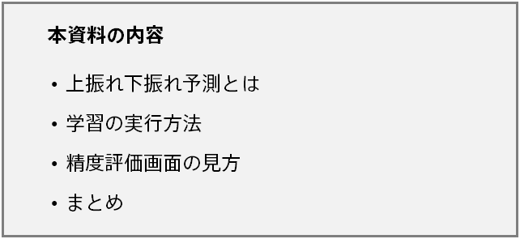
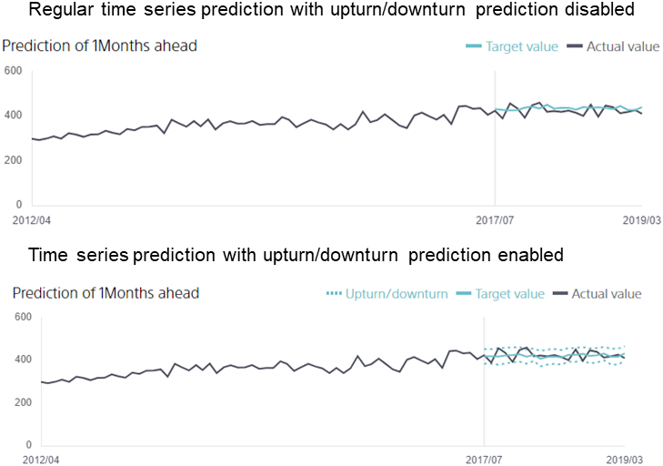
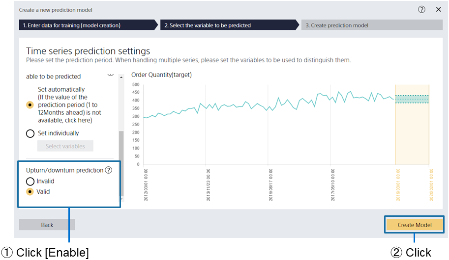
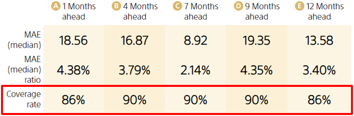
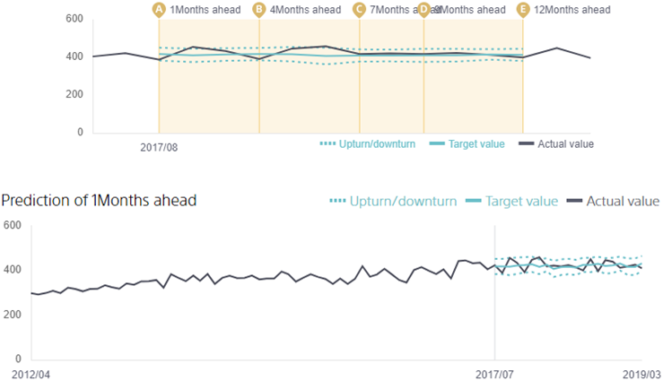

---
title: "Up/Down Deviation Prediction"
date: 2023-06-02T11:00:00+06:00
lastmod: 2023-06-02T11:00:00+06:00
weight: 21
draft: false
# metaタグのパラメータ
meta:
  description: ""
# クラウド・デスクトップ限定ページの場合は片方のみtrueにする
visible:
  is_cloud_only: true
  is_desktop_only: false
# 検索でヒットする文字列の指定
keywords: ["Up/Down Deviation Prediction", "Prediction Interval"]
---

{}
Prediction One provides a function for time series prediction. In previous time series prediction, one future prediction result was output for a single point in time. When using prediction results in actual work, information on things such as how confidently that value was output and how much that value may deviate can help in decision making.

This document describes up/down deviation prediction, which outputs information on how much values may increase or decrease in addition to the prediction for a specific time that is output when performing time series prediction.

A tutorial is also provided for the up/down deviation prediction function. Please refer to it to see a specific example.
{}

{}

{}
Up/down deviation prediction predicts the amount that a predicted value may deviate up or down in addition to the most likely value (predicted value) derived from time series prediction. An overview of up/down deviation prediction is indicated in the figure below.

With the regular time series prediction mode, one prediction value is output for a single point in time, but when up/down deviation prediction is used, two prediction values are added to indicate the up/down deviation. The up/down deviation values output with this function are trained to ensure that there is a 90% chance that the actual value will be within the range of the two values. Therefore, the up/down deviation prediction result basically means that there is a 90% chance that the actual future result will lie between the two values.

{}

{}
Now let’s look at the method for performing training and prediction for up/down deviation prediction. Up/down deviation prediction is an option used in the time series prediction mode, so the method for preparing data and configuring training is basically the same as the time series prediction mode. For details, refer to "{}." Here, we look at the method for enabling up/down deviation prediction, how to view the accuracy evaluation screen, and how to view the prediction results, using order prediction as an example.

By selecting [Using time series prediction mode] when creating a new prediction model, a [Time Series Prediction Settings] screen like the following is displayed. The [Up/Down Deviation Prediction] item is on the left side of the screen. To perform up/down deviation prediction, click [Enable] for that item. Configure the other settings in the same manner as regular time series prediction. When the settings are complete, click the [Create prediction model] button to start training.

The up/down deviation prediction setting used last time training was performed is carried over. If you used up/down deviation prediction once but want to use regular time series prediction next time, click [Disable] for the [Up/Down Deviation Prediction] field on the [Time Series Prediction Settings] screen.

{}

{}
When you open the [Accuracy Details] tab after model training is complete, [Accuracy Evaluation Value] and [Predictions and Results] are displayed. The screen is mostly the same as the regular time series prediction mode, but there are two differences.

First, there is a metric called "Coverage". It indicates the probability that the actual value will be within the range of up/down deviation prediction. For details on the calculation method, refer to "{}." This metric can be used to estimate the quality of the up/down deviation prediction. Because training is performed in Prediction One to have a coverage of 90%, the closer the number is to 90%, the better the model is. Example accuracy evaluation values are indicated in the figure below. In the figure below, the accuracy evaluation values are calculated for five scenarios, which are one month ahead, four months ahead, seven months ahead, nine months ahead, and 12 months ahead.

Now, if we take a look at the graph of the actual value and predicted value, we can see that there are dotted lines indicating the up/down deviation prediction values, in addition to the blue solid line. Much like the regular time series prediction value, these lines are output by a different model depending on how far ahead they are predicting, so different up/down deviation prediction is output for each target prediction period.

{}

{}
When the settings are changed with the regular time series prediction mode (with up/down deviation prediction disabled) then up/down deviation prediction is enabled, two additional prediction values are output for up/down deviation prediction and the prediction value in the middle also differs from the prediction value output by the original time series prediction mode, even if the same data is input. This is because a different model is used depending on whether up/down deviation prediction is enabled. Take note of this when using a time series prediction model with up/down deviation prediction enabled or disabled.

{}

{}
Up/down deviation prediction is as an optional function for time series prediction. Although it is difficult to create a complete model for the pinpoint prediction of important numeric values for business, such as demand and sales, up/down deviation prediction can be used to see how accurate prediction values are and how much they may vary, which provides you with more versatile prediction results.

Please try using up/down deviation prediction in your business as described in this document.
{}